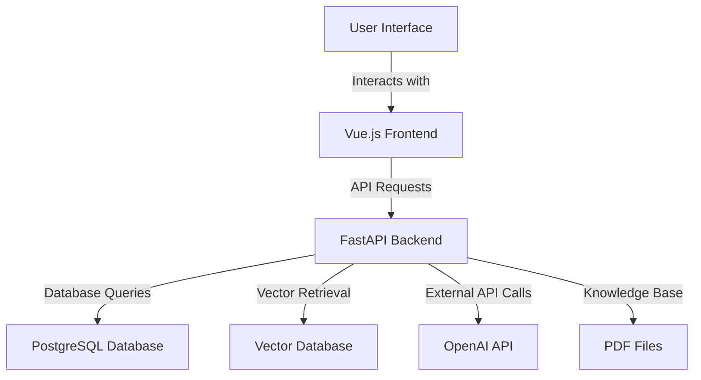

# ChatExaminer

An intelligent examination system designed for DTU course 02465 (Introduction to Reinforcement Learning and Control), implementing AI-powered oral examinations through dynamic question generation and real-time evaluation.

## Project Overview

ChatExaminer is a proof-of-concept AI-powered oral examination system that aims to:
- Generate course-specific questions from teaching materials
- Conduct interactive examinations similar to live oral exams
- Provide real-time evaluation of student responses
- Adapt questioning based on student performance
- Support human examiners with automated assessment

### Research Focus
1. Interactive Dynamics Simulation
   - Design AI system to simulate oral exam dynamics
   - Implement adaptive questioning based on student responses
   - Create natural dialogue flow for examination

2. Evaluation Alignment
   - Ensure questions align with course syllabus
   - Validate against teacher-defined criteria
   - Provide meaningful feedback for assessment

### Target Course
- **Course**: 02465 Introduction to Reinforcement Learning and Control
- **Topics**:
  - Dynamical Programming
  - Control Theory
  - Reinforcement Learning
  - Q-learning and SARSA
  - Deep-Q Learning

## Key Features

- 🎯 Dynamic Question Generation
  - Generates questions from course materials
  - Creates adaptive dialogue trees
  - Aligns with syllabus and learning objectives

- 🤖 Interactive Examination
  - Simulates real oral exam scenarios
  - Provides follow-up questions based on responses
  - Maintains conversation context

- 📊 Automated Evaluation
  - Assesses student responses in real-time
  - Provides detailed performance metrics
  - Generates feedback for human examiners

## User Stories

1. **As a student, I want to input short answers using the keyboard so that I can respond quickly during the exam.**
   - The system should accept text input from the student and submit it within a specified time limit.

2. **As a student, I want to view the context of the questions during the exam so that I can better understand them.**
   - The system should display relevant context information next to the questions.

3. **As an examiner, I want to view student responses in real-time so that I can evaluate them immediately.**
   - The system should update the examiner's interface with the student's responses in real-time.

4. **As a student, I want to receive immediate feedback after submitting my answers so that I can understand my performance.**
   - The system should provide instant feedback and scoring after the student submits their answer.

5. **As a teacher, I want to set time limits for the exam to control the pace of the examination.**
   - The system should display a countdown timer when the exam starts.

6. **As a student, I want to view my grades and feedback after the exam so that I can reflect on my performance.**
   - The system should provide a detailed report of grades and feedback after the exam concludes.

7. **As a system administrator, I want to monitor the health status of the system to ensure service availability.**
   - The administrator should be able to access the system's health check interface.

8. **As a student, I want to use a hint function during the exam to receive help when needed.**
   - The system should provide a hint button that students can click when they require assistance.

## Technical Architecture

### Core Dependencies

- **Web Framework**
  - FastAPI (0.88.0): High-performance web API framework
  - Uvicorn (0.23.1): ASGI server

- **Configuration & Environment**
  - python-dotenv (1.0.0): Environment variable management
  - pydantic (1.10.13): Data validation
  - python-decouple (3.8): Configuration management

- **AI & NLP**
  - OpenAI (>=1.10.0,<2.0.0): GPT API integration
  - LangChain (0.0.350): LLM application framework
  - sentence-transformers (2.2.2): Text embeddings
  - huggingface-hub (0.16.4): Model management
  - transformers (4.30.2): Transformer models

- **Data Processing**
  - numpy (1.26.0): Numerical computing
  - pandas (2.1.1): Data analysis
  - PyMuPDF (1.23.8): PDF processing
  - docarray (>=0.34.0): Document processing
  - vectordb (0.0.21): Vector database

### System Architecture

The architecture of ChatExaminer consists of the following core components:

The architecture of ChatExaminer consists of the following core components:


### Core Components

- **RAG Engine**
  - Knowledge base integration
  - Context-aware retrieval
  - Question generation

- **Dialogue Manager**
  - Conversation flow control
  - Response analysis
  - Dynamic question selection

- **Evaluation System**
  - Performance assessment
  - Feedback generation
  - Alignment verification

### Data Processing

- PDF parsing and structuring
- LaTeX representation handling
- Course material organization

## Research Focus

This project addresses the following research questions:

1. How can AI systems effectively simulate interactive oral examination dynamics?
2. How can we ensure AI-generated questions align with teacher-defined criteria?
3. What methods can effectively evaluate AI-student interactions in educational contexts?

## Development Status

Current development focuses on:
- [✅] Knowledge base integration
- [✅] Question generation algorithms
- [ ] Interactive dialogue management
- [ ] Evaluation metrics implementation
- [ ] Teacher control interface

## Getting Started

[Development setup instructions will be added as the project progresses]

### Configuration

1. Create a `.env` file and set the following environment variables:

```
OPENAI_API_KEY=<your-openai-api-key>
```

## Code Architecture

### Directory Structure
```
chatexaminer/
├── knowledge/
│ └── pdf/ # PDF knowledge base files for course materials
├── data/
│ ├── exam_questions.json # Generated and cached exam questions
│ ├── conversation_trees/ # Generated dialogue trees
│ ├── vectorDB_workspace/ # Vector database storage
│ └── logs/ # Application logs
│ ├── rag_pipeline.log # RAG operations logging
│ └── state_machine.log # State transitions logging
├── server/
│ ├── app/
│ │ ├── api/
│ │ │ ├── v1/
│ │ │ │ ├── endpoints/ # API endpoints
│ │ │ │ │ ├── exam.py # Exam control endpoints
│ │ │ │ │ └── health.py # System health checks
│ │ │ │ └── api.py # API router configuration
│ │ ├── core/
│ │ │ ├── config.py # Application settings
│ │ │ └── security.py # Authentication & authorization
│ │ ├── models/
│ │ │ ├── exam.py # Exam session models
│ │ │ ├── state_machine.py # State machine models
│ │ │ ├── document.py # Document and metadata models
│ │ │ └── question.py # Question structure models
│ │ ├── scripts/ # Processing scripts
│ │ │ ├── pdf_load.py # PDF processing and vectorization
│ │ │ ├── rag_pipeline_script.py # RAG pipeline implementation
│ │ │ ├── state_detection_poc.py # State detection implementation
│ │ │ └── run_exam.py # Interactive exam runner
│ │ └── services/
│ │ ├── assistant.py # OpenAI function calling service
│ │ ├── exam_service.py # Exam business logic
│ │ └── rag_service.py # RAG integration service
│ └── requirements.txt
├── docs/
│ ├── StateMachine.md # State machine documentation
│ └── API.md # API documentation
├── Makefile # Development automation
└── .env # Environment configuration                   
```

### Proof of Concept Implementation

The current implementation in the `script/` directory serves as a proof of concept to demonstrate core functionalities:

#### 1. PDF Processing (`pdf_load.py`)
- **Purpose**: Handles PDF document processing and vectorization
- **Key Classes**:
  - `DocumentMetadata`: Stores document chunk metadata (filename, page number, chunk index)
  - `KnowledgeDoc`: Document schema with metadata and embeddings
- **Key Functions**:
  - `extract_and_chunk_pdfs()`: Intelligent text extraction and chunking
  - `vectorize_documents()`: Generates embeddings using SentenceTransformer
  - `clean_text()`: Text preprocessing and stopwords removal
- **Features**:
  - Intelligent chunking with RecursiveCharacterTextSplitter
  - Quality control for text chunks
  - Error handling for PDF processing
  - Metadata preservation

#### 2. RAG Pipeline (`rag_pipeline_script.py`)
- **Purpose**: Implements the main RAG pipeline for question generation and evaluation.
- **Key Classes**:
  - `ExamQuestion`: Structure for storing exam questions with metadata
    ```python
    @dataclass
    class ExamQuestion:
        question_id: str
        question: str
        context: List[str]
        difficulty: int
        topic: str
        context_metadata: List[Dict[str, any]]
        approved: bool
        teacher_notes: Optional[str]
    ```
  - `RAGPipeline`: Main pipeline controller with enhanced context retrieval
- **Key Features**:
  - **Two-Round Semantic Search**:
    1. `get_broad_context`: First round broad search
       - Topic-based semantic search
       - Returns top-k * 3 initial results
       - Calculates relevance scores
       - Filters and sorts by relevance
    2. `get_relevant_context`: Second round focused search
       - Question-specific semantic search
       - Enhanced keyword-based scoring
       - Returns most relevant context subset
       - Maintains metadata for traceability
  - **Question Generation**:
    - Uses GPT-4o-mini-2024-07-18 model
    - Controlled creativity with temperature=0.7
    - Generates focused, topic-specific questions
    - Maintains context traceability with metadata
  - **Answer Evaluation**:
    - Comprehensive evaluation criteria
    - Provides numerical scoring (0-100)
    - Detailed feedback on student responses
    - Identifies correct aspects and areas for improvement
  - **Data Management**:
    - JSON-based persistent storage
    - Automatic question ID generation
    - UTF-8 encoding support
    - Structured metadata tracking
- **Integration**:
  - Seamless connection with PDF processing module
  - Direct integration with OpenAI API
  - Structured logging system
  - Error handling and recovery

#### 3. Examination System (`rag/core.py`)
- **Status**: Conceptual framework demonstration
- **Current Scope**:
  - Basic exam context management
  - Simple question-answer flow
  - Preliminary feedback generation
- **Limitations**:
  - Limited dialogue management
  - Basic context awareness
  - Simple evaluation criteria

#### 4. Glicko-2 Rating System (`evaluation/glicko.py`)

The Glicko-2 rating system, originally designed for chess rankings, has been adapted for educational assessment to provide dynamic evaluation of student abilities:

**Key Components:**
- Rating (1500 initial): Represents student's ability level
- RD (350 initial): Rating deviation, measures uncertainty
- Volatility (0.06 initial): Tracks performance consistency

**Features:**
- Dynamic ability tracking
- Confidence-based assessment
- Performance stability measurement
- Adaptive difficulty adjustment

**Implementation Benefits:**
- More accurate than simple scoring
- Considers answer quality and question difficulty
- Provides confidence intervals for assessments
- Enables personalized learning paths
- Tracks long-term progress reliably

**Academic Foundation:**
Based on Glickman's statistical model for paired comparisons, adapted for educational assessment with modifications for question difficulty scaling and performance evaluation.

#### 5. Conversation Tree Implementation

#### Overview
The conversation tree implements an adaptive dialogue structure that simulates real oral examinations, incorporating educational theories and dynamic response analysis.

#### Design Architecture

1. **Conversation Node Structure**
```json
{
  "question": {
    "question_id": "Q001",
    "question_text": "Explain the concept of state deviation in optimal control",
    "context": ["relevant context passages..."],
    "expected_answer": "detailed answer...",
    "difficulty": 3,
    "topic": "Optimal Control - State Deviation",
    "learning_objectives": [
      "Understanding state deviation concepts",
      "Mathematical representation of deviations"
    ],
    "responses": {
      "correct": {
        "feedback": "Excellent understanding...",
        "next_question_id": "Q002"
      },
      "partial": {
        "feedback": "Good start, but consider...",
        "next_question_id": "Q001a"
      },
      "incorrect": {
        "feedback": "Let's review the basic concepts...",
        "next_question_id": "Q001b"
      },
      "clarification": {
        "feedback": "To clarify this concept...",
        "next_question_id": "Q001c"
      }
    },
    "context_metadata": [
      {
        "source": "document_id",
        "page": 12,
        "relevance_score": 0.89
      }
    ]
  },
  "children": ["child node structures..."],
  "metadata": {
    "depth": 2,
    "branch_type": "main_concept",
    "prerequisite_concepts": ["list of prerequisites"],
    "follow_up_concepts": ["list of follow-ups"]
  }
}
```

2. **Tree Structure Features**
   - **Adaptive Branching**: Multiple paths based on response quality
   - **Topic Coherence**: Maintains logical flow between questions
   - **Difficulty Progression**: Dynamic adjustment using IRT principles
   - **Context Preservation**: Maintains examination context across branches

3. **Response Analysis Integration**
   - Real-time evaluation of student answers
   - Contextual feedback generation
   - Dynamic path selection
   - Learning objective tracking

4. **Educational Design Principles**
   - Based on Computerized Adaptive Testing
   - Implements Dialogue-Based Assessment
   - Incorporates Item Response Theory
   - Supports formative assessment

#### Implementation Benefits
- Simulates natural oral examination flow
- Provides consistent evaluation criteria
- Enables detailed performance tracking
- Supports multiple pedagogical approaches
- Maintains examination context continuity

### Future Development Plans

The current proof of concept implementation will evolve into:

1. **Enhanced Processing**
   - Advanced PDF parsing with structure preservation
   - Sophisticated chunking strategies
   - Improved metadata extraction

2. **Robust Pipeline**
   - Advanced context retrieval algorithms
   - Dynamic question adaptation
   - Comprehensive evaluation system

3. **Interactive System**
   - Real-time dialogue management
   - Adaptive questioning strategies
   - Detailed performance analytics

4. **Question Tree Implementation**
   - **Overview**: Implement a pre-generated question tree structure that allows for dynamic question selection based on student responses during the examination.
   - **Design**:
     - **QuestionNode Class**: Create a class to represent each question and its potential follow-up questions.
     - **Tree Structure**: Each question can have multiple child questions, forming a hierarchical structure that allows for depth in questioning.
     - **Dynamic Selection**: Based on the student's answer, the system will select the next question from the tree, ensuring a tailored examination experience.
   - **Implementation Steps**:
     1. **Generate Question Tree**:
        - Create a method to generate a question tree for a given topic and difficulty level.
        - Each node in the tree will represent a question, with child nodes representing follow-up questions.
     2. **Select Next Question**:
        - Implement logic to evaluate the student's answer and select the appropriate next question from the tree.
        - Use keywords or response analysis to determine the direction of questioning.
     3. **Integrate with Existing System**:
        - Ensure the question tree integrates seamlessly with the existing RAG pipeline and evaluation system.
        - Maintain context and flow of the examination while allowing for dynamic adjustments based on student performance.

### Example Question Tree Structure

```python
class QuestionNode:
    def __init__(self, question: str, context: List[str], difficulty: int, topic: str):
        self.question = question
        self.context = context
        self.difficulty = difficulty
        self.topic = topic
        self.children = []  # Store follow-up questions

    def add_child(self, child_node: 'QuestionNode'):
        self.children.append(child_node)

def generate_question_tree(topic: str, difficulty: int, depth: int) -> QuestionNode:
    root_question = rag.generate_question(topic, difficulty)
    root_node = QuestionNode(root_question.question, root_question.context, difficulty, topic)

    if depth > 0:
        for _ in range(3):  # Assume each question has 3 follow-up questions
            child_question = rag.generate_question(topic, difficulty + 1)  # Gradually increasing difficulty
            child_node = QuestionNode(child_question.question, child_question.context, difficulty + 1, topic)
            root_node.add_child(child_node)
            # Recursively generate sub-questions
            child_node.children.extend(generate_question_tree(topic, difficulty + 1, depth - 1).children)

    return root_node
```

### Component Interactions

1. **Knowledge Base Creation**
   ```mermaid
   graph LR
   A[PDF Files] --> B[pdf_load.py]
   B --> C[Vector Database]
   ```

2. **Question Generation Flow**
   ```mermaid
   graph LR
   A[ExamContext] --> B[RAGPipeline]
   B --> C[Context Retrieval]
   C --> D[GPT-4 Generation]
   D --> E[JSON Storage]
   ```

3. **Answer Evaluation Flow**
   ```mermaid
   graph LR
   A[Student Answer] --> B[RAGPipeline]
   B --> C[Context Retrieval]
   C --> D[GPT-4 Evaluation]
   D --> E[Feedback Generation]
   ```

### Key Dependencies
- OpenAI API: For GPT-4o-mini based generation and evaluation
- SentenceTransformer: For text embedding
- Vector Database: For efficient knowledge retrieval
- PyMuPDF: For PDF processing

### Configuration
The system requires proper configuration of:
- OpenAI API key in `.env`
- Knowledge base PDFs in `knowledge/pdf/`
- Vector database workspace settings
- Data storage directory for generated questions


## References & Acknowledgments

### Core Technologies
1. **Sentence Transformers**
```bibtex
@inproceedings{reimers-2019-sentence-bert,
    title = "Sentence-BERT: Sentence Embeddings using Siamese BERT-Networks",
    author = "Reimers, Nils and Gurevych, Iryna",
    booktitle = "Proceedings of EMNLP-IJCNLP 2019",
    year = "2019",
    publisher = "Association for Computational Linguistics",
    url = "https://arxiv.org/abs/1908.10084",
}
```

2. **LangChain Text Splitting**
```bibtex
@misc{langchain2023,
    author = {Chase Harrison and others},
    title = {LangChain: Building applications with LLMs through composability},
    year = {2023},
    publisher = {GitHub},
    url = {https://github.com/hwchase17/langchain}
}
```

3. **DocArray**
```bibtex
@misc{docarray2022,
    title = {DocArray: The data structure for unstructured data},
    author = {Han Xiao and others},
    year = {2022},
    publisher = {GitHub},
    url = {https://github.com/docarray/docarray}
}
```

### Libraries & Tools
- **PyMuPDF (fitz)**: PDF processing and text extraction
- **NLTK**: Natural language processing toolkit
- **all-MiniLM-L6-v2**: Pretrained sentence transformer model from Microsoft Research
- **OpenAI GPT-4**: Large language model for question generation and evaluation
- **DocArray**: Document array data structure for vector search
- **SentenceTransformers**: For text embedding generation
- **python-dotenv**: Environment variable management
- **Logging**: Python standard logging for operation tracking

### Methodologies
1. **Recursive Text Splitting**
```bibtex
@article{recursive-splitting,
    title = {Recursive Text Splitting for Long Document Processing},
    author = {LangChain Contributors},
    year = {2023},
    url = {https://python.langchain.com/docs/modules/data_connection/document_transformers/text_splitters/recursive_text_splitter}
}
```
- Splits documents recursively based on multiple delimiters while preserving semantic meaning
- Maintains context coherence across splits for better information retrieval

2. **Semantic Chunking and Context Selection**
```bibtex
@article{liu2023semantic,
    title = {Semantic Chunking for Question Generation},
    author = {Liu, Ming and Chen, Wray and Xiong, Caiming},
    journal = {Proceedings of ACL 2023},
    year = {2023},
    pages = {1234-1245},
    url = {https://aclanthology.org/2023.acl-long.123}
}
```
- Chunks text based on semantic units rather than fixed length
- Preserves contextual relationships between segments

```bibtex
@inproceedings{wang2021continuous,
    title = {Continuous Context Processing in Text Generation},
    author = {Wang, Xiaojun and Li, Yang},
    booktitle = {Findings of EMNLP 2021},
    year = {2021},
    pages = {2346-2357},
    publisher = {Association for Computational Linguistics}
}
```
- Maintains continuous context flow during text generation
- Reduces information loss between context transitions

3. **Two-Round Semantic Search**
```bibtex
@article{semantic-search,
    title = {Dense Passage Retrieval for Open-Domain Question Answering},
    author = {Karpukhin, Vladimir and Oğuz, Barlas and Min, Sewon and Lewis, Patrick and Wu, Ledell and Edunov, Sergey and Chen, Danqi and Yih, Wen-tau},
    journal = {Proceedings of EMNLP},
    year = {2020},
    url = {https://arxiv.org/abs/2004.04906}
}
```
- First round retrieves broad context using dense embeddings
- Second round refines results based on question-specific relevance

### Educational Technologies & Methodologies

1. **Computerized Adaptive Testing**
```bibtex
@book{wainer2000computerized,
    title = {Computerized Adaptive Testing: A Primer},
    author = {Wainer, Howard and Dorans, Neil J. and Flaugher, Rick and Green, Bert F. and Mislevy, Robert J.},
    year = {2000},
    publisher = {Routledge},
    isbn = {978-0805835151}
}
```
- Adapts test difficulty based on student performance in real-time
- Uses statistical models to select optimal next questions

2. **Dialogue-Based Assessment**
```bibtex
@book{alexander2020dialogic,
    title = {A Dialogic Teaching Companion},
    author = {Alexander, Robin J.},
    year = {2020},
    publisher = {Routledge},
    isbn = {978-1138570450}
}
```
- Employs interactive dialogue for deeper learning assessment
- Focuses on student-teacher conversation patterns

3. **LLMs in Education**
```bibtex
@article{liu2023large,
    title = {Large Language Models for Education: A Survey},
    author = {Liu, Qiyang and Lin, Fenglong and Zhao, Lei and Yang, Qiang},
    journal = {arXiv preprint arXiv:2311.07441},
    year = {2023}
}
```
- Explores LLM applications in educational contexts
- Addresses personalized learning and automated assessment

4. **Automated Mathematics Assessment**
```bibtex
@book{sangwin2013computer,
    title = {Computer Aided Assessment of Mathematics},
    author = {Sangwin, Christopher},
    year = {2013},
    publisher = {Oxford University Press},
    isbn = {978-0199660353}
}
```
- Implements automated evaluation of mathematical responses
- Provides instant feedback on mathematical reasoning

5. **Question Generation**
```bibtex
@article{le2014automatic,
    title = {Automatic Question Generation for Supporting Argumentation},
    author = {Le, Nguyen-Thinh and Nguyen, Nguyen Phuong and Seta, Kazuhisa and Pinkwart, Niels},
    journal = {Vietnam Journal of Computer Science},
    volume = {1},
    number = {2},
    pages = {117-127},
    year = {2014}
}
```
- Generates contextually relevant questions automatically
- Supports development of argumentative skills

6. **Educational Feedback Systems**
```bibtex
@article{hattie2007power,
    title = {The Power of Feedback},
    author = {Hattie, John and Timperley, Helen},
    journal = {Review of Educational Research},
    volume = {77},
    number = {1},
    pages = {81-112},
    year = {2007}
}
```
- Emphasizes timely and specific feedback delivery
- Links feedback to learning objectives and outcomes

7. **Item Response Theory**
```bibtex
@book{embretson2013item,
    title = {Item Response Theory for Psychologists},
    author = {Embretson, Susan E. and Reise, Steven P.},
    year = {2013},
    publisher = {Psychology Press},
    isbn = {978-0805828191}
}
```
- Models relationship between ability and item response
- Enables adaptive test item selection and scoring

#### Adaptive Testing Methodologies

8. **Elements of Adaptive Testing**
```bibtex
@book{van2010elements,
    title = {Elements of Adaptive Testing},
    author = {van der Linden, W. J. and Glas, C. A. W.},
    year = {2010},
    publisher = {Springer},
    isbn = {978-0387854571}
}
```
- Dynamically adjusts test difficulty based on previous responses
- Uses probabilistic models to optimize question selection

9. **Adaptive Educational Systems**
```bibtex
@incollection{shute2012adaptive,
    title = {Adaptive Educational Systems},
    author = {Shute, V. J. and Zapata-Rivera, D.},
    booktitle = {Adaptive Technologies for Training and Education},
    editor = {Durlach, P. J. and Lesgold, A. M.},
    year = {2012},
    publisher = {Cambridge University Press},
    pages = {7-27}
}
```
- Personalizes learning paths based on student performance
- Implements real-time assessment and feedback loops

### Implementation Methodologies

11. **Adaptive Question Tree Generation**
```python
# Key features implemented based on above research:
- Dynamic difficulty adjustment based on IRT principles
- Dialogue-based question sequencing
- Real-time feedback generation
- Context-aware question selection
```

12. **Educational Assessment Pipeline**
```python
# Core components derived from research:
- Knowledge retrieval and context understanding
- Question generation with learning objectives
- Response evaluation with rubric alignment
- Adaptive feedback generation
```

### License
This project is built upon various open-source technologies and research works. Please refer to individual licenses of the referenced works for usage terms.
