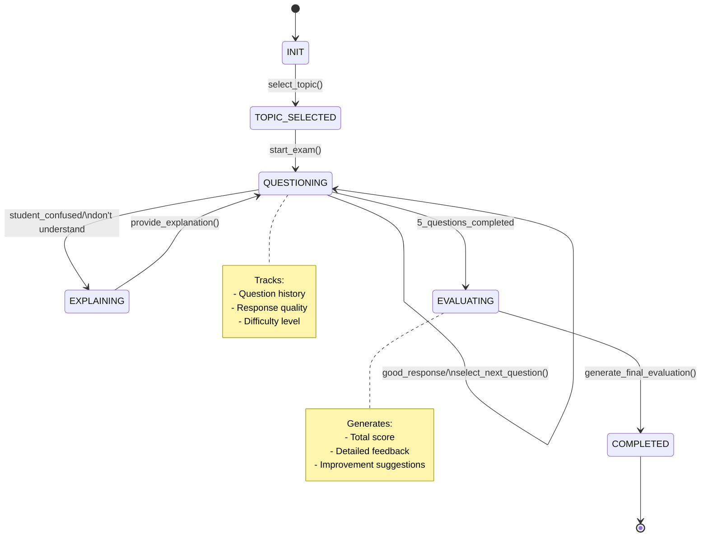

# AI Examiner Dialogue System

## Overview
The AI Examiner implements an intelligent dialogue system for conducting oral examinations in Reinforcement Learning and Control Theory. The system dynamically adapts its questioning strategy based on student responses while maintaining a structured evaluation process.

## Dialogue System Architecture

The system follows a state machine architecture to manage the examination flow:



## State Descriptions

### 1. INIT
- Initial state where the examination session begins
- Loads available topics and question bank

### 2. TOPIC_SELECTED
- Topic has been randomly selected from the available exam topics
- Prepares relevant questions and evaluation criteria

### 3. QUESTIONING
- Main examination state
- Dynamically selects questions based on:
  - Student's previous responses
  - Current difficulty level
  - Question history
- Maintains coherence between questions
- Tracks student's understanding level

### 4. EXPLAINING
- Activated when student indicates lack of understanding
- Provides necessary context without giving away answers
- Helps guide student back to the topic

### 5. EVALUATING
- Triggered after completing 5 questions
- Analyzes all responses
- Generates comprehensive evaluation

### 6. COMPLETED
- Final state with complete assessment
- Provides detailed feedback and suggestions

## Features

- **Adaptive Questioning**: Adjusts difficulty based on student performance
- **Coherent Flow**: Ensures logical progression between questions
- **Comprehensive Evaluation**: Considers multiple aspects of student responses
- **Supportive Learning**: Provides explanations when needed
- **Structured Assessment**: Follows predefined evaluation criteria

## Evaluation Criteria

The system evaluates responses based on:
1. Concept accuracy (40%)
2. Understanding depth (30%)
3. Expression clarity (20%)
4. Technical terminology usage (10%)

## Example Dialogue Flow

```
AI Examiner: "Welcome to the oral examination. Your topic is [Selected Topic]."

[Topic Introduction]

AI Examiner: [Asks initial question]

Student: [Responds]

AI Examiner: [Dynamically selects next question based on response]
...
[Process continues for 5 questions]

AI Examiner: [Provides final evaluation and feedback]
```

## Implementation Notes

- Questions are pre-generated and stored in JSON format
- Each topic has associated context and expected answers
- Responses are evaluated against predefined criteria
- Final evaluation includes specific improvement suggestions

```python
def generate_prompt(self, state: ExamState, context: Dict) -> str:
    """Generate appropriate prompt based on current state"""
    prompts = {
        ExamState.INIT: """You are an AI examiner for the course 'Introduction to Reinforcement Learning and Control Theory'.
        Maintain a professional but friendly tone. Start by introducing yourself and explaining the exam format.
        Current topic: {topic}""",

        ExamState.QUESTIONING: """Based on the student's previous response: {last_response}
        Understanding level: {understanding_level}
        Question history: {question_history}

        Generate a natural follow-up question that:
        1. Builds on their demonstrated knowledge
        2. Maintains coherence with previous questions
        3. Matches difficulty level {difficulty}
        4. Relates to the topic {topic}

        Respond in a conversational way, acknowledging their previous answer.""",

        ExamState.EXPLAINING: """The student has shown difficulty understanding: {confusion_point}

        Provide a helpful explanation that:
        1. Breaks down the concept
        2. Uses analogies if appropriate
        3. Doesn't give away answers
        4. Guides them back to the topic

        Maintain an encouraging tone.""",

        ExamState.EVALUATING: """Review the entire conversation:
        {conversation_history}

        Generate a comprehensive evaluation that:
        1. Analyzes their understanding
        2. Highlights strengths
        3. Suggests improvements
        4. Provides a final score

        Keep the tone constructive and encouraging."""
    }

    return prompts[state].format(**context)
```
