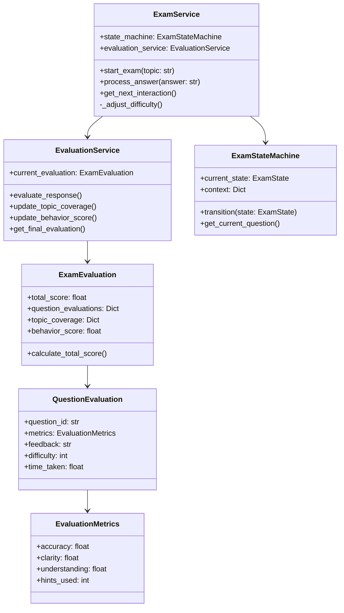
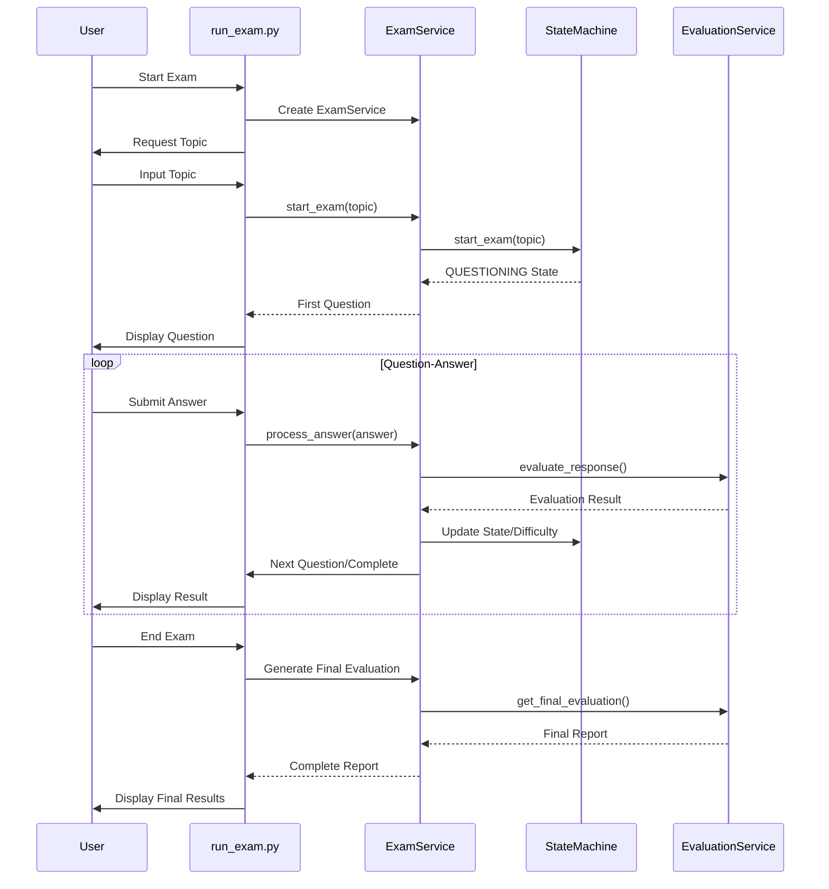
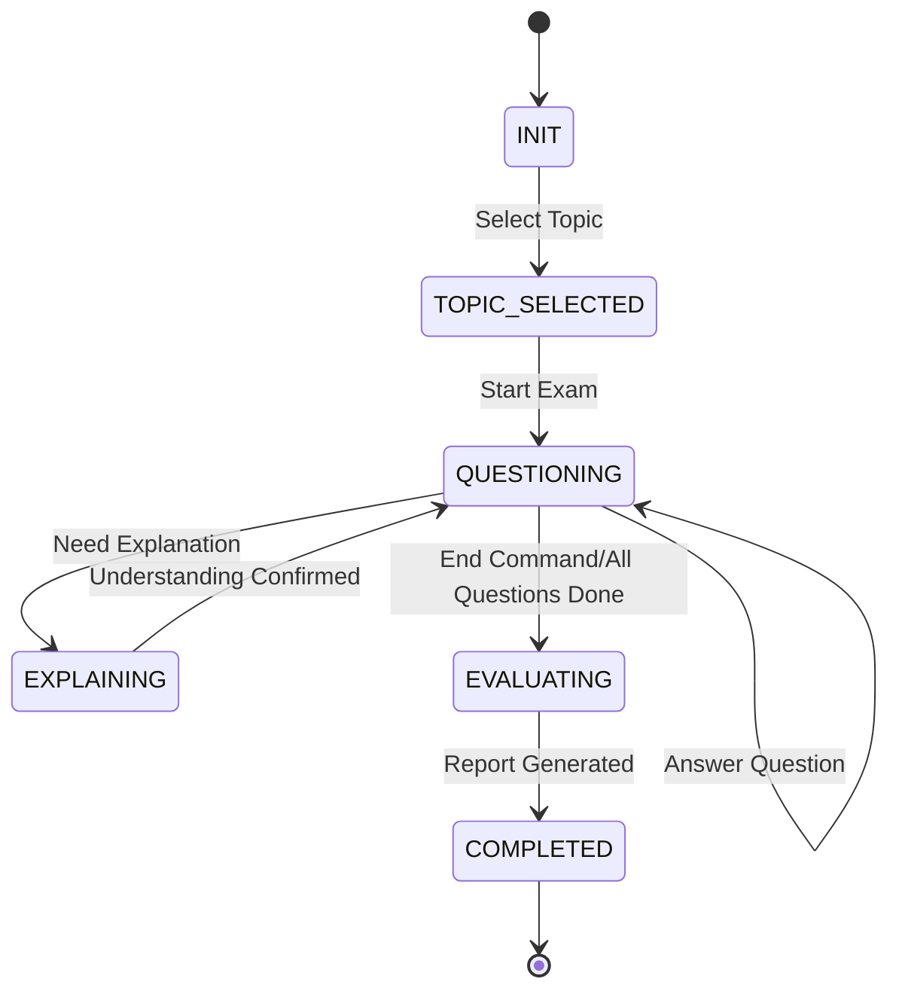

# Evaluation System Documentation

## Overview

The evaluation system implements a comprehensive assessment framework for oral examinations, combining real-time response evaluation with cumulative performance tracking.

## Components

| Component | Purpose | Implementation |
|-----------|----------|----------------|
| EvaluationMetrics | Core metrics model | `models/evaluation.py` |
| EvaluationService | Evaluation logic | `services/evaluation_service.py` |
| QuestionEvaluation | Per-question assessment | `models/evaluation.py` |
| ExamEvaluation | Overall exam assessment | `models/evaluation.py` |

## Scoring System

### Per-Question Metrics

| Metric | Weight | Range | Penalty |
|--------|--------|-------|---------|
| Accuracy | 33.3% | 0-100 | - |
| Clarity | 33.3% | 0-100 | - |
| Understanding | 33.3% | 0-100 | - |
| Hint Usage | - | - | -10 per hint |

### Final Score Composition

| Component | Weight | Calculation |
|-----------|--------|-------------|
| Question Scores | 60% | Average of per-question metrics * difficulty weight |
| Topic Coverage | 20% | Percentage of key points covered |
| Behavior Score | 20% | Based on time, hints, and consistency |

## Implementation Details

### 1. Real-time Evaluation
python
async def evaluate_response(
question: Dict,
student_response: str,
hints_used: int,
time_taken: float
) -> QuestionEvaluation

### 2. Difficulty Adjustment

- Uses GPT-4 for response analysis
- Context-aware evaluation using question materials
- Immediate feedback generation

def _adjust_difficulty(metrics: EvaluationMetrics):
    avg_performance = (metrics.accuracy + metrics.understanding) / 2
    if avg_performance > 85:
        increase_difficulty()
    elif avg_performance < 60:
        decrease_difficulty()

### 3. Topic Coverage Tracking
```python
def update_topic_coverage(
    topic: str,
    score: float,
    covered_points: List[str]
)
```

## Performance Metrics

### Behavioral Analysis

| Metric | Threshold | Penalty |
|--------|-----------|---------|
| Response Time | >5 min | -20 points |
| Hint Usage | >2 per question | -20 points |
| Consistency | <70% | -20 points |

### Response Quality Assessment

| Level | Score Range | Characteristics |
|-------|-------------|-----------------|
| Excellent | 85-100 | Complete, accurate, well-expressed |
| Good | 70-84 | Mostly correct, clear expression |
| Fair | 60-69 | Basic understanding shown |
| Poor | <60 | Incomplete or incorrect |

## References

For evaluation methodologies:

```bibtex
@article{hattie2007power,
    title = {The Power of Feedback},
    author = {Hattie, John and Timperley, Helen},
    journal = {Review of Educational Research},
    volume = {77},
    number = {1},
    pages = {81-112},
    year = {2007}
}
```

For adaptive testing:

```bibtex
@book{wainer2000computerized,
    title = {Computerized Adaptive Testing: A Primer},
    author = {Wainer, Howard},
    year = {2000},
    publisher = {Routledge}
}
```

## Future Improvements

1. Enhanced Context Analysis
   - [ ] Implement semantic similarity scoring
   - [ ] Add concept relationship mapping

2. Feedback Refinement
   - [ ] Generate personalized improvement suggestions
   - [ ] Include concept prerequisite tracking

3. Performance Analytics
   - [ ] Add learning curve analysis
   - [ ] Implement progress tracking over multiple sessions

## System Architecture

### Class Diagram


### Run Exam Flow


### State Transitions


These figures demonstrate:
1. The relationships and dependencies between system components
2. The flow of interactions during an exam
3. The complete state transitions

Each component has a clear role:
- `run_exam.py`: The user interface
- `ExamService`: The core business logic coordinator
- `StateMachine`: The state manager
- `EvaluationService`: The answer evaluation and score calculation