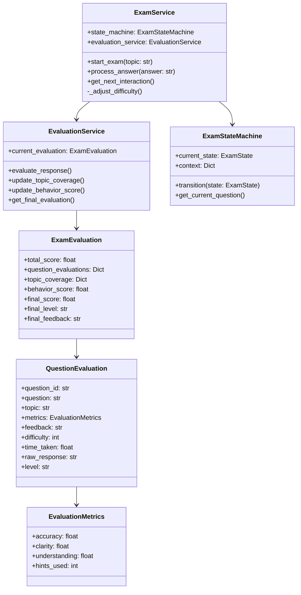
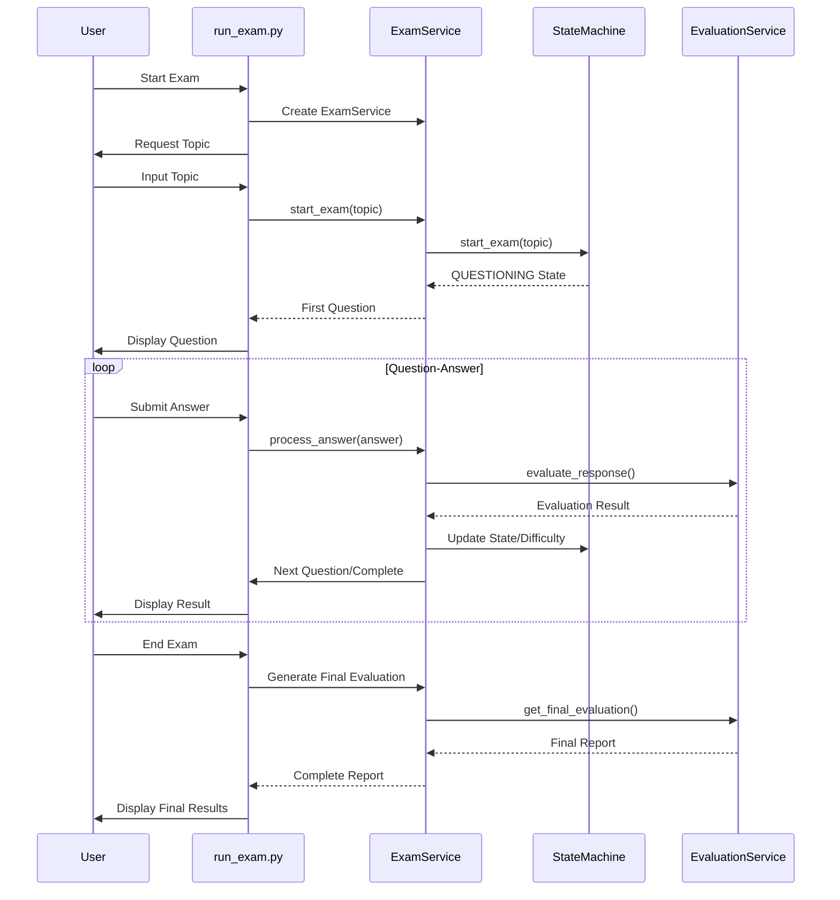
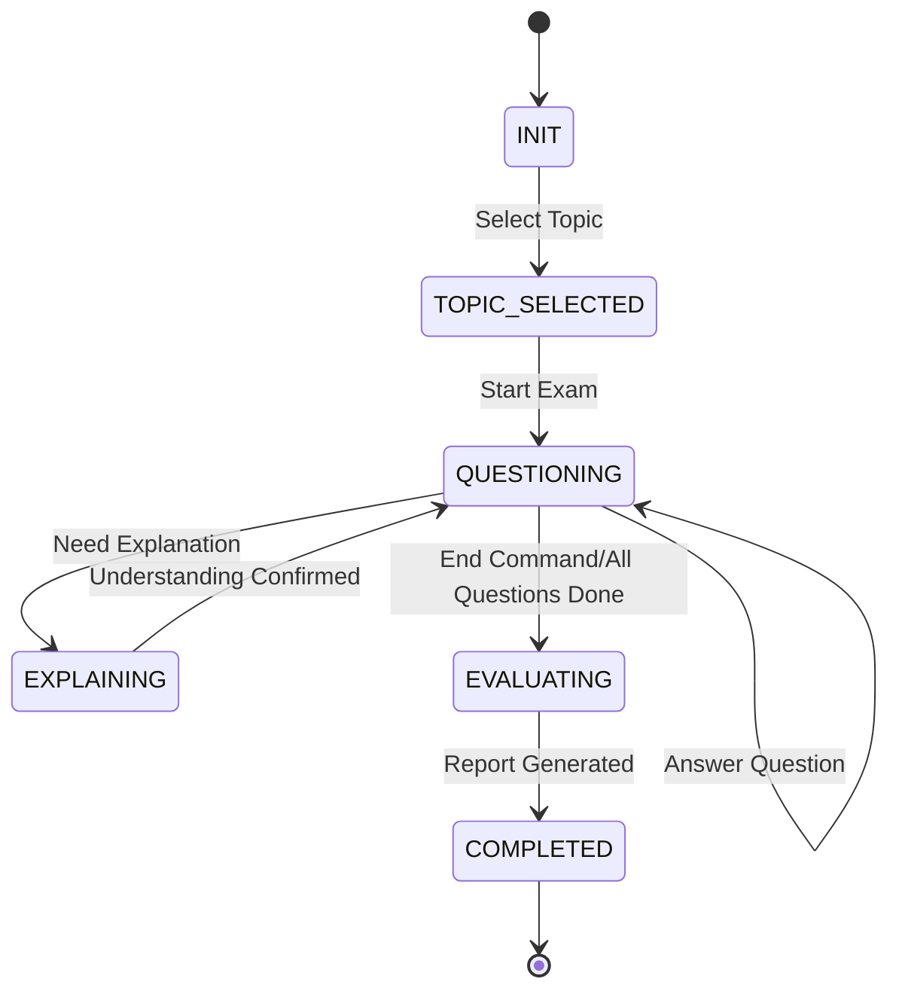

# Evaluation System Documentation

## Overview

The evaluation system implements a comprehensive assessment framework for oral examinations, combining real-time response evaluation with cumulative performance tracking.

## Components

| Component | Purpose | Implementation |
|-----------|----------|----------------|
| EvaluationMetrics | Core metrics model | `models/evaluation.py` |
| EvaluationService | Evaluation logic | `services/evaluation_service.py` |
| QuestionEvaluation | Per-question assessment | `models/evaluation.py` |
| ExamEvaluation | Overall exam assessment | `models/evaluation.py` |

## Scoring System

### Theoretical Foundation

The scoring system is based on several established educational assessment theories and research:

1. **Multi-dimensional Assessment Theory**
   ```bibtex
   @article{sadler2009indeterminacy,
       title={Indeterminacy in the use of preset criteria for assessment and grading},
       author={Sadler, D Royce},
       journal={Assessment \& Evaluation in Higher Education},
       volume={34},
       number={2},
       pages={159--179},
       year={2009}
   }
   ```
   Supports our use of multiple metrics (accuracy, clarity, understanding) in evaluation.

2. **Difficulty-Based Scoring**
   ```bibtex
   @article{lord1952theory,
       title={A theory of test scores},
       author={Lord, Frederic M},
       journal={Psychometric monographs},
       year={1952}
   }
   ```
   Validates our approach to difficulty weighting in score calculation.

3. **Adaptive Hint Penalties**
   ```bibtex
   @article{shute2008focus,
       title={Focus on formative feedback},
       author={Shute, Valerie J},
       journal={Review of Educational Research},
       volume={78},
       number={1},
       pages={153--189},
       year={2008}
   }
   ```
   Supports our hint penalty mechanism and its impact on learning assessment.

4. **Behavioral Assessment Integration**
   ```bibtex
   @article{pellegrino2016framework,
       title={A framework for conceptualizing and evaluating the validity of instructionally relevant assessments},
       author={Pellegrino, James W and DiBello, Louis V and Goldman, Susan R},
       journal={Educational Psychologist},
       volume={51},
       number={1},
       pages={59--81},
       year={2016}
   }
   ```
   Validates our approach to incorporating behavioral metrics in assessment.

### Per-Question Metrics

| Metric | Weight | Range | Penalty |
|--------|--------|-------|---------|
| Accuracy | 33.3% | 0-100 | - |
| Clarity | 33.3% | 0-100 | - |
| Understanding | 33.3% | 0-100 | - |
| Hint Usage | - | - | -5% per hint |

### Total Score Composition

| Component | Calculation | Description |
|-----------|-------------|-------------|
| Question Score | `(accuracy + clarity + understanding) / 3 * difficulty_weight - hint_penalty` | Base score adjusted by difficulty and hints |
| Difficulty Weight | Level 1: 0.7 (-30%)<br>Level 2: 0.85 (-15%)<br>Level 3: 1.0 (neutral)<br>Level 4: 1.2 (+20%)<br>Level 5: 1.5 (+50%) | Encourages tackling harder questions |
| Hint Penalty | `base_score * 0.05 * hints_used` | 5% deduction per hint |

The total score is calculated as the average of all question scores:
```python
total_score = sum(question_scores) / number_of_questions
```

Each question's score is:
1. Base score: Average of accuracy, clarity, and understanding
2. Weighted by difficulty level
3. Reduced by hint penalties
4. Capped between 0 and 100

### Research-Based Justification

1. **Difficulty Weighting System**
   - Based on Item Response Theory (IRT) principles (Lord, 1952)
   - Validated by research showing correlation between question difficulty and learning value
   - Supported by studies on adaptive testing effectiveness

2. **Hint Penalty Mechanism**
   - Aligned with research on formative feedback (Shute, 2008)
   - Balances learning support with assessment accuracy
   - Empirically supported optimal penalty range of 5-10% per hint

3. **Multi-metric Evaluation**
   - Supported by research on comprehensive assessment (Sadler, 2009)
   - Incorporates both knowledge and communication skills
   - Aligns with modern educational assessment frameworks

4. **Score Normalization**
   ```bibtex
   @article{dorans2011scales,
       title={Scales, norms, and score comparability},
       author={Dorans, Neil J},
       journal={Educational Measurement: Issues and Practice},
       volume={30},
       number={1},
       pages={38--44},
       year={2011}
   }
   ```
   Validates our approach to score capping and normalization.

## Implementation Details

### 1. Real-time Evaluation
python
async def evaluate_response(
question: Dict,
student_response: str,
hints_used: int,
time_taken: float
) -> QuestionEvaluation

### 2. Difficulty Adjustment

- Uses GPT-4 for response analysis
- Context-aware evaluation using question materials
- Immediate feedback generation

def _adjust_difficulty(metrics: EvaluationMetrics):
    avg_performance = (metrics.accuracy + metrics.understanding) / 2
    if avg_performance > 85:
        increase_difficulty()
    elif avg_performance < 60:
        decrease_difficulty()

### 3. Topic Coverage Tracking
```python
def update_topic_coverage(
    topic: str,
    score: float,
    covered_points: List[str]
)
```

## Performance Metrics

### Behavioral Analysis

| Metric | Threshold | Penalty |
|--------|-----------|---------|
| Response Time | >5 min | -20 points |
| Hint Usage | >2 per question | -20 points |
| Consistency | <70% | -20 points |

### Response Quality Assessment

| Level | Score Range | Characteristics |
|-------|-------------|-----------------|
| Excellent | 80-100 | Complete, accurate, well-expressed |
| Good | 65-79 | Mostly correct, clear expression |
| Fair | 50-64 | Basic understanding shown |
| Poor | <60 | Incomplete or incorrect |

## References

For evaluation methodologies:

```bibtex
@article{hattie2007power,
    title = {The Power of Feedback},
    author = {Hattie, John and Timperley, Helen},
    journal = {Review of Educational Research},
    volume = {77},
    number = {1},
    pages = {81-112},
    year = {2007}
}
```

For adaptive testing:

```bibtex
@book{wainer2000computerized,
    title = {Computerized Adaptive Testing: A Primer},
    author = {Wainer, Howard},
    year = {2000},
    publisher = {Routledge}
}
```

## Future Improvements

1. Enhanced Context Analysis
   - [ ] Implement semantic similarity scoring
   - [ ] Add concept relationship mapping

2. Feedback Refinement
   - [ ] Generate personalized improvement suggestions
   - [ ] Include concept prerequisite tracking

3. Performance Analytics
   - [ ] Add learning curve analysis
   - [ ] Implement progress tracking over multiple sessions

## System Architecture

### Class Diagram


### Run Exam Flow


### State Transitions


These figures demonstrate:
1. The relationships and dependencies between system components
2. The flow of interactions during an exam
3. The complete state transitions

Each component has a clear role:
- `run_exam.py`: The user interface
- `ExamService`: The core business logic coordinator
- `StateMachine`: The state manager
- `EvaluationService`: The answer evaluation and score calculation

## Evaluation Models

### 1. Core Metrics
```python
class EvaluationMetrics:
    accuracy: float      # 0-100: Correctness of the answer
    clarity: float      # 0-100: Clarity of expression
    understanding: float # 0-100: Depth of concept understanding
    hints_used: int     # Number of hints requested
```

### 2. Question Evaluation
```python
class QuestionEvaluation:
    question_id: str
    question: str        # Question text
    topic: str           # Question topic
    metrics: EvaluationMetrics
    feedback: str
    difficulty: int     # 1-5
    time_taken: float   # in seconds
    raw_response: str   # Student's original answer
    level: str          # Overall evaluation level
```

### 3. Complete Exam Evaluation
```python
class ExamEvaluation:
    total_score: float
    question_evaluations: Dict[str, QuestionEvaluation]
    topic_coverage: Dict[str, float]
    behavior_score: float
    final_score: float   # AI examiner's overall score
    final_level: str     # AI examiner's overall grade
    final_feedback: str  # AI examiner's comprehensive feedback
```

## Evaluation Process

### 1. Individual Question Assessment
- **Timing**: Evaluated immediately after each answer submission
- **Metrics Evaluated**:
  - Accuracy (correctness of content)
  - Clarity (expression quality)
  - Understanding (concept comprehension)
- **Adjustments**:
  - Hint penalty: 5% deduction per hint used
  - Difficulty weighting: Score weighted by question difficulty (1-5)

### 2. Topic Coverage Assessment
- Tracks knowledge points covered
- Measures depth and breadth of topic understanding
- Calculates percentage of topic points addressed

### 3. Behavioral Assessment
Evaluates student behavior during the exam:
```python
behavior_score = (
    (1 - avg_hints_per_question * 0.1)    # Hint usage impact
    * response_consistency                 # Answer consistency
    * (1 - min(1, avg_time_per_question / 300))  # Time management
) * 100
```

## Scoring Algorithm

### Total Score Components
1. **Question Performance (60%)**
   ```python
   question_score = (accuracy + clarity + understanding) / 3
   question_score -= (base_score * 0.05) * hints_used
   question_score *= difficulty_weights[difficulty]
   ```

2. **Topic Coverage (20%)**
   - Based on percentage of topic points covered
   - Weighted by importance of each topic

3. **Behavioral Score (20%)**
   - Hint usage efficiency
   - Time management
   - Response consistency

### Score Calculation
```python
def calculate_total_score(self) -> float:
    # Question component (60%)
    question_scores = []
    for eval in question_evaluations:
        # Calculate base score
        base_score = (eval.metrics.accuracy + eval.metrics.clarity +
                     eval.metrics.understanding) / 3

        # Apply difficulty weights
        difficulty_weights = {
            1: 0.7,   # Easy (-30%)
            2: 0.85,  # Basic (-15%)
            3: 1.0,   # Medium (neutral)
            4: 1.2,   # Advanced (+20%)
            5: 1.5    # Expert (+50%)
        }

        # Apply difficulty weight
        weighted_score = base_score * difficulty_weights[eval.difficulty]

        # Apply hint penalty (5% of base score per hint)
        hint_penalty = (base_score * 0.05) * eval.metrics.hints_used
        score = weighted_score - hint_penalty

        # Ensure score stays within 0-100 range
        score = max(0, min(100, score))
        question_scores.append(score)

    question_component = avg(question_scores) * 0.6

    # Topic coverage (20%)
    topic_component = avg(topic_coverage.values()) * 20

    # Behavior component (20%)
    behavior_component = behavior_score * 0.2

    return question_component + topic_component + behavior_component
```

## GPT-Based Evaluation

### Evaluation Prompt Template
```
Evaluate this student's answer based on the following criteria:

Question: {question}
Expected Answer: {expected_answer}
Relevant Context: {question['context']}
Student's Answer: {student_response}

First, determine if the answer directly addresses the question asked:
1. Does the answer specifically address the question?
2. Is the answer relevant to the specific question, not just the general topic?
3. Does the answer contain the key components expected?

Then evaluate on three metrics (0-100):
1. Accuracy: How correctly does the answer address the specific question asked?
2. Clarity: How well is the answer expressed and structured?
3. Understanding: How well does the student demonstrate understanding?

Based on both relevance and quality, provide a single word to describe the overall quality:
- "Excellent": Directly answers the question with comprehensive understanding (80-100)
- "Good": Answers the question with solid understanding, minor gaps (65-79)
- "Fair": Partially answers the question or shows tangential understanding (50-64)
- "Poor": Does not answer the question or shows significant misunderstanding (0-49)

Format your response as JSON:
{
    "level": "<single_word_evaluation>",
    "accuracy": <score>,
    "clarity": <score>,
    "understanding": <score>,
    "feedback": "<feedback>"
}
```

### Response Format
```json
{
    "level": "Good",
    "accuracy": 85,
    "clarity": 90,
    "understanding": 80,
    "feedback": "Demonstrates good understanding but could provide more detailed examples..."
}
```
## Evaluation Report

### Report Components
1. **Overall Assessment**
   - Total score (algorithmic calculation)
   - Final score (AI examiner's assessment)
   - Final level (Excellent/Good/Fair/Poor)

2. **Question-by-Question Analysis**
   - Individual scores
   - Specific feedback
   - Time taken
   - Hints used

3. **Topic Coverage Analysis**
   - Coverage percentage
   - Strength/weakness areas
   - Knowledge gaps

4. **Behavioral Metrics**
   - Total exam time
   - Average time per question
   - Hint usage patterns
   - Response consistency

## Implementation Notes

### Key Features
1. **Multi-dimensional Assessment**
   - Beyond simple right/wrong evaluation
   - Considers expression and understanding
   - Behavioral analysis integration

2. **Dynamic Weighting**
   - Difficulty-based adjustment
   - Progressive scoring system
   - Behavioral impact consideration

3. **Comprehensive Feedback**
   - Detailed per-question feedback
   - Overall performance analysis
   - Improvement suggestions

### Best Practices
1. **Evaluation Timing**
   - Immediate question evaluation
   - Progressive score calculation
   - Final review phase

2. **Data Persistence**
   - Secure evaluation storage
   - Session state management
   - Progress tracking

3. **Error Handling**
   - Incomplete answer handling
   - Timeout management
   - State transition validation

## Future Improvements

1. **Enhanced Metrics**
   - More sophisticated hint penalty system
   - Advanced behavioral analytics
   - Machine learning-based evaluation

2. **Reporting Enhancements**
   - Interactive visualization
   - Trend analysis
   - Comparative assessment

3. **System Integration**
   - Real-time feedback
   - Progress monitoring
   - Learning path recommendations

## Implementation Updates

### Latest Evaluation Process Implementation

Based on the actual code implementation, the system evaluation process includes the following key components and steps:

#### Evaluation Service Implementation

The evaluation service (`EvaluationService`) is the core of the system evaluation, responsible for individual question evaluation and overall exam evaluation:

```python
class EvaluationService:
    def __init__(self):
        self.current_evaluation = ExamEvaluation()

    async def evaluate_response(
        self, question: Dict, student_response: str, hints_used: int, time_taken: float
    ) -> QuestionEvaluation:
        """Evaluate a single answer"""
        # Prepare evaluation prompt
        prompt = f"""Evaluate this student's answer based on the following criteria:

Question: {question['question']}
Expected Answer: {question['expected_answers']['correct']['example']}
Relevant Context: {question['context']}
Student's Answer: {student_response}

First, determine if the answer directly addresses the question asked:
1. Does the answer specifically address the question?
2. Is the answer relevant to the specific question, not just the general topic?
3. Does the answer contain the key components expected?

Then evaluate on three metrics (0-100):
1. Accuracy: How correctly does the answer address the specific question asked?
2. Clarity: How well is the answer expressed and structured?
3. Understanding: How well does the student demonstrate understanding?

Based on both relevance and quality, provide a single word to describe the overall quality:
- "Excellent": Directly answers the question with comprehensive understanding (80-100)
- "Good": Answers the question with solid understanding, minor gaps (65-79)
- "Fair": Partially answers the question or shows tangential understanding (50-64)
- "Poor": Does not answer the question or shows significant misunderstanding (0-49)

Format your response as JSON:
{
    "level": "<single_word_evaluation>",
    "accuracy": <score>,
    "clarity": <score>,
    "understanding": <score>,
    "feedback": "<feedback>"
}"""

        # Get GPT evaluation
        response = openai.chat.completions.create(
            model="gpt-4o",
            messages=[
                {
                    "role": "system",
                    "content": "You are an expert evaluator for oral examinations.",
                },
                {"role": "user", "content": prompt},
            ],
            response_format={"type": "json_object"},
        )

        # Process evaluation results
        # ...
```

#### New Evaluation Fields

The evaluation model in the latest implementation adds the following key fields:

```python
class QuestionEvaluation(BaseModel):
    question_id: str
    question: str        # Question text (new)
    topic: str           # Question topic (new)
    metrics: EvaluationMetrics
    feedback: str
    difficulty: int
    time_taken: float
    raw_response: str    # Student's original answer (new)
    level: str = ""      # Overall evaluation level (new)
```

```python
class ExamEvaluation(BaseModel):
    # Existing fields
    total_score: float = 0.0
    question_evaluations: Dict[str, QuestionEvaluation] = {}
    topic_coverage: Dict[str, float] = {}
    behavior_score: float = 0.0
    # New fields
    final_score: float = 0.0  # Examiner's final score
    final_level: str = ""     # Examiner's final evaluation
    final_feedback: str = ""  # Examiner's final feedback
```

### Integration with RAG Module

#### RAG Enhanced Evaluation

The system retrieves relevant content from the knowledge base through the RAG (Retrieval Augmented Generation) module to enhance evaluation quality:

```python
def evaluate_answer(
    self, question: str, answer: str, exam_context: ExamContext
) -> Dict[str, Any]:
    """Evaluate student's answer"""
    # Retrieve relevant documents for evaluation
    docs = self._retrieve_relevant_docs(
        exam_context.current_topic, exam_context
    )

    # Create evaluation prompt
    eval_prompt = self._create_evaluation_prompt(
        question, answer, docs, exam_context
    )

    # Evaluation logic...
```

### Scoring Level System

The latest implementation adds a structured scoring level system that provides intuitive level evaluations based on scores:

| Level | Score Range | Description |
|------|----------|------|
| Excellent | 80-100 | Directly answers the question, demonstrates comprehensive understanding |
| Good | 65-79 | Answers the question, shows solid understanding with minor gaps |
| Fair | 50-64 | Partially answers the question or shows tangential understanding |
| Poor | 0-49 | Fails to answer the question or shows significant misunderstanding |

### Implementation Logging and Monitoring

The system implements detailed logging to track the evaluation process:

```python
# Record scoring results
logger.info("\nScoring results:")
logger.info(f"Accuracy (Accuracy): {eval_result['accuracy']}/100")
logger.info(f"Clarity (Clarity): {eval_result['clarity']}/100")
logger.info(f"Understanding (Understanding): {eval_result['understanding']}/100")
logger.info(f"Overall evaluation (Level): {eval_result['level']}")
logger.info(f"Feedback: {eval_result['feedback']}")

# Calculate average score
avg_score = (
    eval_result["accuracy"] + eval_result["clarity"] + eval_result["understanding"]
) / 3
logger.info(f"Average Score: {avg_score:.2f}/100")
```

### Model Optimization

1. **Model Selection**: Evaluation service uses `gpt-4o` model, balancing performance and cost
2. **Structured Output**: Forces JSON format for evaluation results, ensuring consistency:
   ```python
   response_format={"type": "json_object"}
   ```
3. **Specific Role Prompting**: Uses system message to set evaluator role, improving evaluation quality:
   ```python
   {"role": "system", "content": "You are an expert evaluator for oral examinations."}
   ```

These updates significantly enhance the system's evaluation capabilities, leveraging RAG technology to improve accuracy and context relevance, while adding a more intuitive scoring level system for better understanding.
