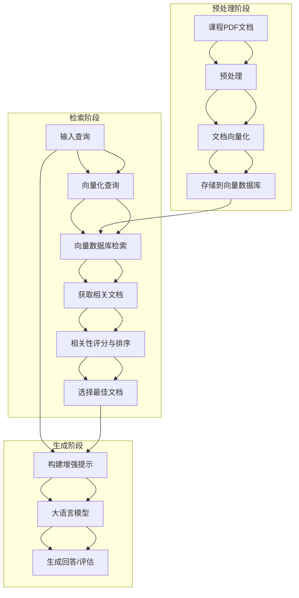
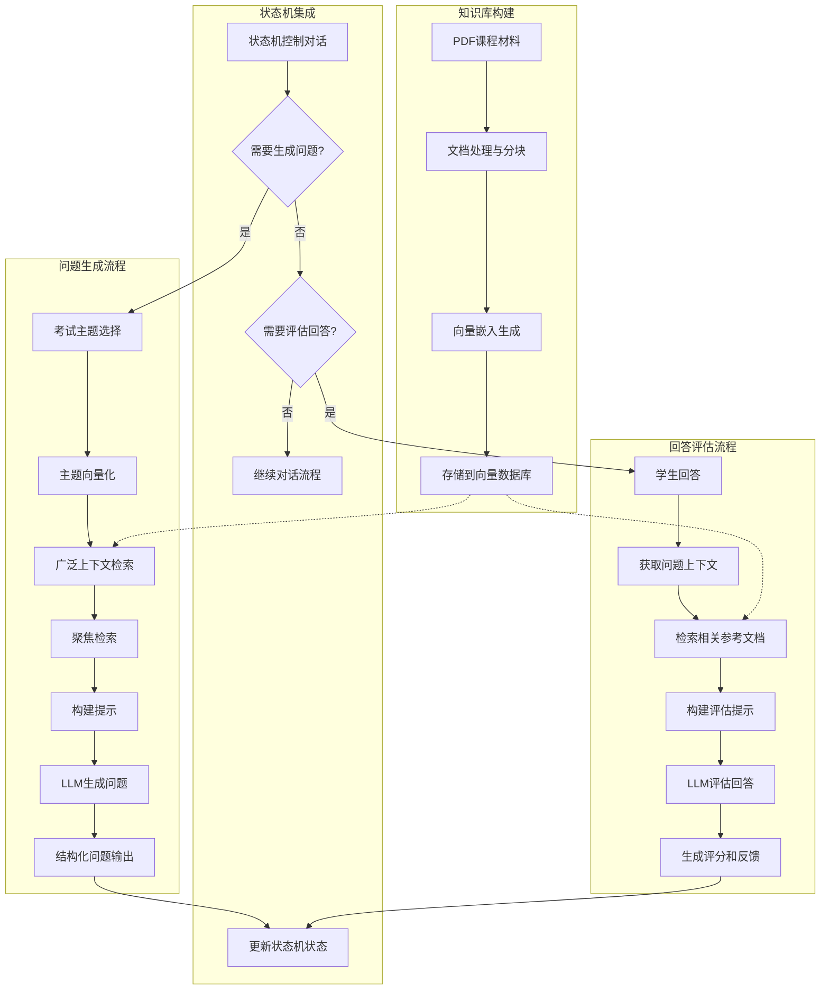

# ChatExaminer中的RAG实现

## 简介

检索增强生成（Retrieval Augmented Generation，简称RAG）是ChatExaminer系统的核心技术之一，它通过将信息检索与生成模型相结合，显著提高了系统在口试评估中的质量、准确性和领域相关性。本文档详细介绍RAG技术在ChatExaminer中的实现原理、关键组件和应用场景。

## RAG基本原理

RAG系统的基本工作原理是：
1. **检索（Retrieval）**：根据输入查询从知识库中检索相关文档或信息片段
2. **增强（Augmentation）**：将检索到的信息与原始查询结合
3. **生成（Generation）**：利用大语言模型基于增强后的输入生成高质量、知识丰富的回答

这种方法解决了大语言模型的几个关键限制：
- 减轻了"幻觉"问题，提高了回答的准确性
- 使系统能够访问最新或专业的领域知识
- 提供了可追溯的信息来源，增强了可解释性

### RAG流程图示



## ChatExaminer中的RAG架构

### 1. 核心组件

ChatExaminer的RAG系统由以下核心组件组成：

#### RAGPipeline类

`RAGPipeline`是整个RAG系统的核心实现，负责协调检索和生成过程：

```python
class RAGPipeline:
    def __init__(self, questions_file: Path = QUESTIONS_FILE):
        """初始化RAG管道与指定问题文件路径"""
        self.questions_file = questions_file
        self.questions = self.load_questions()

    # 其他方法...
```

#### RAGService服务

`RAGService`作为系统服务层的一部分，为前端和其他服务提供RAG功能的接口：

```python
class RAGService:
    def __init__(self):
        self.rag_pipeline = RAGPipeline(questions_file=settings.DATA_DIR / "exam_questions.json")
        self.tree_generator = ConversationTreeGenerator()

    async def generate_question(self, topic: str, difficulty: int):
        return self.rag_pipeline.generate_question(topic, difficulty)

    async def evaluate_answer(self, question_id: str, answer: str):
        return self.rag_pipeline.answer_question(question_id, answer)
```

#### 向量数据库

系统使用向量数据库存储文档嵌入，支持高效的相似性搜索：
- 使用`docarray`组织和存储文档向量
- 使用`vectordb`管理和查询这些向量

### 2. 关键流程

#### 上下文检索流程

RAG系统实现了两阶段检索策略以获取最相关的内容：

```python
def get_relevant_context(self, question: str, top_k: int = 5) -> List[str]:
    """改进的上下文检索"""
    # 将问题向量化
    question_embedding = model.encode(question)

    # 创建带元数据的查询文档
    query_doc = KnowledgeDoc(
        text=question,
        embedding=question_embedding,
        metadata=DocumentMetadata(filename="query", page_number=0, chunk_index=0),
    )

    # 在向量数据库中搜索
    results = db.search(
        inputs=DocList[KnowledgeDoc]([query_doc]),
        limit=top_k * 2,  # 初始获取更多结果以便更好的过滤
    )

    # 增强相关性评分
    scored_contexts = []
    question_keywords = set(question.lower().split())

    for match in results[0].matches:
        text = " ".join(match.text.split())  # 清理文本
        # 计算相关性分数
        text_keywords = set(text.lower().split())
        keyword_overlap = len(question_keywords & text_keywords)
        relevance_score = keyword_overlap / len(question_keywords)

        scored_contexts.append(
            {"text": text, "score": relevance_score, "metadata": match.metadata}
        )

    # 按相关性排序并选择top_k
    scored_contexts.sort(key=lambda x: x["score"], reverse=True)
    return scored_contexts[:top_k]
```

#### 问题生成流程

系统利用RAG生成考试问题，确保问题基于课程材料并具有适当的难度：

```python
def generate_question(
    self, topic: str, subtopic: str, difficulty: int, context: Dict[str, Any]
) -> ExamQuestion:
    """基于主题、子主题、难度和上下文生成问题"""
    # 实现详情...
```

### ChatExaminer中的RAG应用场景



## RAG在系统中的应用

### 1. 考试问题生成

RAG技术用于生成与课程材料紧密对齐的问题：
1. 首先在向量数据库中检索与主题相关的广泛上下文
2. 进行聚焦搜索获取连续的文本块
3. 基于检索到的内容构建提示
4. 使用LLM生成包含问题、正确答案和评分标准的结构化输出

### 2. 学生回答评估

RAG在评估学生回答时发挥关键作用：

```python
def evaluate_answer(
    self, question: str, answer: str, exam_context: ExamContext
) -> Dict[str, Any]:
    """评估学生的回答"""
    # 检索用于评估的相关文档
    docs = self._retrieve_relevant_docs(
        exam_context.current_topic, exam_context
    )

    # 创建评估提示
    eval_prompt = self._create_evaluation_prompt(
        question, answer, docs, exam_context
    )

    # 评估逻辑...
```

评估提示结合了检索到的相关文档，使评估更加准确：

```python
def _create_evaluation_prompt(
    self,
    question: str,
    student_answer: str,
    relevant_docs: List[str],
    exam_context: ExamContext,
) -> str:
    """创建评估提示"""
    prompt = (
        "Please evaluate the student's answer:\n\n"
        f"Question: {question}\n\n"
        f"Student's Answer: {student_answer}\n\n"
        f"Reference Knowledge:\n{chr(10).join(relevant_docs)}\n\n"
        "Evaluation Requirements:\n"
        "1. Accuracy: Does the answer align with knowledge base content\n"
        "2. Completeness: Does it cover all aspects of the question\n"
        "3. Depth of Understanding: Does it demonstrate deep concept comprehension\n"
        "4. Clarity: Is the answer well-structured and clear\n\n"
        "Please provide:\n"
        "1. Score (0-100)\n"
        "2. Detailed evaluation\n"
        "3. Suggestions for improvement"
    )
    return prompt
```

### 3. 与状态机集成

RAG系统与状态机紧密集成，支持智能对话流程：

```
状态机和RAG系统的协作流程如下：
1. 状态机接收用户输入并确定当前状态
2. 基于当前状态和输入确定下一个状态
3. 如需生成问题，调用RAG系统的`generate_question`方法
4. RAG系统基于话题从知识库检索相关文档
5. RAG系统使用检索到的文档生成问题
6. 状态机将问题展示给学生
7. 学生回答后，状态机再次分析状态并可能调用RAG的`evaluate_answer`方法
```

## 技术特点与优势

### 1. 两阶段检索策略

ChatExaminer实现了创新的两阶段检索策略：
- **广泛检索**：首先获取与主题广泛相关的文档
- **聚焦检索**：然后基于初步结果进行更精确的检索，确保获取连续、相关的信息

### 2. 增强的相关性评分

系统使用关键词重叠和语义相似性相结合的方法计算相关性：
- 从向量相似性获取初步结果
- 通过关键词重叠计算额外的相关性分数
- 组合两种方法确保检索质量

### 3. 文档连续性保证

系统特别关注检索文档的连续性，确保生成的问题和评估基于完整的上下文：
- 通过元数据跟踪文档块的连续性
- 优先选择来自同一文档且连续的文本块
- 减少了因碎片化信息导致的误解

## 结论

RAG技术是ChatExaminer系统的关键创新点，通过将检索与生成相结合，实现了：
1. 高质量、与课程材料紧密对齐的问题生成
2. 基于实际知识的准确评估
3. 智能化的对话管理

这种实现不仅提高了系统的准确性和可靠性，也为口试过程中的知识评估提供了坚实的技术基础。通过RAG技术，ChatExaminer能够模拟真实考官的行为，提供基于实际课程内容的评估和反馈。

## 在论文中讨论RAG

在论文中讨论RAG技术时，可以从以下几个方面展开：

### 1. RAG解决的核心问题

重点强调RAG如何解决大语言模型在教育评估中面临的"幻觉"问题：
- 通过检索实际课程材料确保问题和评估的准确性
- 减少生成与课程不相关内容的可能性
- 提供基于事实的评估依据

### 2. 技术创新点

描述ChatExaminer在RAG实现上的创新：
- 两阶段检索策略（广泛检索+聚焦检索）
- 连续文本块获取机制，确保上下文完整性
- 混合相关性评分（向量相似度+关键词重叠）

### 3. 实验验证

展示RAG技术在实际应用中的效果：
- 与非RAG版本的评估质量对比
- 问题相关性和评估准确性的用户研究
- 系统性能指标（检索速度、准确率等）

### 4. 与现有工作比较

将ChatExaminer的RAG实现与现有研究进行比较：
- 传统RAG模型与教育场景优化RAG的区别
- 相比其他口试系统的优势
- 在特定领域知识评估中的优化方向

## 未来工作

虽然当前的RAG实现已经能够有效支持ChatExaminer的核心功能，但仍有以下几个方向可以进一步优化：

### 1. 检索增强技术提升

- **混合检索方法**：结合关键词检索和语义检索，进一步提高相关文档的检索质量
- **动态上下文窗口**：根据问题复杂度自适应调整检索文档数量
- **跨文档推理**：实现从多个文档中整合信息，支持更复杂的知识合成

### 2. 评估增强

- **对比评估**：将学生回答与多个参考答案进行对比，提供更全面的评估
- **错误分析**：识别学生回答中的具体错误概念并提供针对性反馈
- **进度跟踪**：基于学生在不同主题的表现动态调整问题难度

### 3. 知识库优化

- **增量更新**：实现知识库的增量更新机制，无需重建整个向量数据库
- **多模态支持**：扩展到图像、图表等多模态内容，支持更丰富的教学材料
- **层次化索引**：构建主题-子主题层次结构，提高检索精确度

### 4. 性能优化

- **检索缓存**：缓存常见查询结果，减少重复计算
- **模型量化**：对嵌入模型进行量化，减少内存占用
- **分布式索引**：支持更大规模知识库的分布式检索

通过这些优化，ChatExaminer的RAG系统将能够更好地支持个性化、准确和高效的口试评估场景，为教育技术领域提供有价值的参考实现。
