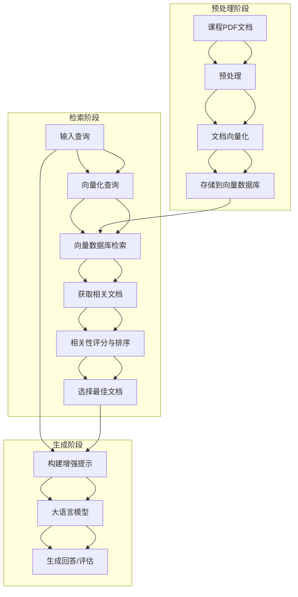
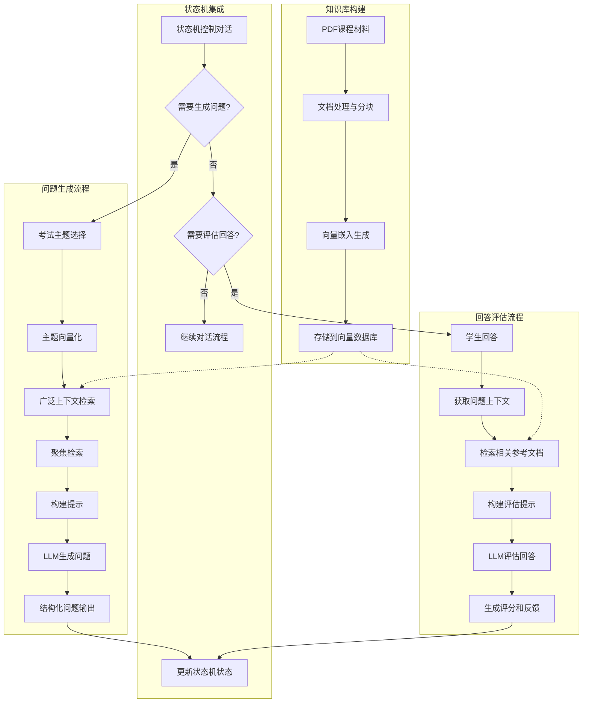
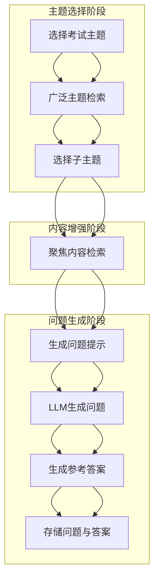
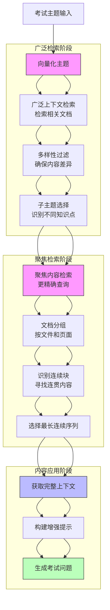

# ChatExaminer中的RAG实现

## 简介

检索增强生成（Retrieval Augmented Generation，简称RAG）是ChatExaminer系统的核心技术之一，它通过将信息检索与生成模型相结合，显著提高了系统在口试评估中的质量、准确性和领域相关性。本文档详细介绍RAG技术在ChatExaminer中的实现原理、关键组件和应用场景。

## RAG基本原理

RAG系统的基本工作原理是：
1. **检索（Retrieval）**：根据输入查询从知识库中检索相关文档或信息片段
2. **增强（Augmentation）**：将检索到的信息与原始查询结合
3. **生成（Generation）**：利用大语言模型基于增强后的输入生成高质量、知识丰富的回答

这种方法解决了大语言模型的几个关键限制：
- 减轻了"幻觉"问题，提高了回答的准确性
- 使系统能够访问最新或专业的领域知识
- 提供了可追溯的信息来源，增强了可解释性

### RAG流程图示



## 知识库构建详解

### 1. PDF文档处理与分块

系统从PDF课程材料中提取文本，并进行智能分块以构建知识库：

```python
def clean_text(text: str) -> str:
    """Clean text"""
    # Only normalize whitespace, keep original content
    text = re.sub(r"\s+", " ", text)  # Normalize whitespace
    return text.strip()


def extract_and_chunk_pdfs(
    pdf_directory: Path = PDF_DIR,
) -> List[tuple[DocumentMetadata, str]]:
    """
    Extract text from PDFs with intelligent chunking

    Args:
        pdf_directory: Directory containing PDF files

    Returns:
        List of tuples containing metadata and text chunks
    """
    documents = []

    # Initialize text splitter with optimal parameters
    text_splitter = RecursiveCharacterTextSplitter(
        chunk_size=1000,
        chunk_overlap=200,
        length_function=len,
        separators=["\n\n", "\n", ".", "!", "?", ";", " ", ""],
    )

    pdf_directory.mkdir(parents=True, exist_ok=True)

    for filename in os.listdir(pdf_directory):
        if not filename.endswith(".pdf"):
            continue

        file_path = pdf_directory / filename
        try:
            # Process PDF using PyMuPDF (fitz)
            with fitz.open(file_path) as doc:
                for page_num, page in enumerate(doc):
                    # Extract text from page
                    text = page.get_text()

                    # Clean and preprocess text
                    cleaned_text = clean_text(text)
                    if not cleaned_text.strip():
                        continue

                    # langchain text chunking
                    chunks = text_splitter.split_text(cleaned_text)

                    # Process each text chunk
                    for chunk_idx, chunk in enumerate(chunks):
                        # Skip chunks that are too short
                        if len(chunk.split()) < 20:  # Minimum 20 words per chunk
                            continue

                        metadata = DocumentMetadata(
                            filename=filename,
                            page_number=page_num + 1,
                            chunk_index=chunk_idx,
                        )
                        documents.append((metadata, chunk))

        except Exception as e:
            print(f"Error processing {filename}: {str(e)}")
            continue

    return documents
```

分块策略特点：
1. **固定大小的块**：每块约1000字符，确保语义单元的完整性
2. **块间重叠**：相邻块重叠200字符，避免关键信息被分割
3. **自然边界分割**：优先在段落、句子等自然边界处分割文本
4. **最小内容保证**：过滤少于20个词的短块，确保内容丰富性
5. **元数据跟踪**：每个块都附带文件名、页码和块索引，便于溯源

### 2. 文档向量化

系统使用预训练的Sentence Transformer模型将文本转换为向量表示：

```python
def vectorize_documents(documents):
    """Vectorize documents with metadata"""
    vectors = []
    for metadata, text in documents:
        embedding = model.encode(text, show_progress_bar=True)
        vectors.append((metadata, text, embedding))
    return vectors

# Load pre-trained embedding model (e.g., SBERT)
model = SentenceTransformer("all-MiniLM-L6-v2")

# Vectorize documents
document_vectors = vectorize_documents(pdf_documents)

# Create vector database
db = InMemoryExactNNVectorDB[KnowledgeDoc](workspace="./vectorDB_workspace")

# Create list of all documents
doc_list = [
    KnowledgeDoc(text=text, embedding=np.array(embedding), metadata=metadata)
    for metadata, text, embedding in document_vectors
]

# Index documents into database
db.index(inputs=DocList[KnowledgeDoc](doc_list))
```

向量化过程特点：
1. **高效语义嵌入**：使用all-MiniLM-L6-v2模型，它平衡了性能和计算效率
2. **元数据保留**：在向量化过程中保留文档的元数据信息
3. **内存向量数据库**：使用InMemoryExactNNVectorDB存储向量，支持高效的最近邻搜索
4. **结构化存储**：使用KnowledgeDoc结构体统一存储文本、向量和元数据

### 3. 语义搜索实现

系统提供了语义搜索功能，用于检索与查询语义相关的文档：

```python
def semantic_search(query_text: str, db, model, top_k=3):
    """Perform semantic search with metadata in results"""
    processed_query = clean_text(query_text)

    query_embedding = model.encode(processed_query)
    query_doc = KnowledgeDoc(
        text=processed_query,
        embedding=query_embedding,
        metadata=DocumentMetadata(filename="query", page_number=0, chunk_index=0),
    )

    results = db.search(inputs=DocList[KnowledgeDoc]([query_doc]), limit=top_k)
    return results
```

搜索特点：
1. **查询向量化**：将查询文本转换为与文档相同空间的向量表示
2. **语义匹配**：基于向量相似度而非关键词匹配进行检索
3. **灵活的结果数量**：可自定义返回的top_k结果数量
4. **元数据关联**：检索结果包含完整的元数据，便于溯源和后续处理

## ChatExaminer中的RAG架构

### 1. 核心组件

ChatExaminer的RAG系统由以下核心组件组成：

#### RAGPipeline类

`RAGPipeline`是整个RAG系统的核心实现，负责协调检索和生成过程：

```python
class RAGPipeline:
    def __init__(self, questions_file: Path = QUESTIONS_FILE):
        """初始化RAG管道与指定问题文件路径"""
        self.questions_file = questions_file
        self.questions = self.load_questions()

    # 其他方法...
```

#### RAGService服务

`RAGService`作为系统服务层的一部分，为前端和其他服务提供RAG功能的接口：

```python
class RAGService:
    def __init__(self):
        self.rag_pipeline = RAGPipeline(questions_file=settings.DATA_DIR / "exam_questions.json")
        self.tree_generator = ConversationTreeGenerator()

    async def generate_question(self, topic: str, difficulty: int):
        return self.rag_pipeline.generate_question(topic, difficulty)

    async def evaluate_answer(self, question_id: str, answer: str):
        return self.rag_pipeline.answer_question(question_id, answer)
```

#### 向量数据库

系统使用向量数据库存储文档嵌入，支持高效的相似性搜索：
- 使用`docarray`组织和存储文档向量
- 使用`vectordb`管理和查询这些向量

### 2. 关键流程

#### 上下文检索流程

RAG系统实现了两阶段检索策略以获取最相关的内容：

```python
def get_relevant_context(self, question: str, top_k: int = 5) -> List[str]:
    """改进的上下文检索"""
    # 将问题向量化
    question_embedding = model.encode(question)

    # 创建带元数据的查询文档
    query_doc = KnowledgeDoc(
        text=question,
        embedding=question_embedding,
        metadata=DocumentMetadata(filename="query", page_number=0, chunk_index=0),
    )

    # 在向量数据库中搜索
    results = db.search(
        inputs=DocList[KnowledgeDoc]([query_doc]),
        limit=top_k * 2,  # 初始获取更多结果以便更好的过滤
    )

    # 增强相关性评分
    scored_contexts = []
    question_keywords = set(question.lower().split())

    for match in results[0].matches:
        text = " ".join(match.text.split())  # 清理文本
        # 计算相关性分数
        text_keywords = set(text.lower().split())
        keyword_overlap = len(question_keywords & text_keywords)
        relevance_score = keyword_overlap / len(question_keywords)

        scored_contexts.append(
            {"text": text, "score": relevance_score, "metadata": match.metadata}
        )

    # 按相关性排序并选择top_k
    scored_contexts.sort(key=lambda x: x["score"], reverse=True)
    return scored_contexts[:top_k]
```

#### 问题生成流程

系统利用RAG生成考试问题，确保问题基于课程材料并具有适当的难度：

```python
def generate_question(
    self, topic: str, subtopic: str, difficulty: int, context: Dict[str, Any]
) -> ExamQuestion:
    """基于主题、子主题、难度和上下文生成问题"""
    # 实现详情...
```

### ChatExaminer中的RAG应用场景



## RAG在问题生成中的实现细节

### 1. 问题生成流程详解

问题生成是ChatExaminer中RAG技术的核心应用，它通过多阶段处理实现高质量、与课程内容紧密对齐的考试问题：



#### 步骤1: 广泛主题检索

首先，系统基于用户选择的主题进行广泛的知识库检索，为后续提问奠定知识基础：

```python
def get_broad_context(self, topic: str, top_k: int = 15) -> List[Dict[str, Any]]:
    """First-round search: Get broad context related to the topic"""
    # Vectorize the topic
    topic_embedding = model.encode(topic)
    query_doc = KnowledgeDoc(
        text=topic,
        embedding=topic_embedding,
        metadata=DocumentMetadata(filename="query", page_number=0, chunk_index=0),
    )

    # Perform vector search
    results = db.search(
        inputs=DocList[KnowledgeDoc]([query_doc]),
        limit=top_k,
    )

    # Extract result texts and metadata
    broad_contexts = [
        {"text": match.text, "metadata": match.metadata} for match in results[0].matches
    ]

    # Filter to ensure contexts are sufficiently different
    filtered_contexts = []
    used_texts = set()

    for context in broad_contexts:
        # Use first 100 characters as a unique identifier
        text_key = context["text"][:100]
        if text_key not in used_texts:
            used_texts.add(text_key)
            filtered_contexts.append(context)
            # Stop when we have enough subtopics
            if len(filtered_contexts) >= num_subtopics:
                break

    return filtered_contexts
```

#### 步骤2: 聚焦内容检索

针对选定的子主题，系统进行更精确的检索，获取连续、相关的内容：

```python
def focused_search(self, selected_context: Dict[str, Any], top_k: int = 3) -> List[Dict[str, Any]]:
    """Second-round search: Focused search based on selected content ensuring continuity"""
    # Vectorize the selected context
    context_embedding = model.encode(selected_context["text"])
    query_doc = KnowledgeDoc(
        text=selected_context["text"],
        embedding=context_embedding,
        metadata=DocumentMetadata(filename="query", page_number=0, chunk_index=0),
    )

    # Get initial results
    results = db.search(
        inputs=DocList[KnowledgeDoc]([query_doc]),
        limit=top_k * 2,  # Get more initial results to find continuous blocks
    )

    # Group contexts by file and page
    grouped_contexts = {}
    for match in results[0].matches:
        key = (match.metadata.filename, match.metadata.page_number)
        if key not in grouped_contexts:
            grouped_contexts[key] = []
        grouped_contexts[key].append(
            {
                "text": match.text,
                "metadata": match.metadata,
                "chunk_index": match.metadata.chunk_index,
            }
        )

    # Find continuous blocks
    continuous_contexts = []
    for contexts in grouped_contexts.values():
        # Sort by chunk index
        contexts.sort(key=lambda x: x["chunk_index"])

        # Find continuous sequences
        current_sequence = []
        for context in contexts:
            if not current_sequence:
                current_sequence.append(context)
            elif context["chunk_index"] == current_sequence[-1]["chunk_index"] + 1:
                current_sequence.append(context)
            # When sequence breaks, store existing sequence and start new one
            else:
                if len(current_sequence) > 1:  # Only keep sequences of length > 1
                    continuous_contexts.append(current_sequence)
                current_sequence = [context]

    # Choose longest continuous sequence
    if continuous_contexts:
        longest_sequence = max(continuous_contexts, key=len)
        return longest_sequence[:top_k]  # Limit returned amount

    # If no continuous sequences, return original results
    return [
        {"text": match.text, "metadata": match.metadata}
        for match in results[0].matches[:top_k]
    ]
```

#### 步骤3: 问题生成

基于检索到的内容，系统构建专用提示并调用LLM生成考试问题：

```python
def generate_question(
    self, topic: str, subtopic: str, difficulty: int, context: Dict[str, Any]
) -> ExamQuestion:
    """Generate a single question"""
    # Get existing questions for the same subtopic and different difficulty
    existing_questions = [
        q
        for q in self.questions.values()
        if q.subtopic == subtopic and q.difficulty != difficulty
    ]

    # Build prompt for existing questions
    existing_questions_prompt = ""
    if existing_questions:
        existing_questions_prompt = "\nExisting questions for this subtopic:\n"
        for q in existing_questions:
            existing_questions_prompt += f"- Difficulty {q.difficulty}/5: {q.question}\n"

    # Add filename and page number information
    source_info = f"Source: {context['metadata'].filename}, Page {context['metadata'].page_number}"

    # Retrieve focused contexts
    focused_contexts = self.focused_search(context)
    context_text = "\n".join(c["text"] for c in focused_contexts)

    # Enhanced prompt for specific question generation
    prompt = f"""Based on the following specific context, generate a precise and focused exam question related to the topic '{topic}'.

Topic: {topic}
Difficulty: {difficulty}/5
Selected Content: {context['text'][:200]}...

{existing_questions_prompt}
Requirements:
1. Focus on a single, specific concept, formula, or relationship related to the topic
2. Question must be answerable using ONLY the provided context
3. Maximum length: 15 words
4. Question difficulty should be distinct from existing questions:
   - Difficulty 1: Basic recall and simple understanding
   - Difficulty 2: Application of concepts
   - Difficulty 3: Analysis and relationships
   - Difficulty 4: Evaluation and comparison
   - Difficulty 5: Synthesis and deep understanding
5. Instead of asking "What is X?", consider:
   - Difficulty 1-2: Components, parameters, basic relationships
   - Difficulty 3: Mathematical meanings, specific conditions
   - Difficulty 4: Compare and contrast, advantages/disadvantages
   - Difficulty 5: Complex relationships, theoretical implications

Context for reference:
{context_text}

Generate a focused question that tests understanding at the appropriate difficulty level."""

    # Generate question using GPT-4
    response = client.chat.completions.create(
        model="gpt-4o-mini-2024-07-18",
        messages=[
            {
                "role": "system",
                "content": "You are an expert at generating precise, focused exam questions. Avoid broad, open-ended questions."
            },
            {
                "role": "user",
                "content": prompt,
            },
        ],
        temperature=0.7,
    )

    question_text = response.choices[0].message.content.strip()

    # Generate reference answers... (omitted)

    # Create question object and save
    question = ExamQuestion(
        question_id=f"Q{len(self.questions) + 1}",
        question=question_text,
        context=[c["text"] for c in focused_contexts],
        difficulty=difficulty,
        topic=topic,
        subtopic=subtopic,
        context_metadata=[
            {
                "filename": c["metadata"].filename,
                "page_number": c["metadata"].page_number,
                "chunk_index": c["metadata"].chunk_index,
            }
            for c in focused_contexts
        ],
        expected_answers=expected_answers,  # Contains reference answers
    )

    self.questions[question.question_id] = question
    self.save_questions()

    return question
```

### 2. 问题生成的创新特点

ChatExaminer的RAG增强问题生成具有以下创新特点：

#### 多难度分层生成

系统能根据指定难度生成不同层次的问题，并在提示中明确定义难度级别：
- **难度1**：基本概念回忆与简单理解
- **难度2**：概念应用和基本解释
- **难度3**：概念间关系分析和条件应用
- **难度4**：不同概念的评估与比较
- **难度5**：综合应用和深度理解

#### 课程内容对齐保证

系统通过多层检索策略确保问题紧密对齐课程内容：
1. 广泛主题检索：确定相关文档
2. 子主题选择：确保覆盖主题的不同方面
3. 聚焦内容检索：获取连续、详细的内容块
4. 上下文融合提示：确保问题基于实际教材生成

#### 问题差异化保证

系统采用多种策略确保生成的问题具有差异性：
1. 记录已生成问题，避免重复
2. 在提示中包含已有问题作为参考
3. 对文本片段进行多样化筛选
4. 通过文本特征提取引导不同问题形式

#### 参考答案生成

系统不仅生成问题，还通过RAG生成多级参考答案，用于后续评估：
1. **正确答案**：包含所有关键点的完整回答
2. **部分正确**：包含一些正确点但缺少关键细节的回答
3. **错误答案**：展示常见误解的回答

#### 可溯源性设计

每个生成的问题都保留完整的溯源信息：
1. 来源文档名称
2. 页码和块索引
3. 使用的完整上下文
4. 问题生成提示

这种设计使教师能够追踪问题的来源，确保质量和准确性。

## RAG在系统中的应用

### 1. 考试问题生成

RAG技术用于生成与课程材料紧密对齐的问题：
1. 首先在向量数据库中检索与主题相关的广泛上下文
2. 进行聚焦搜索获取连续的文本块
3. 基于检索到的内容构建提示
4. 使用LLM生成包含问题、正确答案和评分标准的结构化输出

### 2. 学生回答评估

RAG在评估学生回答时发挥关键作用：

```python
def evaluate_answer(
    self, question: str, answer: str, exam_context: ExamContext
) -> Dict[str, Any]:
    """评估学生的回答"""
    # 检索用于评估的相关文档
    docs = self._retrieve_relevant_docs(
        exam_context.current_topic, exam_context
    )

    # 创建评估提示
    eval_prompt = self._create_evaluation_prompt(
        question, answer, docs, exam_context
    )

    # 评估逻辑...
```

评估提示结合了检索到的相关文档，使评估更加准确：

```python
def _create_evaluation_prompt(
    self,
    question: str,
    student_answer: str,
    relevant_docs: List[str],
    exam_context: ExamContext,
) -> str:
    """创建评估提示"""
    prompt = (
        "Please evaluate the student's answer:\n\n"
        f"Question: {question}\n\n"
        f"Student's Answer: {student_answer}\n\n"
        f"Reference Knowledge:\n{chr(10).join(relevant_docs)}\n\n"
        "Evaluation Requirements:\n"
        "1. Accuracy: Does the answer align with knowledge base content\n"
        "2. Completeness: Does it cover all aspects of the question\n"
        "3. Depth of Understanding: Does it demonstrate deep concept comprehension\n"
        "4. Clarity: Is the answer well-structured and clear\n\n"
        "Please provide:\n"
        "1. Score (0-100)\n"
        "2. Detailed evaluation\n"
        "3. Suggestions for improvement"
    )
    return prompt
```

### 3. 与状态机集成

RAG系统与状态机紧密集成，支持智能对话流程：

```
状态机和RAG系统的协作流程如下：
1. 状态机接收用户输入并确定当前状态
2. 基于当前状态和输入确定下一个状态
3. 如需生成问题，调用RAG系统的`generate_question`方法
4. RAG系统基于话题从知识库检索相关文档
5. RAG系统使用检索到的文档生成问题
6. 状态机将问题展示给学生
7. 学生回答后，状态机再次分析状态并可能调用RAG的`evaluate_answer`方法
```

## 技术特点与优势

### 1. 两阶段检索策略

ChatExaminer实现了创新的两阶段检索策略：
- **广泛检索**：首先获取与主题广泛相关的文档
- **聚焦检索**：然后基于初步结果进行更精确的检索，确保获取连续、相关的信息

#### 层层递进的检索流程

这种层层递进的检索策略能够有效提升问题生成的质量和相关性：



#### 广泛上下文检索详解

广泛上下文检索的目标是从课程材料中获取与主题相关的广泛内容，为后续定向检索提供基础：

1. **主题向量化**：将用户选择的考试主题转换为向量表示
2. **相似度搜索**：使用向量相似度在数据库中检索多个相关文档片段
3. **多样性保证**：通过前缀去重等方法确保检索结果多样性
4. **子主题识别**：从广泛检索结果中识别不同的知识点或子主题

#### 聚焦上下文检索详解

聚焦上下文检索则针对已选的子主题进行更精确的内容获取：

1. **内容深化**：基于选定内容进行更精确的二次检索
2. **文档分组**：将检索结果按文件名和页码分组
3. **连续性识别**：在每个分组中识别块索引连续的文本序列
4. **最优序列选择**：选择最长的连续序列，保证上下文的完整性和连贯性

#### 技术创新

此检索策略的创新点在于：

1. **渐进式深化**：从广泛到聚焦的渐进式检索过程
2. **连续性保证**：特别重视文档块的连续性，确保上下文完整
3. **多样性与精确性平衡**：在第一阶段保证多样性，第二阶段保证精确性
4. **文档结构感知**：利用元数据（文件名、页码、块索引）识别文档的物理结构

### 2. 增强的相关性评分

系统使用关键词重叠和语义相似性相结合的方法计算相关性：
- 从向量相似性获取初步结果
- 通过关键词重叠计算额外的相关性分数
- 组合两种方法确保检索质量

## RAG原理的数学表达

为了更精确地理解RAG系统的工作原理，以下使用数学符号对核心流程进行形式化表达：

### 1. 文档向量化

文档集合 $D = \{d_1, d_2, ..., d_n\}$ 经过分块处理后得到文档块集合 $C = \{c_1, c_2, ..., c_m\}$，其中每个文档块包含元数据 $M(c_i)$ 和文本内容 $T(c_i)$。

向量化过程可表示为映射函数 $f: C \rightarrow \mathbb{R}^d$，将文本映射到 $d$ 维向量空间：

$$E(c_i) = f(T(c_i))$$

其中 $E(c_i) \in \mathbb{R}^d$ 是文档块 $c_i$ 的嵌入向量。

### 2. 查询处理

给定查询 $q$，同样通过映射函数获取查询向量：

$$E(q) = f(q)$$

### 3. 相似度计算与排序

向量间相似度通常采用余弦相似度：

$$sim(q, c_i) = \frac{E(q) \cdot E(c_i)}{||E(q)|| \cdot ||E(c_i)||} = \frac{\sum_{j=1}^{d} E(q)_j \cdot E(c_i)_j}{\sqrt{\sum_{j=1}^{d} E(q)_j^2} \cdot \sqrt{\sum_{j=1}^{d} E(c_i)_j^2}}$$

### 4. 两阶段检索数学模型

#### 4.1 广泛检索阶段

给定主题 $t$，检索相关文档块集合：

$$R_{broad}(t) = TopK(\{sim(t, c_i) \mid c_i \in C\}, k_{broad})$$

其中 $TopK$ 表示取相似度最高的 $k_{broad}$ 个结果。

多样性过滤可表示为：

$$R_{filtered}(t) = \{c_i \in R_{broad}(t) \mid \forall c_j \in R_{filtered}(t), i \neq j \Rightarrow prefix(c_i) \neq prefix(c_j)\}$$

其中 $prefix(c_i)$ 表示文档块的前缀特征。

#### 4.2 聚焦检索阶段

选择子主题 $s \in R_{filtered}(t)$ 后，进行聚焦检索：

$$R_{focused}(s) = TopK(\{sim(s, c_i) \mid c_i \in C\}, k_{focused})$$

文档分组操作：

$$G(R_{focused}(s)) = \{g_1, g_2, ..., g_l\}$$

其中 $g_j = \{c_i \in R_{focused}(s) \mid M(c_i).filename = f_j \land M(c_i).page = p_j\}$

连续块识别：

$$S(g_j) = \{seq_1, seq_2, ..., seq_m\}$$

其中 $seq_k = \{c_{i_1}, c_{i_2}, ..., c_{i_p}\}$ 满足 $\forall 1 \leq a < p, M(c_{i_a}).chunk\_index + 1 = M(c_{i_{a+1}}).chunk\_index$

选择最长连续序列：

$$L(g_j) = \arg\max_{seq_k \in S(g_j)} |seq_k|$$

最终选择最佳连续序列：

$$C_{best} = \arg\max_{g_j \in G(R_{focused}(s))} |L(g_j)|$$

### 5. 增强相关性评分

混合相关性评分函数：

$$\text{score}(q, c_i) = \alpha \cdot sim(q, c_i) + (1-\alpha) \cdot \text{keyword\_overlap}(q, c_i)$$

其中关键词重叠度定义为：

$$\text{keyword\_overlap}(q, c_i) = \frac{|K(q) \cap K(c_i)|}{|K(q)|}$$

$K(x)$ 表示文本 $x$ 中的关键词集合。

### 6. 生成过程

基于检索到的上下文 $C_{retrieved}$ 和输入 $x$，增强提示构建为：

$$P(x, C_{retrieved}) = [P_{system}, x, C_{retrieved}]$$

其中 $P_{system}$ 是系统提示。

最终生成过程可表示为条件概率：

$$p(y|P(x, C_{retrieved})) = \prod_{i=1}^{|y|} p(y_i|y_{<i}, P(x, C_{retrieved}))$$

其中 $y$ 是生成的输出（问题或评估），$y_{<i}$ 表示之前生成的所有标记。

这种形式化表示为ChatExaminer状态机提供了严格的数学基础，确保系统行为的一致性和可预测性，同时支持基于概率的灵活转换机制。

## 大语言模型(LLM)的数学表达

ChatExaminer系统的核心生成和推理能力由大语言模型提供，本节使用数学语言形式化描述LLM的工作原理及其在系统中的应用。

### 1. Transformer架构基础

LLM基于Transformer架构，其数学基础可表示为：

令 $X = [x_1, x_2, ..., x_n]$ 表示输入的token序列，每个token被嵌入为 $d$ 维向量。位置编码 $P = [p_1, p_2, ..., p_n]$ 添加到输入中以提供位置信息，得到：

$$H^0 = [x_1 + p_1, x_2 + p_2, ..., x_n + p_n]$$

### 2. 自注意力机制

自注意力机制是Transformer的核心，计算如下：

$$\text{Attention}(Q, K, V) = \text{softmax}\left(\frac{QK^T}{\sqrt{d_k}}\right)V$$

其中：
- $Q = H^{l-1}W_Q^l$ 为查询矩阵
- $K = H^{l-1}W_K^l$ 为键矩阵
- $V = H^{l-1}W_V^l$ 为值矩阵
- $d_k$ 是键向量的维度
- $W_Q^l, W_K^l, W_V^l$ 是可学习的参数矩阵

多头注意力机制为：

$$\text{MultiHead}(H^{l-1}) = \text{Concat}(\text{head}_1, ..., \text{head}_h)W^O$$

其中每个头部 $\text{head}_i$ 计算为：

$$\text{head}_i = \text{Attention}(H^{l-1}W_{Q_i}, H^{l-1}W_{K_i}, H^{l-1}W_{V_i})$$

### 3. 前馈网络层

每个Transformer层还包含一个前馈网络：

$$\text{FFN}(x) = \max(0, xW_1 + b_1)W_2 + b_2$$

综合起来，第 $l$ 层的输出为：

$$H^l = \text{LayerNorm}(H^{l-1} + \text{MultiHead}(H^{l-1}))$$
$$H^l = \text{LayerNorm}(H^l + \text{FFN}(H^l))$$

### 4. 生成过程

给定上下文 $c = [c_1, c_2, ..., c_m]$，LLM生成下一个token的概率分布为：

$$P(x_{m+1} | c) = \text{softmax}(H^L W_E^T)$$

其中 $H^L$ 是最后一层的隐藏状态，$W_E$ 是嵌入矩阵。

整个序列的生成概率可表示为：

$$P(x_{1:n}) = \prod_{i=1}^{n} P(x_i | x_{1:i-1})$$

### 5. 在ChatExaminer中的应用

#### 5.1 提示工程数学表示

ChatExaminer系统中的提示可表示为函数 $\Phi: (q, c, r) \rightarrow p$，将问题 $q$、上下文 $c$ 和规则 $r$ 映射到提示 $p$：

$$p = \Phi(q, c, r) = r \oplus q \oplus c$$

其中 $\oplus$ 表示字符串连接操作。

#### 5.2 提示模板化

系统使用结构化提示模板 $T(·)$，参数化为：

$$T(q, c, \theta) = \theta_{\text{prefix}} \oplus q \oplus \theta_{\text{mid}} \oplus c \oplus \theta_{\text{suffix}}$$

其中 $\theta = \{\theta_{\text{prefix}}, \theta_{\text{mid}}, \theta_{\text{suffix}}\}$ 是提示模板参数。

#### 5.3 思维链提示

对于复杂推理任务，系统使用思维链（Chain-of-Thought，CoT）提示：

$$P_{\text{CoT}}(y|x) = \sum_{z \in Z} P(y|z,x) \cdot P(z|x)$$

其中 $z$ 是推理步骤，$Z$ 是所有可能的推理路径集合。

#### 5.4 LLM与RAG集成

RAG系统中的LLM生成过程可形式化为：

$$P_{\text{RAG}}(y|x) = \sum_{z \in \text{retrieve}(x)} P_{\text{LLM}}(y|x,z) \cdot P(z|x)$$

其中 $\text{retrieve}(x)$ 是检索函数，$P(z|x)$ 是文档 $z$ 相对于查询 $x$ 的相关性概率。

### 6. LLM评估过程

在评估学生回答时，LLM的判断过程可以表示为：

$$\text{Score}(a_s, q) = f_{\text{LLM}}(a_s, q, a_r, c_q)$$

其中：
- $a_s$ 是学生回答
- $q$ 是问题
- $a_r$ 是参考答案
- $c_q$ 是相关上下文
- $f_{\text{LLM}}$ 是LLM的评估函数

### 7. 校准与一致性

为增强评估的一致性，系统使用校准函数：

$$\text{Calibrated}(s) = \gamma \cdot s + \beta$$

其中 $\gamma$ 和 $\beta$ 是基于历史评估数据学习的参数，调整原始分数 $s$ 的分布。

这些数学表达式揭示了LLM在ChatExaminer系统中的核心作用，从token级别的概率计算到高层次的提示工程和评估过程，为系统的生成和推理能力提供了理论基础。

## 结论

RAG技术是ChatExaminer系统的关键创新点，通过将检索与生成相结合，实现了：
1. 高质量、与课程材料紧密对齐的问题生成
2. 基于实际知识的准确评估
3. 智能化的对话管理

这种实现不仅提高了系统的准确性和可靠性，也为口试过程中的知识评估提供了坚实的技术基础。通过RAG技术，ChatExaminer能够模拟真实考官的行为，提供基于实际课程内容的评估和反馈。

## 在论文中讨论RAG

在论文中讨论RAG技术时，可以从以下几个方面展开：

### 1. RAG解决的核心问题

重点强调RAG如何解决大语言模型在教育评估中面临的"幻觉"问题：
- 通过检索实际课程材料确保问题和评估的准确性
- 减少生成与课程不相关内容的可能性
- 提供基于事实的评估依据

### 2. 技术创新点

描述ChatExaminer在RAG实现上的创新：
- 两阶段检索策略（广泛检索+聚焦检索）
- 连续文本块获取机制，确保上下文完整性
- 混合相关性评分（向量相似度+关键词重叠）

### 3. 实验验证

展示RAG技术在实际应用中的效果：
- 与非RAG版本的评估质量对比
- 问题相关性和评估准确性的用户研究
- 系统性能指标（检索速度、准确率等）

### 4. 与现有工作比较

将ChatExaminer的RAG实现与现有研究进行比较：
- 传统RAG模型与教育场景优化RAG的区别
- 相比其他口试系统的优势
- 在特定领域知识评估中的优化方向

## 未来工作

虽然当前的RAG实现已经能够有效支持ChatExaminer的核心功能，但仍有以下几个方向可以进一步优化：

### 1. 检索增强技术提升

- **混合检索方法**：结合关键词检索和语义检索，进一步提高相关文档的检索质量
- **动态上下文窗口**：根据问题复杂度自适应调整检索文档数量
- **跨文档推理**：实现从多个文档中整合信息，支持更复杂的知识合成

### 2. 评估增强

- **对比评估**：将学生回答与多个参考答案进行对比，提供更全面的评估
- **错误分析**：识别学生回答中的具体错误概念并提供针对性反馈
- **进度跟踪**：基于学生在不同主题的表现动态调整问题难度

### 3. 知识库优化

- **增量更新**：实现知识库的增量更新机制，无需重建整个向量数据库
- **多模态支持**：扩展到图像、图表等多模态内容，支持更丰富的教学材料
- **层次化索引**：构建主题-子主题层次结构，提高检索精确度

### 4. 性能优化

- **检索缓存**：缓存常见查询结果，减少重复计算
- **模型量化**：对嵌入模型进行量化，减少内存占用
- **分布式索引**：支持更大规模知识库的分布式检索

通过这些优化，ChatExaminer的RAG系统将能够更好地支持个性化、准确和高效的口试评估场景，为教育技术领域提供有价值的参考实现
