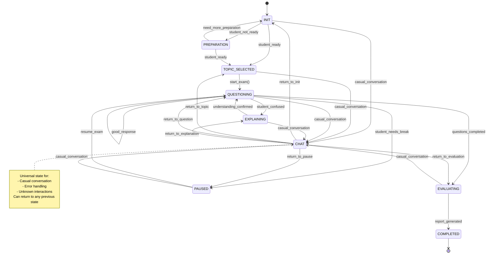

# AI Examiner Dialogue System

## Overview
The AI Examiner implements an intelligent dialogue system for conducting oral examinations. The system uses OpenAI Function Calling for state transitions and evaluations.

## Dialogue System Architecture



## State Descriptions

### 1. INIT
- Initialize examination session
- Handle greetings and casual conversation
- Wait for topic selection
- Load available topics
- Stay in INIT until specific topic mentioned

### 2. TOPIC_SELECTED
- Topic has been explicitly mentioned
- Load relevant pre-generated questions
- Prepare evaluation criteria
- Wait for exam start confirmation

### 3. QUESTIONING
- Core examination state
- Dynamic question selection
- Immediate response evaluation
- Can be paused if needed

### 4. EXPLAINING
- Provide concept explanations
- Can remain in state if more explanation needed
- Only exit when student confirms understanding
- Track hint request frequency
- Ensure no answer disclosure

### 5. PAUSED
- Handle temporary interruptions
- Maintain exam progress
- Allow for breaks and technical issues
- Resume capability

### 6. EVALUATING
- Comprehensive assessment
- Consider hint requests
- Generate detailed feedback

### 7. COMPLETED
- Generate final report
- Save conversation history
- Provide suggestions

## Implementation Notes

### State Transitions
Using OpenAI Function Calling:
```python
{
    "intention": int,     # Dialog intention type
    "evaluation": int,    # Response score (1-5)
    "metadata": {
        "hint_requested": bool,
        "difficulty": int,
        "topic": str,
        "is_greeting": bool,    # New field
        "topic_mentioned": bool  # New field
    }
}
```

### Evaluation Criteria
- Concept accuracy (40%)
- Understanding depth (30%)
- Expression clarity (20%)
- Technical terminology (10%)
- Hint requests (affects score)

## State Transitions

| Current State | Next State | Condition | Description |
|--------------|------------|-----------|-------------|
| INIT | TOPIC_SELECTED | student_ready | Student indicates readiness |
| INIT | PREPARATION | student_not_ready | Student needs preparation |
| INIT | CHAT | casual_conversation | General conversation |
| TOPIC_SELECTED | QUESTIONING | start_exam() | Begin examination |
| TOPIC_SELECTED | CHAT | casual_conversation | General conversation |
| QUESTIONING | EXPLAINING | student_confused | Student needs clarification |
| QUESTIONING | EVALUATING | questions_completed | All questions answered |
| QUESTIONING | QUESTIONING | good_response | Continue with next question |
| QUESTIONING | PAUSED | student_needs_break | Student requests break |
| QUESTIONING | CHAT | casual_conversation | General conversation |
| EXPLAINING | QUESTIONING | understanding_confirmed | Student understands |
| EXPLAINING | CHAT | casual_conversation | General conversation |
| EVALUATING | COMPLETED | report_generated | Final evaluation done |
| EVALUATING | CHAT | casual_conversation | General conversation |
| PAUSED | QUESTIONING | resume_exam | Resume examination |
| PAUSED | CHAT | casual_conversation | General conversation |
| CHAT | INIT | return_to_init | Return to initial state |
| CHAT | TOPIC_SELECTED | return_to_topic | Return to topic selection |
| CHAT | QUESTIONING | return_to_question | Return to questioning |
| CHAT | EXPLAINING | return_to_explanation | Return to explanation |
| CHAT | EVALUATING | return_to_evaluation | Return to evaluation |
| CHAT | PAUSED | return_to_pause | Return to paused state |
