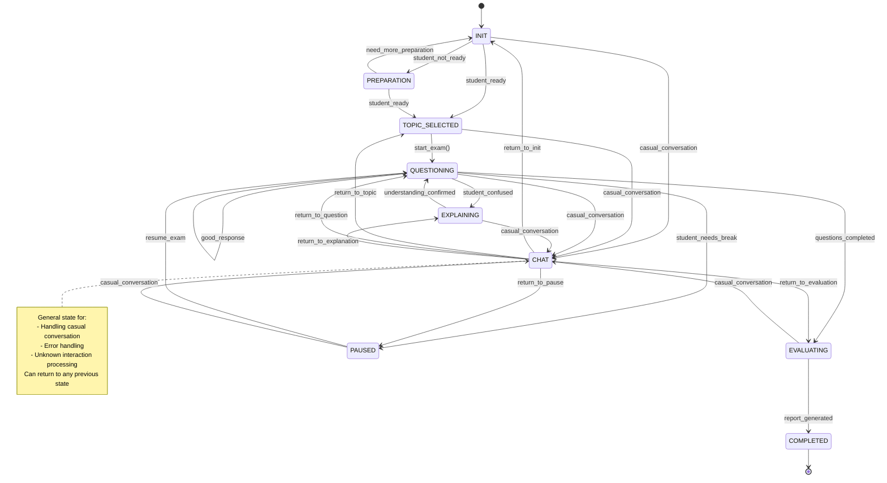

# ChatExaminer Dialogue System

## Overview
ChatExaminer implements a state machine-based intelligent dialogue system for oral examination assessment. The system uses OpenAI Function Calling technology to implement state transitions and evaluation functions, combined with Retrieval-Augmented Generation (RAG) technology to ensure that question content is closely aligned with course materials.

## Dialogue System Architecture



## State Descriptions

### 1. INIT
- Initialize exam session
- Handle greetings and casual conversation
- Wait for topic selection
- Load available topics
- Remain in this state until a specific topic is clearly mentioned

### 2. TOPIC_SELECTED
- Specific topic has been clearly mentioned
- Load pre-generated questions related to the topic
- Prepare evaluation criteria
- Wait for confirmation to start the exam

### 3. QUESTIONING
- Core exam state
- Dynamic question selection and generation
- Instant response evaluation
- Can pause as needed

### 4. EXPLAINING
- Provide concept explanations
- Remain in this state if more explanation is needed
- Exit only when the student confirms understanding
- Track prompt request frequency
- Ensure answers are not revealed

### 5. PAUSED
- Handle temporary interruptions
- Maintain exam progress
- Allow breaks and handling of technical issues
- Provide resume functionality

### 6. EVALUATING
- Comprehensive evaluation
- Consider prompt request situations
- Generate detailed feedback

### 7. COMPLETED
- Generate final report
- Save conversation history
- Provide improvement suggestions

## Implementation Details

### State Definition
The system uses enum class to define all possible states:

```python
class ConversationState(Enum):
    """Conversation state enumeration"""

    INIT = "INIT"                   # Initial state
    TOPIC_SELECTED = "TOPIC_SELECTED"  # Topic selected
    QUESTIONING = "QUESTIONING"     # Active questioning
    EXPLAINING = "EXPLAINING"       # Explaining concepts
    EVALUATING = "EVALUATING"       # Evaluating student responses
    PAUSED = "PAUSED"               # Temporarily paused
    CHAT = "CHAT"                   # Casual conversation mode
    COMPLETED = "COMPLETED"         # Exam completed
```

### State Machine Core Implementation
The state machine class manages conversation flow and state transitions:

```python
class StateMachine:
    """State machine controlling conversation flow"""

    def __init__(self):
        self.current_state = ConversationState.INIT
        self.conversation_history = []
        self.context = {"hints_used": 0, "questions_asked": [], "responses": []}

    def add_message(self, role: str, content: str):
        """Add message to conversation history"""
        self.conversation_history.append({"role": role, "content": content})

    def determine_next_state(self, user_message: str) -> Tuple[ConversationState, str]:
        """Determine next state based on user input"""
        # Create function definitions for state transitions
        functions = [
            {
                "name": "transition_to_topic_selected",
                "description": "Transition to TOPIC_SELECTED state when a topic is explicitly mentioned",
                "parameters": {
                    "type": "object",
                    "properties": {
                        "topic": {
                            "type": "string",
                            "description": "Exam topic mentioned by the student",
                        },
                        "reason": {
                            "type": "string",
                            "description": "Reason for transitioning to topic selection state",
                        },
                    },
                    "required": ["topic", "reason"],
                },
            },
            # Other state transition functions...
        ]

        # Build prompt for function calling
        system_prompt = f"""You are an AI oral examiner.
You are conducting an exam and need to determine the appropriate state for the conversation.
Current state: {self.current_state.value}

State transition rules:
- INIT → TOPIC_SELECTED: When student mentions a specific exam topic
- INIT → CHAT: When student engages in casual conversation
- TOPIC_SELECTED → QUESTIONING: When student is ready to start the exam
- TOPIC_SELECTED → CHAT: When student engages in casual conversation
...

Analyze the student's message and determine the appropriate state transition (or maintain current state).
"""

        # Add user message to context
        self.add_message("user", user_message)

        # Create messages for API call
        messages = [{"role": "system", "content": system_prompt}] + self.conversation_history[-10:]

        # Call OpenAI API
        response = openai.ChatCompletion.create(
            model="gpt-4-turbo-preview",
            messages=messages,
            functions=functions,
            function_call="auto",
            temperature=0.2,
        )

        # Process returned function call
        response_message = response.choices[0].message
        if response_message.get("function_call"):
            function_called = response_message.function_call.name
            function_args = json.loads(response_message.function_call.arguments)

            # Handle state transitions...
            if function_called == "transition_to_topic_selected":
                self.current_state = ConversationState.TOPIC_SELECTED
                self.context["selected_topic"] = function_args.get("topic")
                response_text = f"I see you want to discuss {function_args.get('topic')}. Let's prepare an exam on this topic for you."
            # Handle other state transitions...
```

### Integration with RAG Module

The state machine integrates with the Retrieval-Augmented Generation (RAG) module to ensure exam questions are generated based on the knowledge base, ensuring content alignment with course materials:

```python
class ExaminerRAG:
    """RAG engine for the examination system"""

    def __init__(self, knowledge_base_path: Path):
        """Initialize RAG engine with knowledge base"""
        self.knowledge_base_path = knowledge_base_path
        self.encoder = self._load_encoder()
        self.vector_db = self._load_vector_db()
        self.question_cache = {}

    def generate_question(self, exam_context: ExamContext) -> QuestionResponse:
        """Generate exam question based on context"""
        # Get topic from context
        topic = exam_context.current_topic

        # Retrieve relevant documents from knowledge base
        docs = self._retrieve_relevant_docs(topic, exam_context)

        # Generate question using retrieved documents
        question, context = self._generate_question(
            topic=topic,
            difficulty=exam_context.difficulty_level,
            docs=docs,
            previous_questions=exam_context.previous_questions
        )

        # Create response
        return QuestionResponse(
            question=question,
            context=context,
            metadata={
                "topic": topic,
                "difficulty": exam_context.difficulty_level,
                "generated_at": "2023-01-21T12:00:00Z"  # Use actual timestamp in real implementation
            }
        )
```

### Retrieval-Enhanced Document Processing

The system uses `docarray` and vector database to manage knowledge documents:

```python
class KnowledgeDoc(BaseDoc):
    """Document schema with metadata"""

    text: str
    embedding: NdArray[384]  # Using sentence-transformers default dimension
    metadata: DocumentMetadata
```

Each document contains:
- Text content
- Vector embedding (384 dimensions)
- Metadata (including source filename, page number, and chunk index)

### Context Management
The state machine maintains conversation context, including:

```python
class ExamContext:
    """Exam session context"""

    subject: str                    # Exam subject
    difficulty_level: int           # 1-5 difficulty level
    previous_questions: List[str]   # Previous questions
    previous_answers: List[str]     # Previous answers
    current_topic: str = ""         # Current topic
```

### State-Specific Response Generation

The system generates customized responses for each state:

```python
def generate_state_specific_response(self, user_message: str) -> str:
    """Generate state-specific response"""
    if self.current_state == ConversationState.INIT:
        return "Welcome to the AI oral examination evaluation system. Please tell me which topic you would like to be tested on."

    elif self.current_state == ConversationState.TOPIC_SELECTED:
        topic = self.context.get("selected_topic", "selected topic")
        return f"I'm ready to examine you on {topic}. Please let me know when you're ready to begin."

    elif self.current_state == ConversationState.QUESTIONING:
        # 通常这里会基于话题生成问题
        return "请根据您的理解回答以下问题。"

    # 其他状态的响应...
```

## Function Calling Practice Application

In practice, OpenAI Function Calling is used for three key functions:

1. **State Detection and Transition**：Analyze student input to determine appropriate dialog state transition
2. **Intent Understanding and Structuring**：Extract key information from unstructured dialog (e.g., topic selection, concept confusion)
3. **Evaluation and Feedback Generation**：Structured evaluation results to ensure consistency and comprehensiveness

Example system call:

```python
# 处理函数调用
if response_message.get("function_call"):
    function_called = response_message.function_call.name
    function_args = json.loads(response_message.function_call.arguments)

    if function_called == "transition_to_topic_selected":
        # 更新状态
        self.current_state = ConversationState.TOPIC_SELECTED
        # 存储上下文信息
        self.context["selected_topic"] = function_args.get("topic")
        # 生成响应
        response_text = f"I see you want to discuss {function_args.get('topic')}. Let's prepare an exam on this topic for you."
```

## RAG and State Machine Collaboration Process

The collaboration process between the state machine and the RAG system is as follows:

1. The state machine determines the current state (e.g., QUESTIONING)
2. Based on the current state, decide whether to generate a question
3. If a question is needed, call the `generate_question` method of the RAG system
4. The RAG system retrieves relevant documents from the knowledge base based on the topic
5. The RAG system generates a question using the retrieved documents, ensuring content alignment with course materials
6. The state machine receives the question and passes it to the student
7. After the student answers, the state machine analyzes the state again and may call the RAG system's `evaluate_answer` method

## System Optimization Strategy

1. **Context Window Optimization**：The state machine retains only the last 10 messages to avoid excessive context window
2. **Temperature Parameter Adjustment**：Use lower temperature (0.2) to ensure state transition certainty
3. **Exception State Handling**：General CHAT state allows recovery from exception states
4. **Cache Strategy**：Question cache avoids repeated generation of the same question
