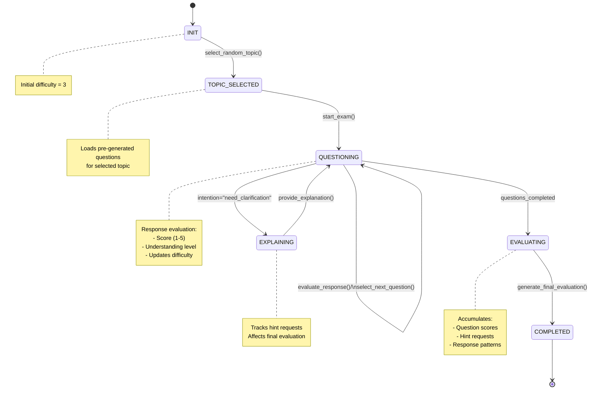

# AI Examiner Dialogue System

## Overview
The AI Examiner implements an intelligent dialogue system for conducting oral examinations. The system uses OpenAI Function Calling for state transitions and evaluations.

## Dialogue System Architecture



## State Transitions
Using OpenAI Function Calling for state transitions:
```python
{
    "intention": int,  # Dialog intention type
    "evaluation": int, # Response score (1-5)
    "metadata": {
        "hint_requested": bool,
        "difficulty": int,
        "topic": str,
        "subtopic": str
    }
}
```

## State Descriptions

### 1. INIT
- Initialize examination session
- Set initial difficulty to 3
- Load question bank and topics

### 2. TOPIC_SELECTED
- Randomly select topic and subtopic
- Load relevant pre-generated questions
- Prepare evaluation criteria

### 3. QUESTIONING
- Core examination state
- Dynamic question selection based on:
  - Current difficulty level
  - Student performance
  - Question history
- Immediate evaluation of each response

### 4. EXPLAINING
- Provide concept explanations and hints
- Track hint request frequency
- Ensure no answer disclosure
- Hint requests affect final score

### 5. EVALUATING
- Comprehensive assessment of all responses
- Consider hint request frequency
- Generate detailed feedback

### 6. COMPLETED
- Generate final evaluation report
- Save conversation history
- Provide improvement suggestions

## Implementation Notes

### Simulation Testing
```python
class Teacher:
    def respond(self, text: str, metadata: dict) -> Tuple[str, dict]:
        """Process student response and determine next action"""
        pass

class Student:
    def respond(self, text: str, metadata: dict) -> Tuple[str, dict]:
        """Generate responses based on different ability levels"""
        pass
```

### Data Storage
```
conversations/
└── {teacher}_{student}_{conversation_id}.json
```

### Evaluation Criteria
- Concept accuracy (40%)
- Understanding depth (30%)
- Expression clarity (20%)
- Technical terminology usage (10%)
- Hint request frequency (affects final score)
