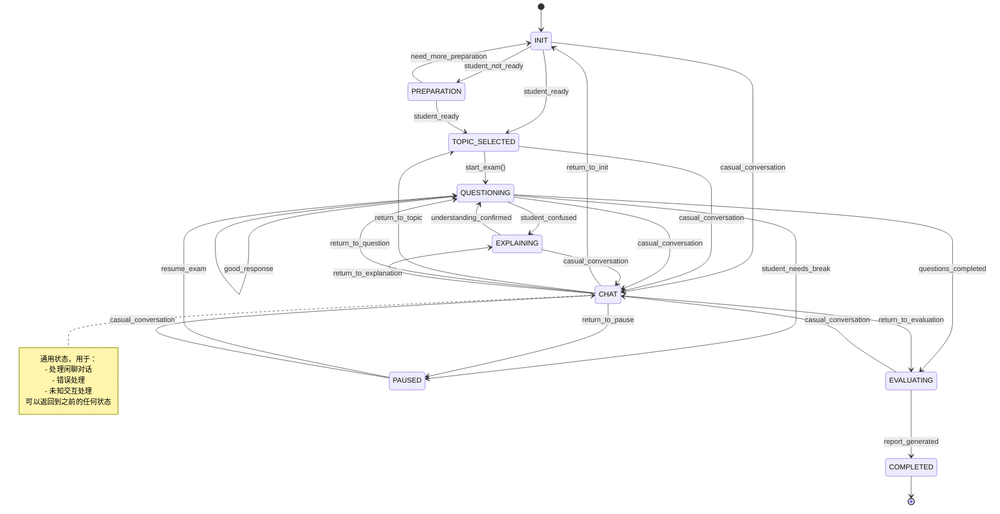

# ChatExaminer 对话系统

## 概述
ChatExaminer 实现了一个基于状态机的智能对话系统，用于进行口试评估。系统使用 OpenAI Function Calling 技术实现状态转换和评估功能，结合检索增强生成（RAG）技术保证问题内容与课程材料的紧密对齐。

## 对话系统架构



## 状态描述

### 1. INIT
- 初始化考试会话
- 处理问候和闲聊
- 等待话题选择
- 加载可用话题
- 在明确提及特定话题前保持在此状态

### 2. TOPIC_SELECTED
- 已明确提及特定话题
- 加载与话题相关的预生成问题
- 准备评估标准
- 等待考试开始确认

### 3. QUESTIONING
- 核心考试状态
- 动态问题选择与生成
- 即时响应评估
- 可根据需要暂停

### 4. EXPLAINING
- 提供概念解释
- 如果需要更多解释可保持在此状态
- 仅在学生确认理解后退出
- 跟踪提示请求频率
- 确保不泄露答案

### 5. PAUSED
- 处理临时中断
- 维持考试进度
- 允许休息和处理技术问题
- 提供恢复功能

### 6. EVALUATING
- 综合评估
- 考虑提示请求情况
- 生成详细反馈

### 7. COMPLETED
- 生成最终报告
- 保存对话历史
- 提供改进建议

## 实现细节

### 状态定义
系统使用枚举类定义所有可能的状态：

```python
class ConversationState(Enum):
    """对话状态枚举"""

    INIT = "INIT"                   # 初始状态
    TOPIC_SELECTED = "TOPIC_SELECTED"  # 已选择话题
    QUESTIONING = "QUESTIONING"     # 主动提问
    EXPLAINING = "EXPLAINING"       # 解释概念
    EVALUATING = "EVALUATING"       # 评估学生回答
    PAUSED = "PAUSED"               # 临时暂停
    CHAT = "CHAT"                   # 闲聊模式
    COMPLETED = "COMPLETED"         # 考试完成
```

### 状态机核心实现
状态机类管理对话流程和状态转换：

```python
class StateMachine:
    """控制对话流程的状态机"""

    def __init__(self):
        self.current_state = ConversationState.INIT
        self.conversation_history = []
        self.context = {"hints_used": 0, "questions_asked": [], "responses": []}

    def add_message(self, role: str, content: str):
        """添加消息到对话历史"""
        self.conversation_history.append({"role": role, "content": content})

    def determine_next_state(self, user_message: str) -> Tuple[ConversationState, str]:
        """根据用户输入决定下一个状态"""
        # 创建状态转换的函数定义
        functions = [
            {
                "name": "transition_to_topic_selected",
                "description": "当明确提及话题时转换到 TOPIC_SELECTED 状态",
                "parameters": {
                    "type": "object",
                    "properties": {
                        "topic": {
                            "type": "string",
                            "description": "学生提及的考试话题",
                        },
                        "reason": {
                            "type": "string",
                            "description": "转换到话题选择状态的原因",
                        },
                    },
                    "required": ["topic", "reason"],
                },
            },
            # 其他状态转换函数...
        ]

        # 构建用于 function calling 的提示
        system_prompt = f"""您是一位AI口试考官。
您正在进行考试，需要确定对话的适当状态。
当前状态: {self.current_state.value}

状态转换规则:
- INIT → TOPIC_SELECTED: 当学生提及特定考试话题时
- INIT → CHAT: 当学生进行闲聊时
- TOPIC_SELECTED → QUESTIONING: 当学生准备开始考试时
- TOPIC_SELECTED → CHAT: 当学生进行闲聊时
...

分析学生的消息并确定适当的状态转换（或保持当前状态）。
"""

        # 将用户消息添加到上下文
        self.add_message("user", user_message)

        # 创建 API 调用的消息
        messages = [{"role": "system", "content": system_prompt}] + self.conversation_history[-10:]

        # 调用OpenAI API
        response = openai.ChatCompletion.create(
            model="gpt-4-turbo-preview",
            messages=messages,
            functions=functions,
            function_call="auto",
            temperature=0.2,
        )

        # 处理返回的函数调用
        response_message = response.choices[0].message
        if response_message.get("function_call"):
            function_called = response_message.function_call.name
            function_args = json.loads(response_message.function_call.arguments)

            # 处理状态转换...
            if function_called == "transition_to_topic_selected":
                self.current_state = ConversationState.TOPIC_SELECTED
                self.context["selected_topic"] = function_args.get("topic")
                response_text = f"我看到您想讨论{function_args.get('topic')}。让我们为您准备这个话题的考试。"
            # 处理其他状态转换...
```

### 与RAG模块集成

状态机与检索增强生成(RAG)模块集成，确保考试问题基于知识库生成，保证内容与课程材料的对齐：

```python
class ExaminerRAG:
    """考试系统的RAG引擎"""

    def __init__(self, knowledge_base_path: Path):
        """使用知识库初始化RAG引擎"""
        self.knowledge_base_path = knowledge_base_path
        self.encoder = self._load_encoder()
        self.vector_db = self._load_vector_db()
        self.question_cache = {}

    def generate_question(self, exam_context: ExamContext) -> QuestionResponse:
        """基于上下文生成考试问题"""
        # 从上下文获取话题
        topic = exam_context.current_topic

        # 从知识库中检索相关文档
        docs = self._retrieve_relevant_docs(topic, exam_context)

        # 使用检索到的文档生成问题
        question, context = self._generate_question(
            topic=topic,
            difficulty=exam_context.difficulty_level,
            docs=docs,
            previous_questions=exam_context.previous_questions
        )

        # 创建响应
        return QuestionResponse(
            question=question,
            context=context,
            metadata={
                "topic": topic,
                "difficulty": exam_context.difficulty_level,
                "generated_at": "2023-01-21T12:00:00Z"  # 实际实现中使用真实时间戳
            }
        )
```

### 检索增强的文档处理

系统使用`docarray`和向量数据库来管理知识文档：

```python
class KnowledgeDoc(BaseDoc):
    """带元数据的文档模式"""

    text: str
    embedding: NdArray[384]  # 使用 sentence-transformers 的默认维度
    metadata: DocumentMetadata
```

每个文档都包含：
- 文本内容
- 向量嵌入（384维）
- 元数据（包括来源文件名、页码和块索引）

### 上下文管理
状态机维护会话上下文，包括：

```python
class ExamContext:
    """考试会话的上下文"""

    subject: str                    # 考试科目
    difficulty_level: int           # 1-5难度等级
    previous_questions: List[str]   # 之前的问题
    previous_answers: List[str]     # 之前的答案
    current_topic: str = ""         # 当前话题
```

### 状态特定响应生成

系统为每个状态生成定制化响应：

```python
def generate_state_specific_response(self, user_message: str) -> str:
    """根据当前状态生成特定响应"""
    if self.current_state == ConversationState.INIT:
        return "欢迎使用AI口试评估系统。请告诉我您想在哪个话题上进行考试。"

    elif self.current_state == ConversationState.TOPIC_SELECTED:
        topic = self.context.get("selected_topic", "所选话题")
        return f"我准备好在{topic}上对您进行考试。请告诉我您何时准备好开始。"

    elif self.current_state == ConversationState.QUESTIONING:
        # 通常这里会基于话题生成问题
        return "请根据您的理解回答以下问题。"

    # 其他状态的响应...
```

## Function Calling实践应用

实际系统中，OpenAI Function Calling 用于三个关键功能：

1. **状态检测与转换**：分析学生输入，确定适当的对话状态转换
2. **意图理解与结构化**：从非结构化对话中提取关键信息（如话题选择、概念混淆）
3. **评估与反馈生成**：结构化评估结果，确保一致性和全面性

示例系统调用：

```python
# 处理函数调用
if response_message.get("function_call"):
    function_called = response_message.function_call.name
    function_args = json.loads(response_message.function_call.arguments)

    if function_called == "transition_to_topic_selected":
        # 更新状态
        self.current_state = ConversationState.TOPIC_SELECTED
        # 存储上下文信息
        self.context["selected_topic"] = function_args.get("topic")
        # 生成响应
        response_text = f"我看到您想讨论{function_args.get('topic')}。让我们为您准备这个话题的考试。"
```

## RAG与状态机协作流程

状态机和RAG系统的协作流程如下：

1. 状态机确定当前状态（如QUESTIONING）
2. 根据当前状态，决定是否需要生成问题
3. 如需生成问题，调用RAG系统的`generate_question`方法
4. RAG系统基于话题从知识库检索相关文档
5. 使用检索到的文档生成问题，确保内容与课程材料对齐
6. 状态机接收问题并传递给学生
7. 学生回答后，状态机再次分析状态并可能调用RAG的`evaluate_answer`方法

## 系统优化策略

1. **上下文窗口优化**：状态机只保留最近10条消息，避免上下文窗口过大
2. **温度参数调整**：使用较低温度(0.2)确保状态转换的确定性
3. **异常状态处理**：通用CHAT状态允许从异常状态恢复
4. **缓存策略**：问题缓存避免重复生成相同问题
