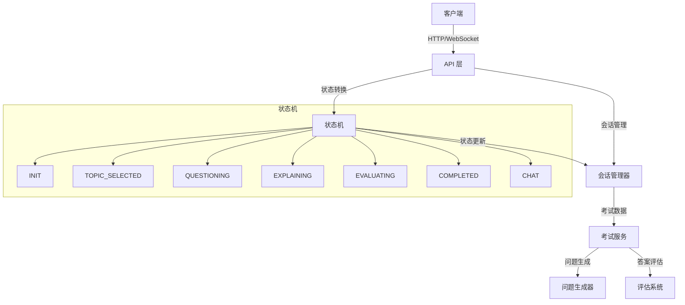
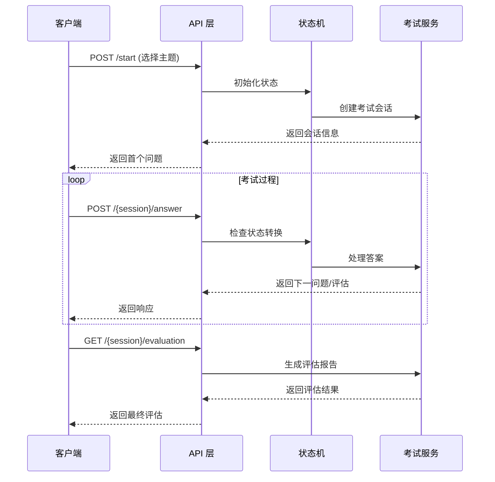

# ChatExaminer API 文档

## 设计原理

### 架构概述

ChatExaminer API 采用 RESTful 架构风格设计，同时结合 WebSocket 提供实时交互能力。系统架构分为以下几个核心部分：

1. **状态管理**
   - 采用有限状态机(FSM)管理考试流程
   - 每个考试会话维护独立的状态
   - 支持状态间的平滑过渡和异常处理

2. **会话管理**
   - 基于 UUID 的会话标识
   - 服务端维护会话状态和上下文
   - 支持多用户并发考试

3. **通信模式**
   - REST API：用于基础的考试流程控制
   - WebSocket：用于实时问答交互
   - 混合模式：确保最佳的用户体验

### 系统架构图



### 接口设计原则

1. **RESTful 规范**
   - 使用标准 HTTP 方法
   - 资源化的 URL 设计
   - 无状态通信原则

2. **实时交互**
   - WebSocket 保持长连接
   - 双向通信支持
   - 实时状态同步

3. **可扩展性**
   - 模块化的接口设计
   - 版本控制支持
   - 灵活的状态转换机制

4. **安全性**
   - 会话级别的隔离
   - 输入验证和消毒
   - 错误处理机制

5. **可维护性**
   - 清晰的接口文档
   - 标准的错误响应
   - 完整的状态追踪

### 数据流图



## 基本信息

- 基础URL: `http://localhost:8000/api/exam`
- 所有请求和响应均使用 JSON 格式
- 所有时间戳使用 ISO 8601 格式

## 通用响应格式

```json
{
    "state": "当前状态",
    "message": "响应消息",
    "data": {
        // 具体数据
    }
}
```

## 状态定义

- `INIT`: 初始状态
- `TOPIC_SELECTED`: 已选择考试主题
- `QUESTIONING`: 问答阶段
- `EXPLAINING`: 解释阶段
- `EVALUATING`: 评估阶段
- `COMPLETED`: 考试完成
- `CHAT`: 闲聊状态

## API 端点

### 1. 启动考试会话

启动新的考试会话并选择考试主题。

- **URL**: `/start`
- **方法**: `POST`
- **请求体**:
  ```json
  {
      "topic": "考试主题"
  }
  ```
- **成功响应** (200):
  ```json
  {
      "state": "QUESTIONING",
      "message": "考试会话已创建并开始",
      "data": {
          "session_id": "uuid",
          "result": {
              "type": "state_change",
              "state": "QUESTIONING"
          },
          "current_question": {
              "question": "问题内容",
              "difficulty": 3
          }
      }
  }
  ```
- **错误响应** (400):
  ```json
  {
      "detail": "错误信息"
  }
  ```

### 2. 提交答案

提交对当前问题的回答。

- **URL**: `/{session_id}/answer`
- **方法**: `POST`
- **请求体**:
  ```json
  {
      "answer": "学生的回答"
  }
  ```
- **成功响应** (200):
  ```json
  {
      "state": "QUESTIONING",
      "message": "回答已处理",
      "data": {
          "result": {
              "type": "response",
              "feedback": "反馈信息"
          },
          "current_question": {
              "question": "下一个问题",
              "difficulty": 3
          }
      }
  }
  ```
- **错误响应** (404):
  ```json
  {
      "detail": "考试会话不存在"
  }
  ```

### 3. 获取考试状态

获取当前考试会话的状态信息。

- **URL**: `/{session_id}/state`
- **方法**: `GET`
- **成功响应** (200):
  ```json
  {
      "state": "QUESTIONING",
      "message": "当前考试状态",
      "data": {
          "context": {
              "questions_answered": 3,
              "hints_requested": 1,
              "current_difficulty": 3,
              "topic": "考试主题"
          },
          "current_question": {
              "question": "当前问题",
              "difficulty": 3
          }
      }
  }
  ```

### 4. 获取评估结果

获取考试的最终评估结果。

- **URL**: `/{session_id}/evaluation`
- **方法**: `GET`
- **成功响应** (200):
  ```json
  {
      "state": "COMPLETED",
      "message": "考试评估结果",
      "data": {
          "total_score": 85.5,
          "topic_coverage": "4/5",
          "behavior_score": 90.0,
          "question_evaluations": {
              "1": {
                  "score": 85,
                  "feedback": "详细反馈",
                  "details": {
                      "准确性": "85/100",
                      "清晰度": "90/100",
                      "理解度": "80/100"
                  }
              }
          },
          "behavior_details": {
              "回答完整性": "85/100",
              "思维逻辑性": "90/100",
              "专业术语": "95/100",
              "举例能力": "85/100"
          }
      }
  }
  ```

## WebSocket 接口

### 实时交互

- **URL**: `ws://localhost:8000/api/exam/{session_id}/ws`
- **发送消息格式**:
  ```json
  {
      "answer": "学生的回答"
  }
  ```
- **接收消息格式**:
  ```json
  {
      "type": "response",
      "state": "QUESTIONING",
      "data": {
          "result": {
              "type": "response",
              "feedback": "反馈信息"
          },
          "current_question": {
              "question": "问题内容",
              "difficulty": 3
          }
      }
  }
  ```
- **错误消息格式**:
  ```json
  {
      "type": "error",
      "message": "错误信息"
  }
  ```

## 错误代码

- 400: 请求参数错误
- 404: 资源不存在
- 500: 服务器内部错误

## 使用示例

### Python 示例

```python
import requests
import json

BASE_URL = "http://localhost:8000/api/exam"

# 1. 启动考试
start_response = requests.post(f"{BASE_URL}/start",
                             json={"topic": "Direct Methods for Optimal Control"})
session_id = start_response.json()["data"]["session_id"]

# 2. 提交答案
answer_response = requests.post(f"{BASE_URL}/{session_id}/answer",
                              json={"answer": "这是答案"})

# 3. 获取状态
state_response = requests.get(f"{BASE_URL}/{session_id}/state")

# 4. 获取评估
evaluation_response = requests.get(f"{BASE_URL}/{session_id}/evaluation")
```

### WebSocket 示例

```python
import websockets
import asyncio
import json

async def connect_exam():
    uri = f"ws://localhost:8000/api/exam/{session_id}/ws"
    async with websockets.connect(uri) as ws:
        await ws.send(json.dumps({"answer": "这是答案"}))
        response = await ws.recv()
        print(json.loads(response))

asyncio.run(connect_exam())
```

## 注意事项

1. 所有请求都需要包含正确的 session_id（除了启动考试）
2. WebSocket 连接在考试会话不存在时会自动关闭
3. 评估结果只有在考试完成状态才能获取
4. 建议使用 WebSocket 进行实时交互，以获得更好的体验
