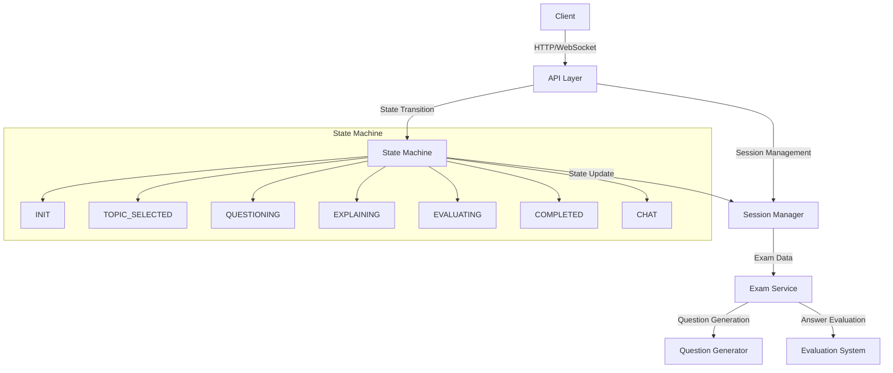
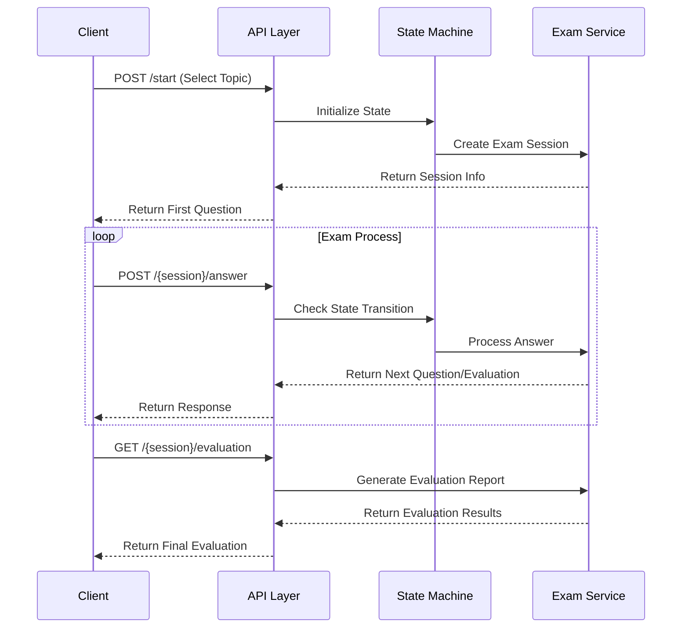
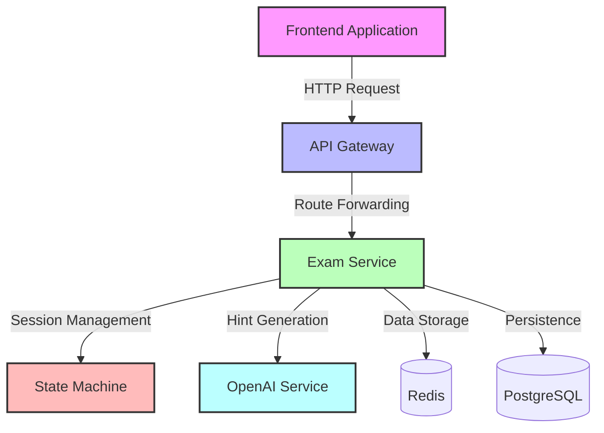
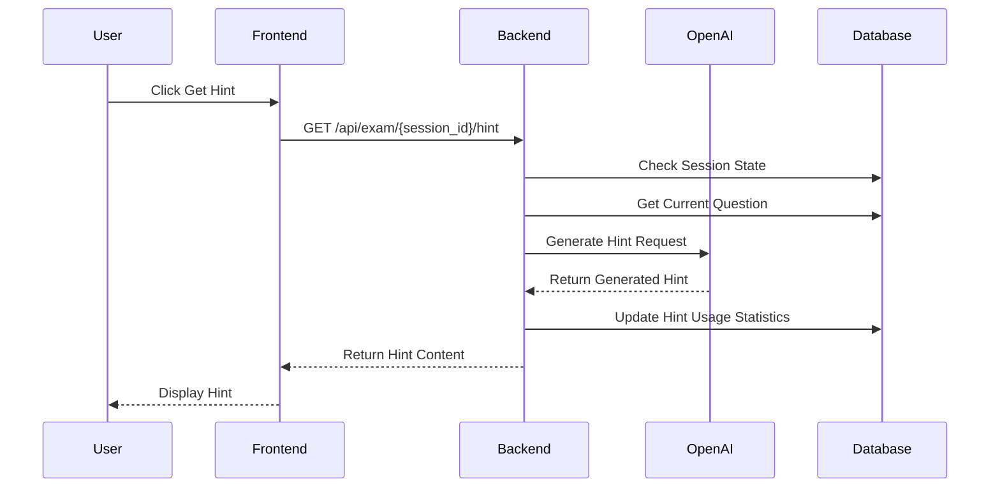
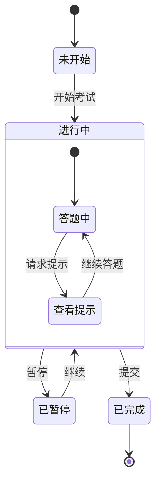
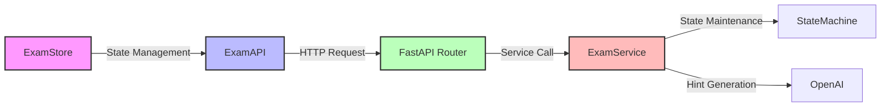
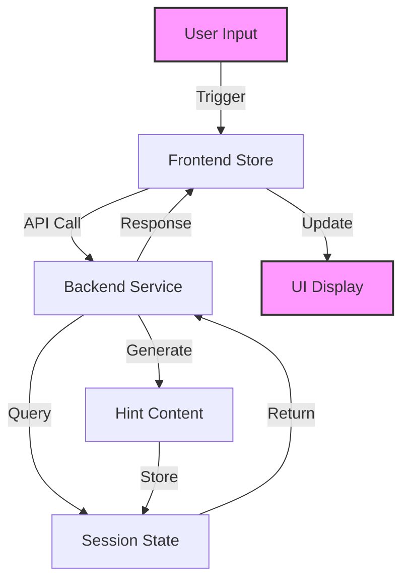

# ChatExaminer API Documentation

## Design Principles

### Architecture Overview

ChatExaminer API adopts a RESTful architecture style design, combined with WebSocket to provide real-time interaction capabilities. The system architecture is divided into the following core parts:

1. **State Management**
   - Uses Finite State Machine (FSM) to manage exam process
   - Each exam session maintains independent state
   - Supports smooth transition between states and exception handling

2. **Session Management**
   - UUID-based session identification
   - Server maintains session state and context
   - Supports concurrent exams from multiple users

3. **Communication Modes**
   - REST API: For basic exam process control
   - WebSocket: For real-time Q&A interaction
   - Hybrid mode: Ensures the best user experience

### System Architecture Diagram



### Interface Design Principles

1. **RESTful Standards**
   - Use standard HTTP methods
   - Resource-based URL design
   - Stateless communication principle

2. **Real-time Interaction**
   - WebSocket maintains persistent connection
   - Bidirectional communication support
   - Real-time state synchronization

3. **Scalability**
   - Modular interface design
   - Version control support
   - Flexible state transition mechanism

4. **Security**
   - Session-level isolation
   - Input validation and sanitization
   - Error handling mechanism

5. **Maintainability**
   - Clear interface documentation
   - Standard error responses
   - Complete state tracking

### Data Flow Diagram



## Basic Information

- Base URL: `http://localhost:8000/api/exam`
- All requests and responses use JSON format
- All timestamps use ISO 8601 format

## Common Response Format

```json
{
    "state": "Current State",
    "message": "Response Message",
    "data": {
        // Specific Data
    }
}
```

## State Definitions

- `INIT`: Initial state
- `TOPIC_SELECTED`: Exam topic selected
- `QUESTIONING`: Q&A phase
- `EXPLAINING`: Explanation phase
- `EVALUATING`: Evaluation phase
- `COMPLETED`: Exam completed
- `CHAT`: Casual conversation state

## API Endpoints

### 1. Start Exam Session

Starts a new exam session and selects the exam topic.

- **URL**: `/start`
- **Method**: `POST`
- **Request Body**:
  ```json
  {
      "topic": "Exam Topic"
  }
  ```
- **Success Response** (200):
  ```json
  {
      "state": "QUESTIONING",
      "message": "Exam session created and started",
      "data": {
          "session_id": "uuid",
          "result": {
              "type": "state_change",
              "state": "QUESTIONING"
          },
          "current_question": {
              "question": "问题内容",
              "difficulty": 3
          }
      }
  }
  ```
- **Error Response** (400):
  ```json
  {
      "detail": "错误信息"
  }
  ```

### 2. Submit Answer

Submit the answer to the current question.

- **URL**: `/{session_id}/answer`
- **Method**: `POST`
- **Request Body**:
  ```json
  {
      "answer": "学生的回答"
  }
  ```
- **Success Response** (200):
  ```json
  {
      "state": "QUESTIONING",
      "message": "回答已处理",
      "data": {
          "result": {
              "type": "response",
              "feedback": "反馈信息"
          },
          "current_question": {
              "question": "下一个问题",
              "difficulty": 3
          }
      }
  }
  ```
- **Error Response** (404):
  ```json
  {
      "detail": "考试会话不存在"
  }
  ```

### 3. Get Exam State

Get the current exam session state information.

- **URL**: `/{session_id}/state`
- **Method**: `GET`
- **Success Response** (200):
  ```json
  {
      "state": "QUESTIONING",
      "message": "当前考试状态",
      "data": {
          "context": {
              "questions_answered": 3,
              "hints_requested": 1,
              "current_difficulty": 3,
              "topic": "考试主题"
          },
          "current_question": {
              "question": "当前问题",
              "difficulty": 3
          }
      }
  }
  ```

### 4. Get Evaluation Results

Get the final evaluation results of the exam.

- **URL**: `/{session_id}/evaluation`
- **Method**: `GET`
- **Success Response** (200):
  ```json
  {
      "state": "COMPLETED",
      "message": "考试评估结果",
      "data": {
          "total_score": 85.5,
          "topic_coverage": "4/5",
          "behavior_score": 90.0,
          "question_evaluations": {
              "1": {
                  "score": 85,
                  "feedback": "详细反馈",
                  "details": {
                      "准确性": "85/100",
                      "清晰度": "90/100",
                      "理解度": "80/100"
                  }
              }
          },
          "behavior_details": {
              "回答完整性": "85/100",
              "思维逻辑性": "90/100",
              "专业术语": "95/100",
              "举例能力": "85/100"
          }
      }
  }
  ```

## WebSocket Interface

### Real-time Interaction

- **URL**: `ws://localhost:8000/api/exam/{session_id}/ws`
- **Send Message Format**:
  ```json
  {
      "answer": "学生的回答"
  }
  ```
- **Receive Message Format**:
  ```json
  {
      "type": "response",
      "state": "QUESTIONING",
      "data": {
          "result": {
              "type": "response",
              "feedback": "反馈信息"
          },
          "current_question": {
              "question": "问题内容",
              "difficulty": 3
          }
      }
  }
  ```
- **Error Message Format**:
  ```json
  {
      "type": "error",
      "message": "错误信息"
  }
  ```

## Error Codes

- 400: Request parameter error
- 404: Resource does not exist
- 500: Server internal error

## Usage Examples

### Python Example

```python
import requests
import json

BASE_URL = "http://localhost:8000/api/exam"

# 1. Start Exam
start_response = requests.post(f"{BASE_URL}/start",
                             json={"topic": "Direct Methods for Optimal Control"})
session_id = start_response.json()["data"]["session_id"]

# 2. Submit Answer
answer_response = requests.post(f"{BASE_URL}/{session_id}/answer",
                              json={"answer": "这是答案"})

# 3. Get State
state_response = requests.get(f"{BASE_URL}/{session_id}/state")

# 4. Get Evaluation
evaluation_response = requests.get(f"{BASE_URL}/{session_id}/evaluation")
```

### WebSocket Example

```python
import websockets
import asyncio
import json

async def connect_exam():
    uri = f"ws://localhost:8000/api/exam/{session_id}/ws"
    async with websockets.connect(uri) as ws:
        await ws.send(json.dumps({"answer": "这是答案"}))
        response = await ws.recv()
        print(json.loads(response))

asyncio.run(connect_exam())
```

## Notes

1. All requests need to include the correct session_id (except for starting the exam)
2. WebSocket connection will automatically close when the exam session does not exist
3. Evaluation results can only be obtained when the exam is completed
4. It is recommended to use WebSocket for real-time interaction to get a better experience

## Hint Related Interface

### Get Hint

Get the hint information for the current exam question.

**Request**

```http
GET /api/exam/{session_id}/hint
```

**Path Parameters**

| Parameter | Type | Description |
|----------|------|-------------|
| session_id | string | Exam Session ID |

**Response**

```json
{
  "state": "string",     // Current Exam State
  "message": "string",   // Response Message
  "data": {
    "hint": "string",    // Generated Hint Content
    "hints_used": number // Used Hint Count
  }
}
```

**Status Codes**

| Status Code | Description |
|-------------|-------------|
| 200 | Successfully Get Hint |
| 404 | Exam Session Does Not Exist |
| 400 | Request Parameter Error |
| 403 | No Permission to Access This Exam Session |

**Example**

Request:
```http
GET /api/exam/abc123/hint
```

Success Response:
```json
{
  "state": "IN_PROGRESS",
  "message": "Hint Generated",
  "data": {
    "hint": "Consider using differential equations to solve this problem, first write the motion equation of the object...",
    "hints_used": 2
  }
}
```

Error Response:
```json
{
  "state": "ERROR",
  "message": "Exam Session Does Not Exist",
  "data": null
}
```

### Usage Limits

1. Each question can request hints up to 3 times
2. Using hints will affect the final score, deducting 10% of the question score each time
3. Hint generation will consider:
   - Question Difficulty
   - Topic/Subtopic
   - Context Information
   - Student Current Performance

### Error Code Description

| Error Code | Description | Solution |
|------------|-------------|----------|
| HINT_LIMIT_EXCEEDED | Exceeds Hint Usage Limit | Wait for Next Question |
| SESSION_NOT_FOUND | Exam Session Does Not Exist | Check if session_id is correct |
| QUESTION_NOT_ACTIVE | No Active Question | Ensure Exam is in Progress |
| UNAUTHORIZED | No Access Permission | Check User Authentication Status |

### WebSocket Events

Real-time event notifications for hints:

```typescript
interface HintEvent {
  type: 'HINT_REQUESTED' | 'HINT_GENERATED' | 'HINT_ERROR';
  data: {
    questionId: string;
    hint?: string;
    error?: string;
    timestamp: string;
  }
}
```

### Client Integration

TypeScript Example:

```typescript
interface HintResponse {
  hint: string;
  hintsUsed: number;
}

class ExamAPI {
  async requestHint(): Promise<HintResponse> {
    if (!this.sessionId) {
      throw new Error('No active exam session');
    }
    const response = await axios.get(
      `${BASE_URL}/${this.sessionId}/hint`
    );
    return {
      hint: response.data.data.hint,
      hintsUsed: response.data.data.hints_used
    };
  }
}
```

### Security Considerations

1. Access Control
   - Verify User Permission to Access This Exam Session
   - Check Hint Request Frequency Limit
   - Prevent Hint Content Leakage

2. Data Protection
   - All API Requests Need to Go Through HTTPS
   - Hint Content Encrypted in Transmission and Storage
   - Periodically Clean Up Historical Hint Data

### Performance Optimization

1. Cache Strategy
   - Cache Hint for Similar Questions
   - Use Redis to Store Session State
   - CDN Accelerate Static Resources

2. Rate Limiting Measures
   - Based on User Request Frequency Limit
   - Server Load Self-Adaptive Adjustment
   - Queue Process Large Concurrent Requests

### Monitoring Metrics

1. Business Metrics
   - Hint Usage Rate
   - Hint Effectiveness Score
   - User Satisfaction

2. Technical Metrics
   - API Response Time
   - Error Rate Statistics
   - System Resource Usage Rate

# API Implementation Documentation

## System Architecture Diagram



## Hint Request Process



## State Transition Diagram



## Component Interaction Diagram



## Data Flow Diagram


