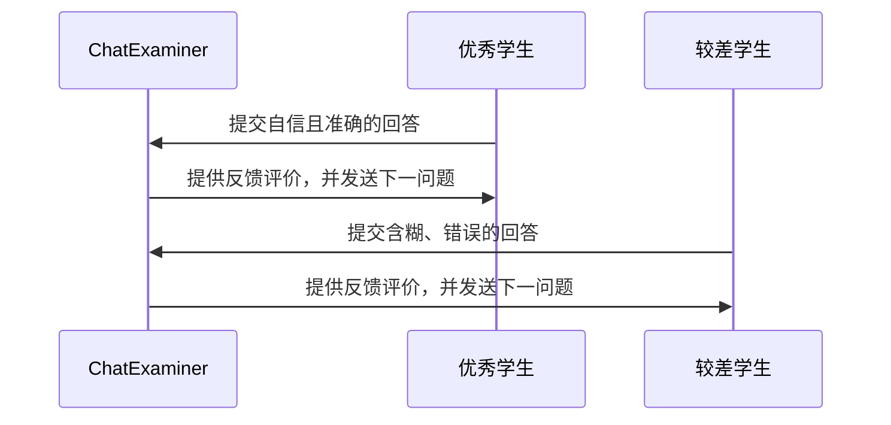

# ChatExaminer 实验设计

## 1. 实验概述

本文通过一系列实验验证 ChatExaminer 系统在自动化口试评价中的性能。实验主要采用两类人工学生：一类为优秀学生（表现自信、回答准确完整），另一类为较差学生（回答含糊、缺乏准确性）。实验将通过多次重复进行，以统计方式分析系统对不同学生性能的区分能力。

## 2. 实验目标

- 验证系统能在实时口试交互中，根据学生回答动态生成后续问题。
- 测量系统定义的多维度评分指标（如准确性、清晰度和理解度）在不同学生类型下的表现差异。
- 通过重复实验验证系统在区分不同能力水平学生时的稳定性与一致性。

## 3. 人工学生设计

为了模拟真实考试场景，设计了两种类型的人工学生，行为模式参照 `server/test/studentPrompt.txt` 中的指令：

- **优秀学生**：内在知识扎实，回答自信、条理清晰，能准确表达核心概念。
- **较差学生**：知识掌握不全面，回答犹豫、混乱且存在错误，表现出低信心。

人工学生的行为通过预设的 prompt 进行控制，可以调整回答的风格和细节，以模拟不同的学生表现。

## 4. 系统交互流程设计

ChatExaminer 与人工学生之间的互动流程如下：

1. 系统启动考试会话并发送第一个问题。
2. 人工学生根据自身角色生成回答，并将回答提交给系统。
3. 系统对回答进行实时评估，给出反馈，并生成下一问题。
4. 重复以上步骤，直到达到预设的问答次数或考试结束。

下面是系统交互流程的示意图：



## 5. 实验数据收集与分析

在实验过程中，系统将收集以下数据：

- 每个问题的评分数据：基于准确性、清晰度和理解度计算得分。
- 回答的响应时间和提示使用情况。
- 每次考试中各人工学生的总体表现：平均得分及方差。
- 系统生成的反馈和后续问题记录。

通过多次重复实验后，利用统计分析方法评估系统是否能够稳定区分不同能力水平的学生，以及各评分指标的有效性。

## 6. 预期结果与讨论

预期系统能够实现以下目标：

- 动态生成与课程内容高度匹配的后续问题，保证交互连贯性。
- 通过多维度评分指标，明显区分优秀学生与较差学生的回答质量。
- 在重复实验中显示出良好的稳定性和一致性，使得不同学生群体之间的表现差异具有统计显著性。

讨论部分将分析系统的优势与局限（例如人工学生回答可能存在相似性的挑战）以及实验中观察到的现象。

## 7. 未来工作

未来的研究方向包括：

- 引入更多样化的人工学生模型，拓展学生行为侧面以增强实验覆盖面。
- 优化提示机制，深入研究提示在多轮互动中对评分的具体影响。
- 结合真实学生数据验证系统在实际教学中的应用效果。

## 8. 基于布卢姆分类法的问题质量评估

为了全面评估 ChatExaminer 系统生成问题的质量，本研究引入布卢姆修订认知分类法（Bloom's Revised Taxonomy）作为理论基础，构建系统化的问题评估框架。布卢姆分类法是教育学中广泛应用的认知层次分类系统，能够有效区分问题的认知难度和类型。

### 8.1 分类框架设计

评估框架基于布卢姆分类法的两个维度：

#### 8.1.1 认知过程维度
- **记忆（Remember）**：回忆或识别基本概念、术语或事实，如"列举强化学习的三个基本要素"
- **理解（Understand）**：理解并能用自己的话解释概念，如"解释状态值函数的意义"
- **应用（Apply）**：应用所学知识解决具体问题，如"使用贝尔曼方程计算给定MDP的最优策略"
- **分析（Analyze）**：分解概念，识别组成部分之间的关系，如"分析Q-learning与SARSA算法的区别及适用场景"
- **评价（Evaluate）**：基于标准进行判断，如"评估在连续状态空间中TD学习相对于MC方法的优势"
- **创造（Create）**：整合元素形成新的整体或观点，如"设计一个强化学习算法解决具有部分可观测性的问题"

#### 8.1.2 知识维度
- **事实性知识（Factual）**：基础元素、术语和具体细节
- **概念性知识（Conceptual）**：分类、原理、理论和模型
- **程序性知识（Procedural）**：如何做某事的方法和技巧
- **元认知知识（Metacognitive）**：对认知过程的认识和自我调节

### 8.2 自动分类方法实现

本研究将使用以下方法对系统生成的问题进行自动分类：

#### 8.2.1 大语言模型分类器
利用 GPT-4 模型实现问题自动分类，具体步骤如下：

1. **精细化提示工程**：设计专门的提示模板指导模型进行布卢姆分类
   ```python
   def classify_question(question_text, client):
       prompt = f"""
       请根据布卢姆修订版分类法，对以下问题进行分类：
       问题：{question_text}

       请从以下选项中选择最贴切的类别：
       1. 认知过程维度（必选一项）：记忆、理解、应用、分析、评价、创造
       2. 知识维度（必选一项）：事实性、概念性、程序性、元认知

       同时，提供简短理由说明为何选择这些类别。

       按以下JSON格式返回：
       {{
           "cognitive_process": "选择的认知过程类别",
           "knowledge_dimension": "选择的知识维度类别",
           "reasoning": "分类理由"
       }}
       """

       response = client.chat.completions.create(
           model="gpt-4o",
           messages=[
               {"role": "system", "content": "你是教育评估专家，精通布卢姆分类法。"},
               {"role": "user", "content": prompt}
           ],
           temperature=0.2
       )

       return json.loads(response.choices[0].message.content)
   ```

2. **跨模型验证**：使用多个不同的大语言模型对同一问题进行分类，比较结果一致性
3. **专家校准**：选取部分问题由教育学专家手动分类，作为校准基准

### 8.3 分布均衡性分析

为确保考试问题覆盖不同认知层次，本研究将进行分布均衡性分析：

#### 8.3.1 理想分布设计
根据课程 02465（强化学习与控制理论导论）的教学目标，设计以下理想分布：

| 认知过程维度 | 占比目标 | 说明 |
|------------|---------|------|
| 记忆 | 15% | 基础术语和定义 |
| 理解 | 25% | 核心概念理解 |
| 应用 | 25% | 算法应用和计算 |
| 分析 | 20% | 算法比较和问题分析 |
| 评价 | 10% | 方法评估和选择 |
| 创造 | 5% | 算法设计和问题解决 |

#### 8.3.2 高阶思维与低阶思维比例
- **低阶思维(LOTS)**：记忆、理解、应用，目标比例 65%
- **高阶思维(HOTS)**：分析、评价、创造，目标比例 35%

#### 8.3.3 分布分析方法
```python
def analyze_distribution(questions_with_classifications):
    """分析问题分类分布并与目标分布比较"""
    # 统计实际分布
    cognitive_counts = Counter([q["classification"]["cognitive_process"]
                               for q in questions_with_classifications])

    # 计算各类别百分比
    total = len(questions_with_classifications)
    percentages = {category: count/total*100 for category, count in cognitive_counts.items()}

    # 计算HOTS与LOTS比例
    lots = sum([percentages.get(cp, 0) for cp in ["记忆", "理解", "应用"]])
    hots = sum([percentages.get(cp, 0) for cp in ["分析", "评价", "创造"]])

    return {
        "category_percentages": percentages,
        "lots_percentage": lots,
        "hots_percentage": hots,
        "hots_lots_ratio": hots/lots if lots > 0 else float('inf')
    }
```

### 8.4 质量评估指标

本研究将使用以下指标评估问题质量：

#### 8.4.1 类别多样性指标
- **覆盖度分数(CS)**：六种认知过程类别的覆盖比例
  ```
  CS = (已覆盖的认知类别数 / 6) × 100%
  ```
- **香农多样性指数(SDI)**：衡量分布均衡程度
  ```
  SDI = -∑(pi × log(pi))，其中pi为第i类问题的比例
  ```

#### 8.4.2 难度-认知匹配度
- **一致性系数(CC)**：问题设定难度与认知层次的相关性
  ```
  CC = Pearson(难度等级, 认知层次序号)
  ```
  其中认知层次序号：记忆=1，理解=2，应用=3，分析=4，评价=5，创造=6

#### 8.4.3 课程目标对齐度
- **目标覆盖率(TCR)**：问题类别与课程教学目标的匹配程度
  ```
  TCR = (与课程目标匹配的问题数 / 总问题数) × 100%
  ```
- **加权目标覆盖率(WTCR)**：考虑教学目标重要性的加权覆盖率
  ```
  WTCR = ∑(问题权重i × 目标权重i) / ∑目标权重i
  ```

### 8.5 实验设计与数据收集

#### 8.5.1 实验流程
1. 使用 ChatExaminer 系统生成大量考试问题（目标：至少100题）
2. 对所有问题进行布卢姆分类法自动分类
3. 计算问题分布和质量评估指标
4. 进行优化调整，反馈至问题生成模块
5. 重复上述步骤，直至达到理想分布

#### 8.5.2 数据记录格式
```json
{
  "question_id": "Q123",
  "question_text": "解释在TD学习中γ参数的作用",
  "difficulty": 3,
  "classification": {
    "cognitive_process": "理解",
    "knowledge_dimension": "概念性",
    "reasoning": "该问题要求学生解释概念，体现对γ参数在TD学习中作用的理解"
  },
  "quality_metrics": {
    "difficulty_cognitive_match": 0.85,
    "course_alignment": 0.92
  }
}
```

### 8.6 预期结果与评估标准

#### 8.6.1 理想结果
- 系统生成问题的布卢姆分类分布应接近预设目标
- 高阶思维与低阶思维问题比例达到35:65
- 类别多样性指标：覆盖度分数≥90%，香农多样性指数≥1.5
- 难度-认知匹配度：一致性系数≥0.7
- 课程目标对齐度：目标覆盖率≥85%

#### 8.6.2 分析方法
通过统计图表可视化分布情况，包括：
- 认知过程维度饼图
- 知识维度柱状图
- 难度与认知层次散点图
- 各项质量指标雷达图

这些分析将帮助我们评估系统生成问题的质量，并为进一步优化提供依据。
