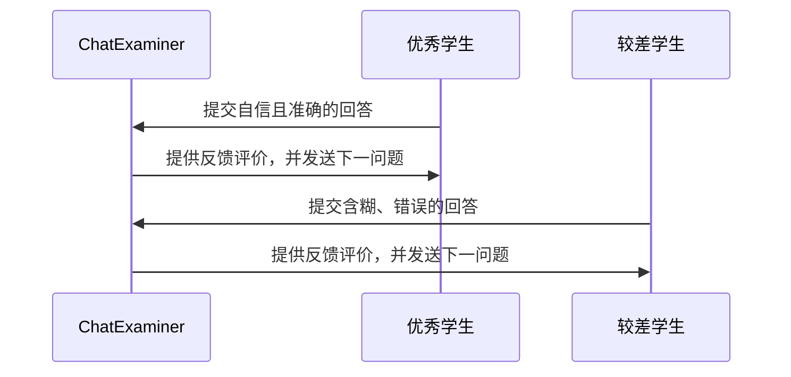

# ChatExaminer 实验设计

## 1. 实验概述

本文通过一系列实验验证 ChatExaminer 系统在自动化口试评价中的性能。实验主要采用两类人工学生：一类为优秀学生（表现自信、回答准确完整），另一类为较差学生（回答含糊、缺乏准确性）。实验将通过多次重复进行，以统计方式分析系统对不同学生性能的区分能力。

## 2. 实验目标

- 验证系统能在实时口试交互中，根据学生回答动态生成后续问题。
- 测量系统定义的多维度评分指标（如准确性、清晰度和理解度）在不同学生类型下的表现差异。
- 通过重复实验验证系统在区分不同能力水平学生时的稳定性与一致性。

## 3. 人工学生设计

为了模拟真实考试场景，设计了两种类型的人工学生，行为模式参照 `server/test/studentPrompt.txt` 中的指令：

- **优秀学生**：内在知识扎实，回答自信、条理清晰，能准确表达核心概念。
- **较差学生**：知识掌握不全面，回答犹豫、混乱且存在错误，表现出低信心。

人工学生的行为通过预设的 prompt 进行控制，可以调整回答的风格和细节，以模拟不同的学生表现。

## 4. 系统交互流程设计

ChatExaminer 与人工学生之间的互动流程如下：

1. 系统启动考试会话并发送第一个问题。
2. 人工学生根据自身角色生成回答，并将回答提交给系统。
3. 系统对回答进行实时评估，给出反馈，并生成下一问题。
4. 重复以上步骤，直到达到预设的问答次数或考试结束。

下面是系统交互流程的示意图：

## 5. 实验数据收集与分析

在实验过程中，系统将收集以下数据：

- 每个问题的评分数据：基于准确性、清晰度和理解度计算得分。
- 回答的响应时间和提示使用情况。
- 每次考试中各人工学生的总体表现：平均得分及方差。
- 系统生成的反馈和后续问题记录。

通过多次重复实验后，利用统计分析方法评估系统是否能够稳定区分不同能力水平的学生，以及各评分指标的有效性。

## 6. 预期结果与讨论

预期系统能够实现以下目标：

- 动态生成与课程内容高度匹配的后续问题，保证交互连贯性。
- 通过多维度评分指标，明显区分优秀学生与较差学生的回答质量。
- 在重复实验中显示出良好的稳定性和一致性，使得不同学生群体之间的表现差异具有统计显著性。

讨论部分将分析系统的优势与局限（例如人工学生回答可能存在相似性的挑战）以及实验中观察到的现象。

## 7. 未来工作

未来的研究方向包括：

- 引入更多样化的人工学生模型，拓展学生行为侧面以增强实验覆盖面。
- 优化提示机制，深入研究提示在多轮互动中对评分的具体影响。
- 结合真实学生数据验证系统在实际教学中的应用效果。
