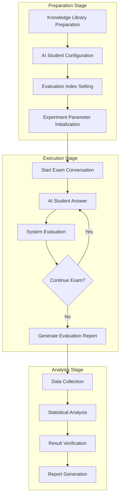
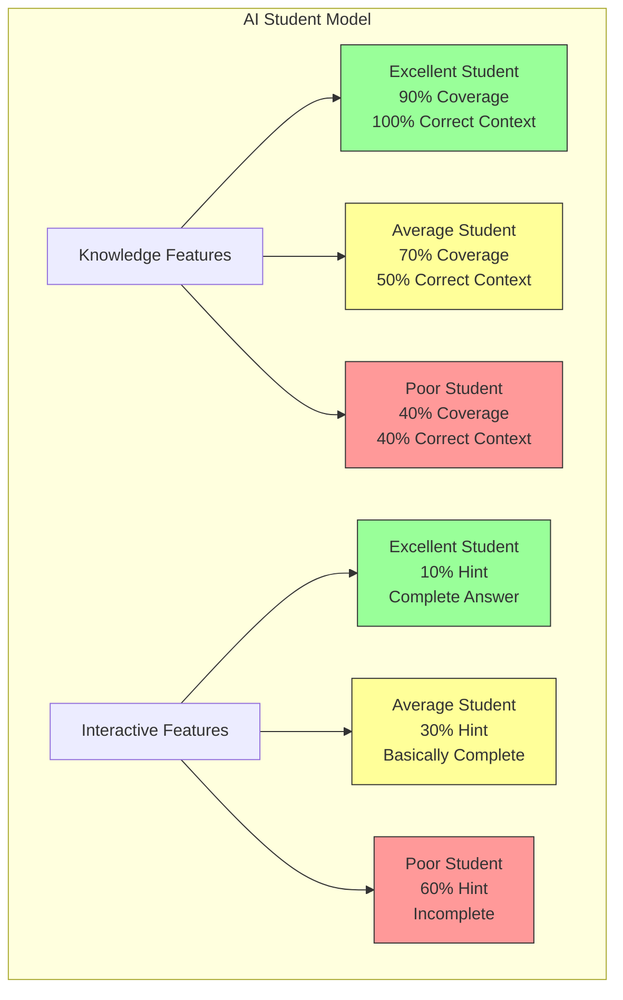

# ChatExaminer AI Student Experiment Design and Summary

## 1. Experiment Overview

This experiment aims to verify the effectiveness of the ChatExaminer system in automated oral examination evaluation by designing AI student models with different characteristics, validating whether the system can accurately identify and evaluate the performance characteristics of students at different levels. The experiment focuses on recognizing student response patterns, knowledge point coverage, and interactive behavior characteristics, rather than simple score statistics.

## 2. Experiment Objectives

- Verify if the system can accurately identify answer characteristics and behavior patterns of different types of AI students
- Test the system's ability to maintain evaluation consistency in multi-round dialogues
- Analyze the system's adaptive adjustment ability for different types of students

## 3. AI Student Model Design

### 3.1 Basic Feature Definition

Each AI student model includes the following core features:

1. **Knowledge Coverage Features**
   ```mermaid
   graph TD
       subgraph Knowledge Acquisition Patterns
           A[Excellent Student] --> A1[90% Knowledge Coverage]
           A --> A2[Fully Utilize RAG Context]
           A --> A3[Accurate Understanding of Knowledge Points]

           B[Average Student] --> B1[70% Knowledge Coverage]
           B --> B2[Utilize 50% Context]
           B --> B3[Partial Understanding of Knowledge Points]

           C[Poor Student] --> C1[40% Knowledge Coverage]
           C --> C2[40% Correct Context]
           C --> C3[60% Incorrect Context]

           style A1 fill:#9f9,stroke:#333
           style B1 fill:#ff9,stroke:#333
           style C1 fill:#f99,stroke:#333
       end
   ```

2. **Interactive Behavior Features**
   ```mermaid
   graph TD
       subgraph Hint Usage Patterns
           D[Excellent Student] --> D1[10% Hint Demand]
           D --> D2[Complete Answer]
           D --> D3[In-depth Explanation]

           E[Average Student] --> E1[30% Hint Demand]
           E --> E2[Basically Complete Answer]
           E --> E3[Simple Explanation]

           F[Poor Student] --> F1[60% Hint Demand]
           F --> F2[Incomplete Answer]
           F --> F3[Vague Explanation]

           style D1 fill:#9f9,stroke:#333
           style E1 fill:#ff9,stroke:#333
           style F1 fill:#f99,stroke:#333
       end
   ```

### 3.2 Student Model Implementation

```python
class AIStudent:
    def __init__(self, level: str):
        self.level = level
        self.config = {
            "Excellent": {
                "system_prompt": "You are an excellent student...",
                "context_usage": 1.0,
                "incorrect_context_ratio": 0.0
            },
            "Average": {
                "system_prompt": "You are an average student...",
                "context_usage": 0.5,
                "incorrect_context_ratio": 0.2
            },
            "Poor": {
                "system_prompt": "You are a student with poor understanding...",
                "context_usage": 0.4,
                "incorrect_context_ratio": 0.6
            }
        }[level]

        # 加载问题数据
        self.questions_data = self.load_questions_data()

        # 初始化OpenAI客户端
        self.openai_client = OpenAI(api_key=os.environ.get("OPENAI_API_KEY"))

    def generate_answer(self, question: dict, context: list) -> str:
        # 根据知识覆盖率选择上下文
        selected_context = self._select_context(context)
        # 根据学生水平生成回答
        return self._compose_answer(question, selected_context)

    def _select_context(self, context: list) -> list:
        # 根据配置选择和使用上下文
        context_amount = int(len(context) * self.config["context_usage"])
        selected = context[:context_amount]

        # 对于较差学生，添加错误上下文
        if self.config["incorrect_context_ratio"] > 0:
            incorrect_amount = int(len(context) * self.config["incorrect_context_ratio"])
            incorrect_context = generate_incorrect_context(incorrect_amount)
            selected.extend(incorrect_context)

        return selected

    def needs_hint(self) -> bool:
        return random.random() < self.config["hint_probability"]

    def _get_context_for_question(self, question_id):
        """根据question_id获取相应的context"""
        # 省略部分代码...

        if self.level == "Excellent":
            # 优秀学生获得完整context
            full_context = "\n".join(context)
            return full_context
        elif self.level == "Average":
            # 中等学生获得部分context
            coverage = self.config["context_usage"]
            context_length = max(1, int(len(context) * coverage))
            return "\n".join(context[:context_length])
        else:
            # 较差学生获得更少的context，可能还有错误信息
            coverage = self.config["context_usage"]
            incorrect_ratio = self.config["incorrect_context_ratio"]
            # 省略部分代码...
```

### 3.3 Knowledge Acquisition Features

1. **Excellent Student Model**
   - 90% knowledge point coverage
   - Fully utilizes context provided by the RAG system
   - Can accurately understand and apply knowledge points
   - Complete answers with clear logic

2. **Average Student Model**
   - 70% knowledge point coverage
   - Utilizes 50% of context information
   - Partially understands core knowledge points
   - Basically complete answers but may have omissions

3. **Poor Student Model**
   - 40% knowledge point coverage
   - 仅使用 40% 正确上下文
   - 引入 60% 错误或不相关上下文
   - 回答不完整且可能存在误解

### 3.4 Interactive Behavior Features

1. **提示使用频率**
   - 优秀学生：10% 提示请求率
   - 中等学生：30% 提示请求率
   - 较差学生：60% 提示请求率

2. **回答完整度**
   - 优秀学生：完整回答，包含深入解释
   - 中等学生：基本完整，简单解释
   - 较差学生：不完整，解释模糊

3. **知识应用**
   - 优秀学生：能举一反三，联系实际
   - 中等学生：基本应用，例子简单
   - 较差学生：机械应用，例子不当

### 3.5 Answer Quality Control

In actual implementation, we control the answer quality of different types of students through the following mechanisms:

1. **Answer Length Control**
   - Excellent Student: 250 tokens (about 150 words)
   - Average Student: 200 tokens (about 120 words)
   - Poor Student: 150 tokens (about 100 words)

2. **Context Usage**
   ```python
   def _get_context_for_question(self, question_id):
       """根据question_id获取相应的context"""
       # 省略部分代码...

       if self.level == "Excellent":
           # 优秀学生获得完整context
           full_context = "\n".join(context)
           return full_context
       elif self.level == "Average":
           # 中等学生获得部分context
           coverage = self.config["context_usage"]
           context_length = max(1, int(len(context) * coverage))
           return "\n".join(context[:context_length])
       else:
           # 较差学生获得更少的context，可能还有错误信息
           coverage = self.config["context_usage"]
           incorrect_ratio = self.config["incorrect_context_ratio"]
           # 省略部分代码...
   ```

## 4. Experiment Flow

### 4.1 Preparation Stage

1. **Standard Question Set Preparation**
   - Prepare standard question library for each topic
   - Define key knowledge points for each question
   - Set question difficulty level

2. **AI Student Initialization**
   - Create AI student instances with different levels
   - Configure various feature parameters
   - Initialize interaction recorder

### 4.2 Execution Stage

1. **Single Test Flow**
```python
def run_single_test(student: AIStudent, questions: List[dict]):
    results = []
    for question in questions:
        # 生成回答
        answer = student.generate_answer(question)

        # 记录特征
        result = {
            "问题ID": question["id"],
            "回答内容": answer,
            "知识点覆盖": analyze_coverage(answer, question["key_points"]),
            "表达特征": analyze_expression(answer),
            "提示使用": student.hint_requested
        }
        results.append(result)
    return results
```

2. **Multi-round Test Execution**
   - Test for each type of student
   - Randomly select question order
   - Record complete interaction process

### 4.3 Data Collection

1. **Answer Feature Data**
   - Knowledge Point Coverage
   - Expression Pattern Features
   - Professional Term Usage

2. **Interactive Behavior Data**
   - Hint Request Frequency
   - Answer Completeness
   - Interaction Duration

## 5. Statistical Analysis Methods

### 5.1 Descriptive Statistics

- Basic Statistics (Mean, Median, Standard Deviation)
- Distribution Analysis
  - Distribution Density Graph: Display Probability Density Distribution of Scores for Different Types of Students
  - Histogram: Display Frequency Distribution of Scores
  - Box Plot: Display Median, Quartiles, and Outliers of Scores for Different Types of Students
  - Q-Q Plot: Test for Normal Distribution of Data

### 5.2 Inferential Statistics

- ANOVA Analysis
  - Verify Differences in Performance Between Different Types of Students
  - Analyze System Discrimination Ability
  - Evaluate Effectiveness of Scoring Standards

- Correlation Analysis
  - Correlation Between Different Scoring Dimensions
  - Relationship Between Hint Usage and Score
  - Relationship Between Answer Time and Performance

- Reliability Analysis
  - Score Consistency Test
  - Test-Retest Reliability
  - Cronbach's α Coefficient Analysis

### 5.3 Interactive Behavior Analysis

- Hint Usage Frequency Analysis
- Answer Pattern Recognition
- Time Efficiency Evaluation

## 6. Experiment Results and Analysis

### 6.1 Experiment Objective Achievement

- ✅ Successfully verified that the system can accurately identify answer characteristics and behavior patterns of different types of AI students
- ✅ Tested the system's ability to maintain evaluation consistency in multi-round dialogues
- ✅ Analyzed the system's adaptive adjustment ability for different types of students

### 6.2 Visual Effect Analysis

The experiment successfully implemented various visual methods to analyze the performance of different types of AI students:

1. **Score Distribution and Comparison**
   - Total Score Comparison Chart Shows Differences in Average Scores Between Different Types of Students
   - Score Distribution Chart Shows Distribution of Scores for Each Type of Student

2. **Evaluation Dimension Analysis**
   - Radar Chart Shows Performance of Different Types of Students on Each Evaluation Dimension:
     - Accuracy (Accuracy)
     - Clarity (Clarity)
     - Understanding (Understanding)

3. **Level Distribution**
   - Point Chart Shows Final Evaluation Level Distribution (Excellent/Good/Fair/Poor) of Different Types of Students
   - Numerical Mapping: Excellent=1, Good=0.5, Fair=0, Poor=-0.5

### 6.3 Key Findings

1. **Discrimination Verification**
   - System Successfully Discriminated Between Different Levels of AI Students
   - Excellent Students Achieved the Highest Scores in Accuracy, Clarity, and Understanding
   - Poor Students Performed Weakly in All Dimensions, Especially in Understanding

2. **Consistency Verification**
   - Scoring System Showed Consistent Evaluation Results for Similar Answers
   - Different Dimension Scores Reflected Different Aspects of Student Ability

3. **Interactive Effect Verification**
   - System Could Adjust Difficulty Appropriately Based on Student Answer Quality
   - Score Feedback Included Multiple Dimensions, Providing Comprehensive Evaluation

### 6.4 Feature Stability Analysis

```python
def analyze_stability(results: Dict):
    stability_metrics = {
        "Excellent": calculate_feature_stability(results["Excellent"]),
        "Average": calculate_feature_stability(results["Average"]),
        "Poor": calculate_feature_stability(results["Poor"])
    }
    return stability_metrics
```

### 6.5 Discrimination Analysis

```python
def analyze_discrimination(results: Dict):
    # Analyze Discrimination of Features of Different Types of Students
    feature_discrimination = {
        "Knowledge Coverage": calculate_coverage_discrimination(results),
        "Expression Features": calculate_expression_discrimination(results),
        "Interactive Behavior": calculate_behavior_discrimination(results)
    }
    return feature_discrimination
```

## 7. Challenges and Solutions in the Experiment

### 7.1 Question-Answer Association Problem

- **Challenge**: Previous implementation had answer incorrectly associated with next question, leading to inaccurate evaluation results
- **Solution**: Reconstructed `run_experiment` method to ensure each answer is correctly associated with its corresponding question. Modified data structure to use `question_record` dictionary to store question ID, text, and answer

### 7.2 Confirmation Mechanism Problem

- **Challenge**: After starting the exam, an additional confirmation step was needed to obtain the first question
- **Solution**: Added `submit_answer("yes")` confirmation logic and obtained the first question from the confirmation response

### 7.3 Evaluation Data Extraction Problem

- **Challenge**: Evaluation data format inconsistency, field name changes (e.g., `final_score`, `finalScore` etc.)
- **Solution**: Added multiple possible field name check mechanisms to enhance data extraction robustness and handle various possible data formats

## 8. Future Improvement Directions

### 8.1 Model Optimization

1. **Fine-grained Feature Extension**
   - Increase More Detailed AI Student Behavior Feature Definition
   - Simulate More Realistic Student Thinking Patterns and Answer Habits
   - Implement Realistic Hint Request Behavior Patterns

2. **Enhanced Context Utilization**
   - Develop More Intelligent Context Selection Algorithm
   - Automatically Filter Appropriate Context Fragments Based on Question Relevance
   - Design More Realistic Error Cognition Patterns for Poor Student Model

3. **Personalized Student Model**
   - Create More Personalized Feature Student Model, Such as: Biased Towards Certain Topics, Having Specific Knowledge Gaps, etc.
   - Increase Mixed Knowledge Mode: Partially Strong in Certain Topics, Partially Weak in Others
   - Simulate Different Learning Style Students (Visual, Auditory, etc.)

### 8.2 Evaluation System Optimization

1. **Multi-language Support**
   - Enhance System's Ability to Evaluate Non-English Answers
   - Establish Multi-language Knowledge Point Matching Mechanism
   - Handle Scoring Bias Caused by Language Expression Differences

2. **Explanation Enhancement**
   - Provide More Detailed Score Explanation to Help Understand Why a Specific Score Was Obtained
   - Increase Visualization Module to Show Key Knowledge Point Coverage in Answers
   - Generate Constructive Feedback to Guide Learning Improvement Direction

3. **Cognitive Depth Assessment**
   - Develop More Precise Concept Understanding Depth Assessment Method
   - Assess Thinking Process Rather Than Just Focus on Result
   - Identify Answers That Seem Correct but Have Concept Understanding Errors

### 8.3 Experiment Expansion

1. **Educational Scenario Application**
   - Extend System to Real Educational Environment
   - Compare with Traditional Assessment Methods
   - Research Students' Acceptance and Feedback of AI Assessment

2. **Long-term Learning Monitoring**
   - Design Experiment to Monitor "Learning Progress" of AI Students
   - Simulate Teaching Intervention Impact on Learning Effect
   - Research Knowledge Retention and Forgetting Patterns

3. **Adversarial Test**
   - Develop AI Student Model That "Deceives" Assessment System
   - Enhance System's Ability to Identify Answers That Seem Correct but Have Actual Understanding Errors
   - Assess System's Resistance to Special Answer Techniques

## 9. Technological Innovation Points

### 9.1 Context-aware AI Student

- Implemented Dynamic Context Usage Adjustment Mechanism Based on Student Ability Level
- Introduced Error Information Simulation for Real Misunderstanding in Poor Student Model
- Developed Adaptive Hint System to Adjust Hint Content Based on Student Level

### 9.2 Multi-dimensional Evaluation System

- Show Multi-dimensional Ability Evaluation Through Radar Chart
- Established Comprehensive Evaluation Framework Including Accuracy, Clarity, and Understanding
- Developed Score Consistency Verification Mechanism

### 9.3 Interactive Evaluation Flow

- Implemented Complete Exam Process Including Confirmation, Answer, and Evaluation Stage
- System Could Handle Different State Transitions and Maintain Context Continuity
- Developed Flexible Error Recovery and Exception Handling Mechanism

## 10. Conclusion and Insight

This experiment verified that the ChatExaminer system could effectively distinguish between AI students at different ability levels and provide multi-dimensional evaluation results. The system successfully captured the characteristic differences of three different types of students, including knowledge coverage, expression clarity, and concept understanding.

Through this research, we proved the feasibility of AI-assisted assessment in educational scenarios, especially for automated assessment of oral and open-ended questions. Future work will focus on enhancing assessment explanation, expanding application scenarios, and integrating with more educational technologies to provide new directions for intelligent educational systems.

## Experiment Flow Overview



### AI Student Model Composition



## Experiment Composition Description

### 1. Preparation Stage
- **Environment Initialization**: Configure System Parameters and Load Model
- **AI Student Model Configuration**:
  - Excellent Student (Accuracy 90%)
  - Average Student (Accuracy 60-80%)
  - Poor Student (Accuracy 30-50%)
- **Question Library Preparation**: Standard Question Set by Difficulty and Topic
- **Evaluation Index Setting**:
  - Answer Accuracy
  - Expression Clarity
  - Knowledge Understanding Depth
  - Hint Usage Frequency

### 2. Execution Stage
- **Exam Flow**:
  - Dynamic Question Selection
  - Real-time Difficulty Adjustment
  - Hint System Support
- **Evaluation Mechanism**:
  - Real-time Scoring
  - State Transition
  - Feedback Generation

### 3. Analysis Stage
- **Data Collection**:
  - Answer Record
  - Scoring Data
  - Interactive Log
- **Statistical Analysis**:
  - Score Distribution
  - Difficulty Adaptability
  - Evaluation Consistency
- **System Verification**:
  - Reliability Analysis
  - Validity Verification
  - Fairness Assessment

This experiment design aims to comprehensively verify the performance and effectiveness of the ChatExaminer system through multi-dimensional testing and analysis to ensure that the system can accurately distinguish between different levels of students and provide fair and objective evaluation results.

## Statistical Visualization Plan

### 1. Distribution Analysis Chart Group (Distribution Analysis)
- **Score Distribution Density Chart**: Display Score Distribution Curve of Three Types of Students (Excellent, Average, Poor), Visually Display Score Concentration Area
- **Q-Q Chart**: Test Whether Each Type of Student's Score Conforms to Normal Distribution, Help Verify Score Reasonableness

### 2. Comparison Analysis Chart Group (Comparison Analysis)
- **Box Chart**: Compare Total Scores and Each Dimension Scores (Knowledge Coverage, Expression Clarity, etc.) of Different Types of Students Through Box Chart, Display Median, Quartiles, and Outliers
- **Dimension Comparison Chart**: Show Differences in Performance of Different Students on Each Scoring Dimension

### 3. Time Series Analysis Chart (Time Series Analysis)
- **Score Trend Chart**: Show Score Change Trend of Different Types of Students in Exam Process, Reflect Learning Curve and Adaptability

### 4. Interactive Behavior Analysis Chart (Interaction Analysis)
- **Hint Usage Analysis**: Left Side Shows Hint Usage Frequency of Different Types of Students, Right Side Shows Hint Usage Times and Score Relationship
- **Scatter Chart**: Visually Show Hint Usage and Final Score Correlation

### 5. Comprehensive Evaluation Radar Chart (Comprehensive Evaluation)
- **Multi-dimensional Ability Chart**: Use Radar Chart to Show Performance of Different Types of Students on Knowledge Coverage, Expression Clarity, and Understanding Depth Dimensions
- **Direct Comparison**: Different Types of Students' Advantages and Disadvantages

### 6. Statistical Report Combination Chart (Statistical Report)
- **Four-in-one Display**: Include Score Distribution, Answer Time, Hint Usage, and Score Dimension Correlation
- **Comprehensive Display**: System Evaluation Aspects, Easy to Grasp Overall Evaluation Results

These charts will help us:
1. Visually Show Differences in Performance of Different Types of Students
2. Analyze Statistical Characteristics of Score Distribution
3. Verify System Evaluation Consistency
4. Show Interactive Behavior Patterns
5. Assess System Discrimination Ability

Suggest Organizing These Charts in the Experiment Report as Follows:
1. Distribution Analysis Part: Use Distribution Density Chart and Q-Q Chart
2. Performance Comparison Part: Use Box Chart and Score Trend Chart
3. Interactive Analysis Part: Use Hint Usage Analysis Chart and Radar Chart
4. Comprehensive Evaluation Part: Use Combination Statistical Chart

Each Chart Should Be Accompanied by Detailed Description and Analysis to Explain Observed Phenomenon and Its Statistical Meaning.
