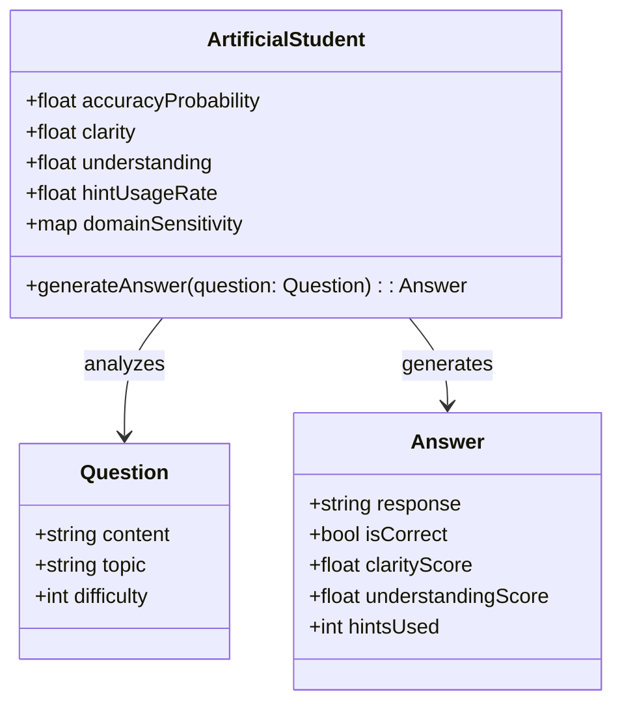
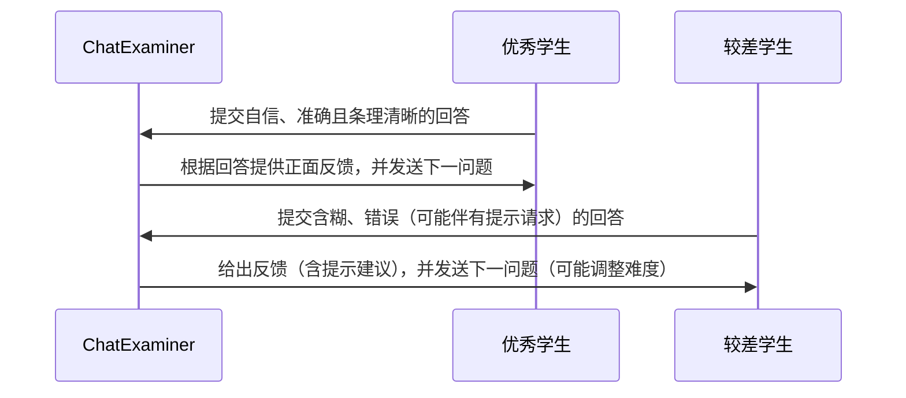

# ChatExaminer 实验设计

## 1. 实验概述

本文旨在通过多次重复测试，验证 ChatExaminer 系统在自动化口试评价中的性能与稳定性。实验不仅模拟原有的优秀学生与较差学生，还引入了概率性回应机制和多维参数控制，从而更真实地反映真实考试中不同学生的表现波动和多样性。

## 2. 实验目标

- 验证系统能在实时口试交互中，根据学生回答动态生成后续问题，确保问题与课程内容高度匹配。
- 测试系统定义的多维度评分指标（如准确性、清晰度、理解度及提示使用情况），在不同学生模型下是否能稳定、准确地反映真实差异。
- 通过多次重复实验，分析各项指标的分布特性，统计验证系统能否在统计意义上稳定地区分不同能力水平的学生，为后续系统优化提供数据支撑。

## 3. 人工学生设计

为更真实地模拟考试中的多样化表现，我们对人工学生模型进行了如下扩展和优化：

### 3.1 概率性回应

- 不再采用简单的二元（优秀/较差）模型，而为每个学生配置一个正确回答的概率分布。例如，优秀学生在大部分题目中有约90%的正确回答概率，而较差学生的正确概率仅为30%。
- 通过引入随机噪声，使得每次回答在预设概率基础上呈现一定波动，从而模拟实际考试中应答的不确定性。

### 3.2 多维参数设定

除了"正确率"，系统还引入了以下维度：

- **表达清晰度**：反映学生表达的逻辑性和条理性。
- **知识理解深度**：衡量学生对概念内涵的掌握程度。
- **提示使用频率**：记录学生在遇到困难时请求提示的比例。

每个学生在这些方面都有预设的基准值和波动范围，模拟某些学生可能在某项能力上表现突出，而在其他能力上相对欠佳的情况（如回答自信但事实错误，或理解深度高而表达不清）。

### 3.3 知识领域特异性

- 针对不同知识主题（如控制理论、强化学习等），每个学生配置单独的主题敏感度参数。例如，一个学生在控制理论领域表现较好，但在强化学习上的表现可能不尽如人意。

### 3.4 提示机制模拟

- 在遇到困难题时，学生根据预设概率决定是否请求提示。优秀学生通常较少请求提示，而较差学生则可能频繁请求。
- 请求提示不仅影响学生的即时回答质量，也作为评分指标之一，检测系统在提示干预下能否及时调整提问策略并准确评估表现。

### 3.5 模型概览图

下面的图表展示了扩展后的人工学生模型各关键参数及其关系：

## 4. 系统交互流程设计

ChatExaminer 与人工学生间的交互流程如下：

1. 系统启动考试会话并发送第一个问题。
2. 人工学生根据各自的角色、概率模型以及多维参数生成回答，并提交给系统。
3. 系统实时评估回答（计算准确性、清晰度、理解度和提示使用影响），反馈评价，并基于反馈动态生成下一问题（包含难易度调整和提示策略）。
4. 重复以上步骤，直到达到预设问答次数或考试结束。

### 4.1 交互流程图

## 5. 实验数据收集与分析

在实验中，系统将收集以下数据：

- **评分数据**：每个问题依据准确性、清晰度、理解度及提示使用情况得到的评分。
- **响应时间**：记录学生回答提交时间，评估交互速度。
- **提示使用情况**：统计每次考试中学生请求提示的次数及对应反馈。
- **总体表现指标**：各人工学生在多轮考试中的平均得分、标准差及分布曲线。

采用统计分析方法，比较优秀学生与较差学生在各指标上的表现，构造分数分布图（如正态分布曲线），以验证系统是否能在统计上显著地区分不同能力水平的学生。

## 6. 预期结果与讨论

预期系统实现以下目标：

- **动态交互**：系统能基于实时评价生成符合课程内容的后续问题，保持交互连贯性与针对性。
- **评分区分**：通过多维评分指标，优秀学生与较差学生在得分上存在统计上显著的差异，且多轮问答后评分分布趋于稳定。
- **提示应用**：提示机制的引入能够改善较差学生的即时表现，同时反映提示使用频率与分数间的关联性，为系统优化提供依据。

讨论部分将分析观察到的优势与局限（如学生模型可能存在的相似性或评分区间重叠问题），并探讨进一步改进学生模型和优化评分算法的方向。

## 7. 未来工作

后续研究将聚焦于：

- **扩展学生模型**：引入更多样化的学生类型和多层次参数配置，以更全面地模拟真实考试中的多样化表现。
- **优化提示机制**：深入研究提示在连续互动中对评分的影响，探索更精细的提示调控策略。
- **结合真实数据验证**：在模拟实验基础上，与真实学生数据进行对比，验证系统在实际教学中的适用性和有效性。
