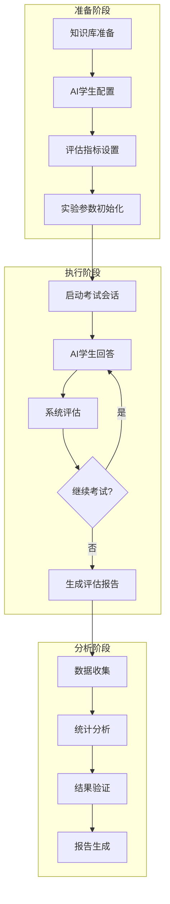
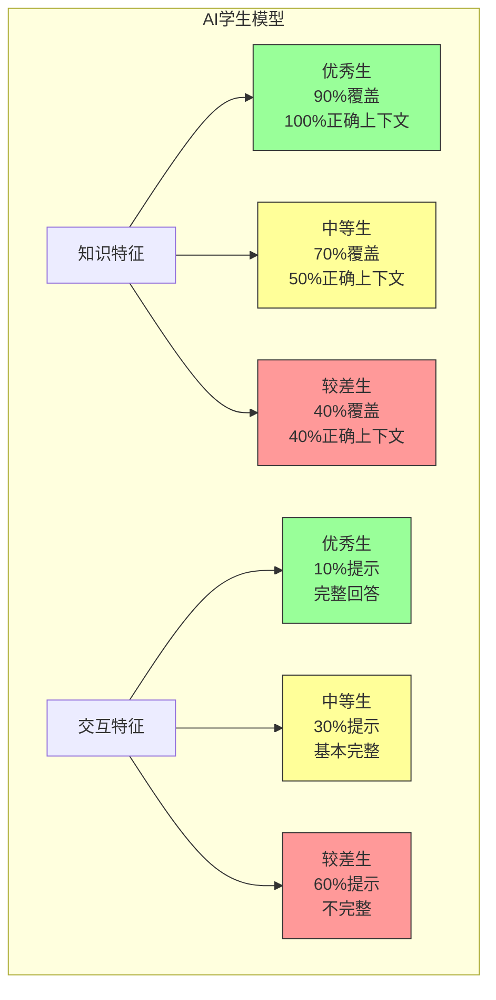

# ChatExaminer AI学生实验设计

## 1. 实验概述

本实验旨在验证 ChatExaminer 系统在自动化口试评价中的有效性，通过设计不同特征的 AI 学生模型，验证系统是否能够准确识别和评估不同水平学生的表现特征。实验重点关注学生回答的模式识别、知识点覆盖度和交互行为特征，而不是简单的分数统计。

## 2. 实验目标

- 验证系统能否准确识别不同类型 AI 学生的回答特征和行为模式
- 测试系统在多轮对话中保持评估一致性的能力
- 分析系统对不同类型学生的适应性调整能力

## 3. AI 学生模型设计

### 3.1 基本特征定义

每个 AI 学生模型包含以下核心特征：

1. **知识覆盖特征**
   ```mermaid
   graph TD
       subgraph 知识获取模式
           A[优秀学生] --> A1[90%知识覆盖]
           A --> A2[完全利用RAG上下文]
           A --> A3[准确理解知识点]

           B[中等学生] --> B1[70%知识覆盖]
           B --> B2[利用50%上下文]
           B --> B3[部分理解知识点]

           C[较差学生] --> C1[40%知识覆盖]
           C --> C2[40%正确上下文]
           C --> C3[60%错误上下文]

           style A1 fill:#9f9,stroke:#333
           style B1 fill:#ff9,stroke:#333
           style C1 fill:#f99,stroke:#333
       end
   ```

2. **交互行为特征**
   ```mermaid
   graph TD
       subgraph 提示使用模式
           D[优秀学生] --> D1[10%提示需求]
           D --> D2[完整回答]
           D --> D3[深入解释]

           E[中等学生] --> E1[30%提示需求]
           E --> E2[基本完整回答]
           E --> E3[简单解释]

           F[较差学生] --> F1[60%提示需求]
           F --> F2[不完整回答]
           F --> F3[模糊解释]

           style D1 fill:#9f9,stroke:#333
           style E1 fill:#ff9,stroke:#333
           style F1 fill:#f99,stroke:#333
       end
   ```

### 3.2 学生模型实现

```python
class AIStudent:
    def __init__(self, level: str):
        self.level = level
        self.config = {
            "优秀": {
                "knowledge_coverage": 0.9,
                "context_usage": 1.0,
                "hint_probability": 0.1,
                "incorrect_context_ratio": 0.0
            },
            "中等": {
                "knowledge_coverage": 0.7,
                "context_usage": 0.5,
                "hint_probability": 0.3,
                "incorrect_context_ratio": 0.2
            },
            "较差": {
                "knowledge_coverage": 0.4,
                "context_usage": 0.4,
                "hint_probability": 0.6,
                "incorrect_context_ratio": 0.6
            }
        }[level]

    def generate_answer(self, question: dict, context: list) -> str:
        # 根据知识覆盖率选择上下文
        selected_context = self._select_context(context)
        # 根据学生水平生成回答
        return self._compose_answer(question, selected_context)

    def _select_context(self, context: list) -> list:
        # 根据配置选择和使用上下文
        context_amount = int(len(context) * self.config["context_usage"])
        selected = context[:context_amount]

        # 对于较差学生，添加错误上下文
        if self.config["incorrect_context_ratio"] > 0:
            incorrect_amount = int(len(context) * self.config["incorrect_context_ratio"])
            incorrect_context = generate_incorrect_context(incorrect_amount)
            selected.extend(incorrect_context)

        return selected

    def needs_hint(self) -> bool:
        return random.random() < self.config["hint_probability"]
```

### 3.3 知识获取特征

1. **优秀学生模型**
   - 90% 知识点覆盖率
   - 完全利用 RAG 系统提供的上下文
   - 能准确理解和运用知识点
   - 回答完整且逻辑清晰

2. **中等学生模型**
   - 70% 知识点覆盖率
   - 利用 50% 的上下文信息
   - 部分理解核心知识点
   - 回答基本完整但可能存在疏漏

3. **较差学生模型**
   - 40% 知识点覆盖率
   - 仅使用 40% 正确上下文
   - 引入 60% 错误或不相关上下文
   - 回答不完整且可能存在误解

### 3.4 交互行为特征

1. **提示使用频率**
   - 优秀学生：10% 提示请求率
   - 中等学生：30% 提示请求率
   - 较差学生：60% 提示请求率

2. **回答完整度**
   - 优秀学生：完整回答，包含深入解释
   - 中等学生：基本完整，简单解释
   - 较差学生：不完整，解释模糊

3. **知识应用**
   - 优秀学生：能举一反三，联系实际
   - 中等学生：基本应用，例子简单
   - 较差学生：机械应用，例子不当

## 4. 实验流程

### 4.1 准备阶段

1. **标准问题集准备**
   - 为每个主题准备标准问题库
   - 定义每个问题的关键知识点
   - 设置问题难度等级

2. **AI 学生初始化**
   - 创建不同水平的 AI 学生实例
   - 配置各个特征参数
   - 初始化交互记录器

### 4.2 执行阶段

1. **单轮测试流程**
```python
def run_single_test(student: AIStudent, questions: List[dict]):
    results = []
    for question in questions:
        # 生成回答
        answer = student.generate_answer(question)

        # 记录特征
        result = {
            "问题ID": question["id"],
            "回答内容": answer,
            "知识点覆盖": analyze_coverage(answer, question["key_points"]),
            "表达特征": analyze_expression(answer),
            "提示使用": student.hint_requested
        }
        results.append(result)
    return results
```

2. **多轮测试执行**
   - 每种类型学生进行 100 轮测试
   - 随机选择问题顺序
   - 记录完整交互过程

### 4.3 数据收集

1. **回答特征数据**
   - 知识点覆盖情况
   - 表达模式特征
   - 专业术语使用

2. **交互行为数据**
   - 提示请求频率
   - 回答完整度
   - 交互持续时间

## 5. 统计分析方法

### 5.1 描述性统计

- 基本统计量（均值、中位数、标准差）
- 分布分析
  - 分布密度图：展示不同类型学生分数的概率密度分布
  - 直方图：显示分数的频数分布
  - 箱线图：展示各类型学生分数的中位数、四分位数和异常值
  - Q-Q图：检验数据的正态分布性

### 5.2 推断性统计

- 方差分析(ANOVA)
  - 验证不同类型学生间的表现差异
  - 分析系统区分能力
  - 评估评分标准的有效性

- 相关性分析
  - 评分维度间的相关性
  - 提示使用与得分的关系
  - 答题时间与表现的关系

- 可靠性分析
  - 评分一致性检验
  - 测试-重测信度
  - Cronbach's α系数分析

### 5.3 交互行为分析

- 提示使用频率分析
- 答题模式识别
- 时间效率评估

## 6. 结果分析

### 6.1 特征稳定性分析

```python
def analyze_stability(results: Dict):
    stability_metrics = {
        "优秀": calculate_feature_stability(results["优秀"]),
        "中等": calculate_feature_stability(results["中等"]),
        "较差": calculate_feature_stability(results["较差"])
    }
    return stability_metrics
```

### 6.2 区分度分析

```python
def analyze_discrimination(results: Dict):
    # 分析不同类型学生特征的区分度
    feature_discrimination = {
        "知识覆盖": calculate_coverage_discrimination(results),
        "表达特征": calculate_expression_discrimination(results),
        "交互行为": calculate_behavior_discrimination(results)
    }
    return feature_discrimination
```

## 7. 预期结果

### 6.1 区分度验证

- 不同类型学生的得分分布应呈现显著差异
- 系统评分应与预设特征高度相关
- 交互行为模式应符合预期设定

### 6.2 一致性验证

- 评分标准的稳定性
- 多次测试的一致性
- 不同题型间的评分平衡

### 6.3 交互效果验证

- 提示系统的有效性
- 答题行为的合理性
- 评分反馈的准确性

## 8. 改进方向

1. **模型优化**
   - 增加更多细粒度的特征定义
   - 优化回答生成算法
   - 增强行为模式的真实性

2. **评估机制**
   - 完善特征识别算法
   - 优化评估维度
   - 提高系统适应性

3. **交互优化**
   - 改进提示机制
   - 优化问题选择策略
   - 增强个性化适应能力

## 9. 统计学验证方法

### 9.1 假设检验设计

1. **主要假设**
   - H0(1): 不同类型学生的特征表现无显著差异
   - H1(1): 不同类型学生的特征表现存在显著差异
   - H0(2): 系统评估结果与预设特征无显著相关性
   - H1(2): 系统评估结果与预设特征存在显著相关性

2. **显著性水平**
   - α = 0.05（95% 置信度）
   - 使用双尾检验

### 9.2 数据分析方法

1. **方差分析 (ANOVA)**
```python
def perform_anova_analysis(results: Dict):
    # 对三组学生的表现进行单因素方差分析
    from scipy import stats

    groups = {
        "knowledge_coverage": [
            results["优秀"]["知识覆盖"],
            results["中等"]["知识覆盖"],
            results["较差"]["知识覆盖"]
        ],
        "expression_quality": [
            results["优秀"]["表达特征"],
            results["中等"]["表达特征"],
            results["较差"]["表达特征"]
        ],
        "interaction_behavior": [
            results["优秀"]["交互行为"],
            results["中等"]["交互行为"],
            results["较差"]["交互行为"]
        ]
    }

    anova_results = {}
    for feature, data in groups.items():
        f_stat, p_value = stats.f_oneway(*data)
        anova_results[feature] = {
            "F统计量": f_stat,
            "P值": p_value,
            "显著性": p_value < 0.05
        }

    return anova_results
```

2. **相关性分析**
```python
def correlation_analysis(results: Dict):
    import numpy as np
    from scipy import stats

    # 计算系统评估结果与预设特征的相关性
    correlations = {}
    for student_type in ["优秀", "中等", "较差"]:
        system_eval = np.array(results[student_type]["系统评估"])
        preset_features = np.array(results[student_type]["预设特征"])

        # Pearson相关系数
        r, p = stats.pearsonr(system_eval, preset_features)
        correlations[student_type] = {
            "相关系数": r,
            "P值": p,
            "显著性": p < 0.05
        }

    return correlations
```

3. **效应量计算**
```python
def calculate_effect_size(results: Dict):
    from scipy import stats
    import numpy as np

    # 计算Cohen's d效应量
    def cohens_d(group1, group2):
        n1, n2 = len(group1), len(group2)
        var1, var2 = np.var(group1, ddof=1), np.var(group2, ddof=1)
        pooled_se = np.sqrt(((n1 - 1) * var1 + (n2 - 1) * var2) / (n1 + n2 - 2))
        return (np.mean(group1) - np.mean(group2)) / pooled_se

    effect_sizes = {}
    features = ["知识覆盖", "表达特征", "交互行为"]

    for feature in features:
        excellent_vs_average = cohens_d(
            results["优秀"][feature],
            results["中等"][feature]
        )
        average_vs_poor = cohens_d(
            results["中等"][feature],
            results["较差"][feature]
        )

        effect_sizes[feature] = {
            "优秀vs中等": excellent_vs_average,
            "中等vs较差": average_vs_poor
        }

    return effect_sizes
```

### 9.3 可靠性分析

1. **内部一致性检验**
```python
def reliability_analysis(results: Dict):
    from scipy import stats

    # 计算Cronbach's α系数
    def cronbach_alpha(itemscores):
        itemvars = itemscores.var(axis=0, ddof=1)
        tscores = itemscores.sum(axis=1)
        nitems = itemscores.shape[1]
        return (nitems / (nitems-1)) * (1 - itemvars.sum() / tscores.var(ddof=1))

    reliability_scores = {}
    for student_type in ["优秀", "中等", "较差"]:
        scores = np.array([
            results[student_type]["知识覆盖"],
            results[student_type]["表达特征"],
            results[student_type]["交互行为"]
        ]).T

        reliability_scores[student_type] = {
            "Cronbach's α": cronbach_alpha(scores)
        }

    return reliability_scores
```

2. **测试-重测信度**
```python
def test_retest_reliability(test1_results: Dict, test2_results: Dict):
    from scipy import stats

    reliability_coefficients = {}
    features = ["知识覆盖", "表达特征", "交互行为"]

    for feature in features:
        for student_type in ["优秀", "中等", "较差"]:
            r, p = stats.pearsonr(
                test1_results[student_type][feature],
                test2_results[student_type][feature]
            )
            reliability_coefficients[f"{student_type}_{feature}"] = {
                "相关系数": r,
                "P值": p
            }

    return reliability_coefficients
```

### 9.4 结果报告格式

1. **统计报告模板**
```python
def generate_statistical_report(results: Dict):
    report = {
        "方差分析结果": perform_anova_analysis(results),
        "相关性分析": correlation_analysis(results),
        "效应量": calculate_effect_size(results),
        "可靠性分析": reliability_analysis(results)
    }

    # 生成LaTeX格式的报告
    latex_report = """
    \\section{统计分析结果}

    \\subsection{方差分析}
    % 插入ANOVA结果表格

    \\subsection{相关性分析}
    % 插入相关系数矩阵

    \\subsection{效应量}
    % 插入效应量分析结果

    \\subsection{可靠性分析}
    % 插入信度系数表格
    """

    return report, latex_report
```

2. **可视化展示**
```python
def visualize_results(results: Dict):
    import matplotlib.pyplot as plt
    import seaborn as sns

    # 绘制箱线图比较不同类型学生的表现
    plt.figure(figsize=(12, 6))
    features = ["知识覆盖", "表达特征", "交互行为"]

    for i, feature in enumerate(features):
        plt.subplot(1, 3, i+1)
        data = [results[st][feature] for st in ["优秀", "中等", "较差"]]
        sns.boxplot(data=data)
        plt.title(feature)
        plt.xticks([0, 1, 2], ["优秀", "中等", "较差"])

    plt.tight_layout()
    plt.savefig("statistical_analysis_results.png")
```

### 9.5 统计分析流程

1. **数据预处理**
   - 异常值检测与处理
   - 正态性检验
   - 数据标准化

2. **分析执行**
   - 运行方差分析
   - 计算相关系数
   - 进行效应量分析
   - 执行可靠性检验

3. **结果解释**
   - 基于p值判断显著性
   - 评估效应量大小
   - 解释相关性强度
   - 分析可靠性水平

4. **报告生成**
   - 生成统计表格
   - 创建可视化图表
   - 撰写分析报告
   - 提供改进建议

## 实验流程概览



### AI 学生模型构成



## 实验组成部分说明

### 1. 准备阶段
- **环境初始化**：配置系统参数、加载模型
- **AI学生模型配置**：
  - 优秀学生 (准确率 90%)
  - 中等学生 (准确率 60-80%)
  - 较差学生 (准确率 30-50%)
- **问题库准备**：按难度和主题分类的标准问题集
- **评估指标设置**：
  - 回答准确性
  - 表达清晰度
  - 知识理解深度
  - 提示使用频率

### 2. 执行阶段
- **考试流程**：
  - 动态问题选择
  - 实时难度调整
  - 提示系统支持
- **评估机制**：
  - 实时评分
  - 状态转换
  - 反馈生成

### 3. 分析阶段
- **数据收集**：
  - 答题记录
  - 评分数据
  - 交互日志
- **统计分析**：
  - 分数分布
  - 难度适应性
  - 评估一致性
- **系统验证**：
  - 可靠性分析
  - 有效性验证
  - 公平性评估

这个实验设计旨在全面验证 ChatExaminer 系统的性能和有效性，通过多维度的测试和分析，确保系统能够准确区分不同水平的学生，并提供公平、客观的评估结果。

## 统计可视化方案

### 1. 分布分析图组（Distribution Analysis）
- **分数分布密度图**：展示三类学生（优秀、中等、较差）的得分分布曲线，直观显示分数集中区域
- **Q-Q图**：检验每类学生的得分是否符合正态分布，帮助验证评分的合理性

### 2. 比较分析图组（Comparison Analysis）
- **箱线图**：通过箱形图对比不同类型学生的总分和各维度得分（知识覆盖、表达清晰度等），显示中位数、四分位数和异常值
- **维度对比图**：展示不同学生在各个评分维度上的表现差异

### 3. 时间序列分析图（Time Series Analysis）
- **得分趋势图**：展示不同类型学生在考试过程中的得分变化趋势，反映学习曲线和适应性

### 4. 交互行为分析图（Interaction Analysis）
- **提示使用分析**：左侧显示各类学生的提示使用频率，右侧展示提示使用次数与得分的关系
- **散点图**：直观展示提示使用与最终得分的相关性

### 5. 综合评估雷达图（Comprehensive Evaluation）
- **多维度能力图**：用雷达图展示各类学生在知识覆盖、表达清晰度、理解深度等维度的表现
- **直观对比**：不同类型学生的优势和劣势

### 6. 统计报告组合图（Statistical Report）
- **四合一展示**：包含得分分布、答题时间、提示使用情况和评分维度相关性
- **全面展示**：系统评估的各个方面，便于整体把握评估结果

这些图表将帮助我们：
1. 直观展示不同类型学生的表现差异
2. 分析评分分布的统计特性
3. 验证系统的评估一致性
4. 展示交互行为模式
5. 评估系统的区分能力

建议将这些图表按以下方式组织在实验报告中：
1. 分布分析部分：使用分布密度图和Q-Q图
2. 表现对比部分：使用箱线图和得分趋势图
3. 交互分析部分：使用提示使用分析图和雷达图
4. 综合评估部分：使用组合统计图

每组图表都应配有详细的说明和分析，解释观察到的现象及其统计意义。
