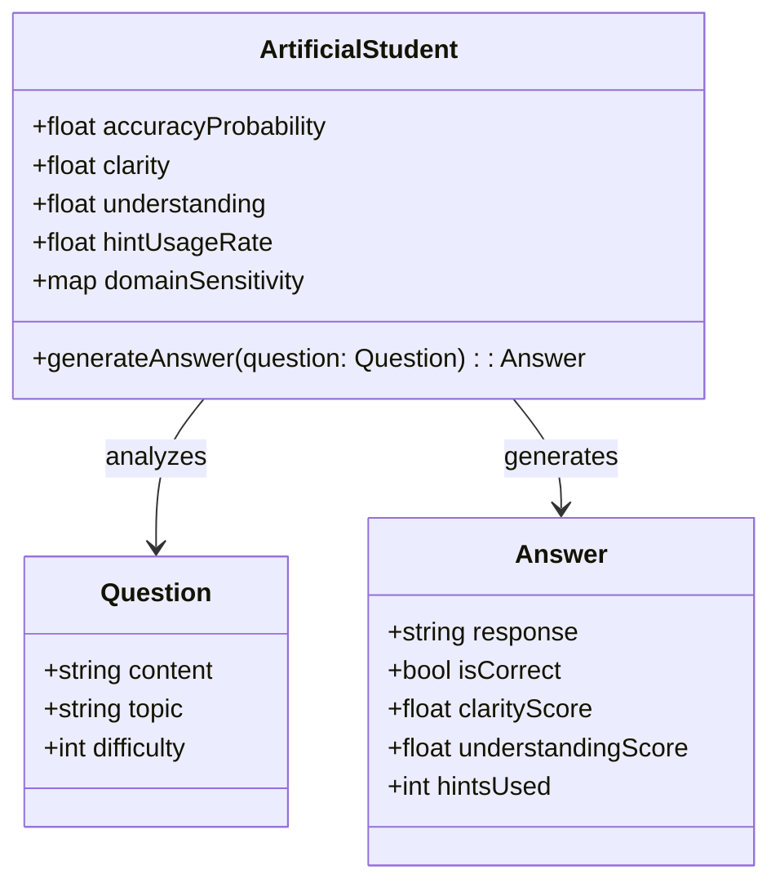
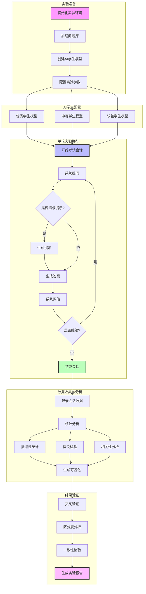

# ChatExaminer 实验设计

## 1. 实验概述

本文旨在通过多次重复测试，验证 ChatExaminer 系统在自动化口试评价中的性能与稳定性。实验不仅模拟原有的优秀学生与较差学生，还引入了概率性回应机制和多维参数控制，从而更真实地反映真实考试中不同学生的表现波动和多样性。

## 2. 实验目标

- 验证系统能在实时口试交互中，根据学生回答动态生成后续问题，确保问题与课程内容高度匹配。
- 测试系统定义的多维度评分指标（如准确性、清晰度、理解度及提示使用情况），在不同学生模型下是否能稳定、准确地反映真实差异。
- 通过多次重复实验，分析各项指标的分布特性，统计验证系统能否在统计意义上稳定地区分不同能力水平的学生，为后续系统优化提供数据支撑。

## 3. 人工学生设计

为更真实地模拟考试中的多样化表现，我们对人工学生模型进行了如下扩展和优化：

### 3.1 概率性回应

- 不再采用简单的二元（优秀/较差）模型，而为每个学生配置一个正确回答的概率分布。例如，优秀学生在大部分题目中有约90%的正确回答概率，而较差学生的正确概率仅为30%。
- 通过引入随机噪声，使得每次回答在预设概率基础上呈现一定波动，从而模拟实际考试中应答的不确定性。

### 3.2 多维参数设定

除了"正确率"，系统还引入了以下维度：

- **表达清晰度**：反映学生表达的逻辑性和条理性。
- **知识理解深度**：衡量学生对概念内涵的掌握程度。
- **提示使用频率**：记录学生在遇到困难时请求提示的比例。

每个学生在这些方面都有预设的基准值和波动范围，模拟某些学生可能在某项能力上表现突出，而在其他能力上相对欠佳的情况（如回答自信但事实错误，或理解深度高而表达不清）。

### 3.3 知识领域特异性

- 针对不同知识主题（如控制理论、强化学习等），每个学生配置单独的主题敏感度参数。例如，一个学生在控制理论领域表现较好，但在强化学习上的表现可能不尽如人意。

### 3.4 提示机制模拟

- 在遇到困难题时，学生根据预设概率决定是否请求提示。优秀学生通常较少请求提示，而较差学生则可能频繁请求。
- 请求提示不仅影响学生的即时回答质量，也作为评分指标之一，检测系统在提示干预下能否及时调整提问策略并准确评估表现。

### 3.5 模型概览图

下面的图表展示了扩展后的人工学生模型各关键参数及其关系：



## 4. 实验流程

### 4.1 实验流程图



### 4.2 流程说明

1. **实验准备阶段**
   - 初始化实验环境：设置随机种子、配置日志系统
   - 加载问题库：从JSON文件加载预设题目
   - 创建AI学生模型：初始化不同水平的学生实例
   - 配置实验参数：设置实验轮数、问题数量等

2. **AI学生配置阶段**
   - 配置三种不同水平的学生模型
   - 设置各模型的特征参数
   - 初始化学习历史记录

3. **单轮实验执行**
   - 执行完整的考试会话流程
   - 记录问答交互过程
   - 收集评估数据

4. **数据收集与分析**
   - 记录详细的会话数据
   - 进行多维度统计分析
   - 生成数据可视化

5. **结果验证**
   - 进行交叉验证
   - 分析系统区分度
   - 检验评估一致性
   - 生成完整实验报告

## 5. 实验数据收集与分析

### 5.1 数据记录机制

系统将在每次会话中自动生成详细的 JSON 格式数据记录，包含以下关键信息：

1. **会话级数据**
   - 会话ID
   - 开始和结束时间
   - 当前状态（QUESTIONING/CHAT）
   - 总问题数量
   - 总得分

2. **问题级数据**
   - 问题ID
   - 问题内容
   - 难度等级
   - 知识主题
   - 提问时间

3. **答题记录**
   - 学生回答内容
   - 提交时间
   - 使用的提示数量
   - 各维度评分（准确性、清晰度、理解度）
   - 评估反馈

4. **行为指标**
   - 每题答题时长
   - 提示使用频率
   - 状态转换记录

数据将以 JSON 文件形式保存在 data/ 目录下，采用 session_<session_id>.json 的命名格式。这种结构化的数据记录方式便于后续使用 Python 数据分析工具（如 pandas）进行统计分析。

### 5.2 评分数据收集

在实验中，系统将收集以下数据：

- **评分数据**：每个问题依据准确性、清晰度、理解度及提示使用情况得到的评分。
- **响应时间**：记录学生回答提交时间，评估交互速度。
- **提示使用情况**：统计每次考试中学生请求提示的次数及对应反馈。
- **总体表现指标**：各人工学生在多轮考试中的平均得分、标准差及分布曲线。

采用统计分析方法，比较优秀学生与较差学生在各指标上的表现，构造分数分布图（如正态分布曲线），以验证系统是否能在统计上显著地区分不同能力水平的学生。

### 5.3 统计分析方法

在收集到充分的实验数据后，我们将进行以下统计分析：

1. **描述性统计**
   - 计算各评分维度的均值、中位数、标准差
   - 生成箱线图显示分数分布
   - 分析评分趋势和波动

2. **假设检验**
   - 使用独立样本 t 检验比较不同类型学生的表现差异
   - 采用配对样本检验分析同一学生在不同主题上的表现
   - 进行方差分析（ANOVA）评估多个因素的影响

3. **相关性分析**
   - 计算提示使用与得分间的相关系数
   - 分析答题时长与得分的关系
   - 评估不同评分维度间的相互关系

4. **预测模型**
   - 基于历史数据建立学生表现预测模型
   - 验证模型在新数据上的预测准确率
   - 识别影响得分的关键因素

## 6. 预期结果与讨论

预期系统实现以下目标：

- **动态交互**：系统能基于实时评价生成符合课程内容的后续问题，保持交互连贯性与针对性。
- **评分区分**：通过多维评分指标，优秀学生与较差学生在得分上存在统计上显著的差异，且多轮问答后评分分布趋于稳定。
- **提示应用**：提示机制的引入能够改善较差学生的即时表现，同时反映提示使用频率与分数间的关联性，为系统优化提供依据。

讨论部分将分析观察到的优势与局限（如学生模型可能存在的相似性或评分区间重叠问题），并探讨进一步改进学生模型和优化评分算法的方向。

## 7. 统计学方法与结果验证

为了更科学地验证评估系统的有效性，本实验将运用统计学方法对采集的评分数据进行严谨分析，主要包括以下几个方面：

- **描述性统计分析**：计算各项评分指标（如准确性、清晰度和理解度）的平均值、标准差和其他统计量，直观展示不同类型学生的总体表现。

- **分布图绘制**：绘制评分分布图（例如正态分布曲线或箱线图），比较优秀学生与较差学生在各评分指标上的分布情况，观察评分曲线是否存在显著区分。

- **假设检验**：采用双样本t检验或非参数检验方法，验证不同学生群体（如优秀学生 vs 较差学生）在各项评分指标上是否存在统计学上显著的差异。

- **相关性分析**：分析提示使用频率与评分之间的相关性，评估提示机制对学生回答质量以及最终得分的影响。

通过上述统计方法，可以量化系统在区分不同能力水平学生方面的效果，并为后续系统的优化与改进提供数据支持。

## 8. 未来工作

后续研究将聚焦于：

- **扩展学生模型**：引入更多样化的学生类型和多层次参数配置，以更全面地模拟真实考试中的多样化表现。
- **优化提示机制**：深入研究提示在连续互动中对评分的影响，探索更精细的提示调控策略。
- **结合真实数据验证**：在模拟实验基础上，与真实学生数据进行对比，验证系统在实际教学中的适用性和有效性。

## 9. 功能实现细节

### 9.1 数据记录实现

1. **数据记录类设计**
```python
class ExamSession:
    def __init__(self):
        self.session_data = {
            "session_id": str(uuid.uuid4()),
            "start_time": datetime.now().isoformat(),
            "end_time": None,
            "current_state": "INIT",
            "total_questions": 0,
            "total_score": 0,
            "questions": [],
            "answers": [],
            "behavior_metrics": {
                "answer_times": [],
                "hint_usage": [],
                "state_transitions": []
            }
        }

    def record_question(self, question_data):
        self.session_data["questions"].append({
            "question_id": question_data["id"],
            "content": question_data["content"],
            "difficulty": question_data["difficulty"],
            "topic": question_data["topic"],
            "timestamp": datetime.now().isoformat()
        })

    def record_answer(self, answer_data):
        self.session_data["answers"].append({
            "question_id": answer_data["question_id"],
            "content": answer_data["content"],
            "timestamp": datetime.now().isoformat(),
            "hints_used": answer_data["hints_used"],
            "scores": {
                "accuracy": answer_data["scores"]["accuracy"],
                "clarity": answer_data["scores"]["clarity"],
                "understanding": answer_data["scores"]["understanding"]
            },
            "feedback": answer_data["feedback"]
        })

    def save_session(self):
        self.session_data["end_time"] = datetime.now().isoformat()
        filename = f"data/session_{self.session_data['session_id']}.json"
        with open(filename, 'w', encoding='utf-8') as f:
            json.dump(self.session_data, f, ensure_ascii=False, indent=2)
```

2. **数据分析工具实现**
```python
class ExamDataAnalyzer:
    def __init__(self, data_dir="data/"):
        self.data_dir = data_dir
        self.sessions = self.load_sessions()

    def load_sessions(self):
        sessions = []
        for file in glob.glob(f"{self.data_dir}/session_*.json"):
            with open(file, 'r', encoding='utf-8') as f:
                sessions.append(json.load(f))
        return sessions

    def calculate_statistics(self):
        df = pd.DataFrame([
            {
                'session_id': session['session_id'],
                'total_score': session['total_score'],
                'questions_count': len(session['questions']),
                'avg_accuracy': np.mean([a['scores']['accuracy'] for a in session['answers']]),
                'avg_clarity': np.mean([a['scores']['clarity'] for a in session['answers']]),
                'avg_understanding': np.mean([a['scores']['understanding'] for a in session['answers']]),
                'total_hints': sum([a['hints_used'] for a in session['answers']])
            }
            for session in self.sessions
        ])
        return df.describe()

    def generate_visualizations(self):
        # 生成评分分布图
        plt.figure(figsize=(12, 6))
        scores_df = pd.DataFrame([
            {
                'Accuracy': a['scores']['accuracy'],
                'Clarity': a['scores']['clarity'],
                'Understanding': a['scores']['understanding']
            }
            for session in self.sessions
            for a in session['answers']
        ])
        scores_df.boxplot()
        plt.title('Score Distribution by Dimension')
        plt.savefig('visualizations/score_distribution.png')
```

### 9.2 统计分析实现

1. **假设检验实现**
```python
class StatisticalAnalyzer:
    def __init__(self, data_analyzer):
        self.data = data_analyzer

    def perform_t_test(self, group1_scores, group2_scores):
        """执行独立样本t检验"""
        t_stat, p_value = stats.ttest_ind(group1_scores, group2_scores)
        return {
            't_statistic': t_stat,
            'p_value': p_value,
            'significant': p_value < 0.05
        }

    def perform_anova(self, groups):
        """执行单因素方差分析"""
        f_stat, p_value = stats.f_oneway(*groups)
        return {
            'f_statistic': f_stat,
            'p_value': p_value,
            'significant': p_value < 0.05
        }

    def correlation_analysis(self):
        """计算各指标间的相关性"""
        scores_df = pd.DataFrame([
            {
                'accuracy': a['scores']['accuracy'],
                'clarity': a['scores']['clarity'],
                'understanding': a['scores']['understanding'],
                'hints_used': a['hints_used'],
                'response_time': (datetime.fromisoformat(a['timestamp']) -
                                datetime.fromisoformat(s['start_time'])).total_seconds()
            }
            for s in self.data.sessions
            for a in s['answers']
        ])
        return scores_df.corr()
```

### 9.3 预测模型实现

1. **学生表现预测模型**
```python
class PerformancePredictor:
    def __init__(self, data_analyzer):
        self.data = data_analyzer
        self.model = None

    def prepare_features(self):
        """准备特征数据"""
        features = []
        labels = []
        for session in self.data.sessions:
            for answer in session['answers']:
                features.append([
                    answer['hints_used'],
                    len(answer['content'].split()),
                    answer['scores']['clarity'],
                    answer['scores']['understanding']
                ])
                labels.append(answer['scores']['accuracy'])
        return np.array(features), np.array(labels)

    def train_model(self):
        """训练预测模型"""
        X, y = self.prepare_features()
        X_train, X_test, y_train, y_test = train_test_split(X, y, test_size=0.2)

        self.model = RandomForestRegressor(n_estimators=100)
        self.model.fit(X_train, y_train)

        return {
            'train_score': self.model.score(X_train, y_train),
            'test_score': self.model.score(X_test, y_test)
        }

    def predict_performance(self, new_data):
        """预测新数据的表现"""
        if self.model is None:
            raise ValueError("Model not trained yet")
        return self.model.predict(new_data)
```

### 9.4 实验运行流程

1. **实验执行脚本**
```python
def run_experiment():
    # 初始化实验环境
    exam_session = ExamSession()
    data_analyzer = ExamDataAnalyzer()
    stat_analyzer = StatisticalAnalyzer(data_analyzer)
    predictor = PerformancePredictor(data_analyzer)

    # 运行实验
    try:
        # 执行考试会话
        exam_session.record_question(...)
        exam_session.record_answer(...)
        exam_session.save_session()

        # 分析数据
        statistics = data_analyzer.calculate_statistics()
        correlations = stat_analyzer.correlation_analysis()

        # 训练预测模型
        model_performance = predictor.train_model()

        # 生成可视化
        data_analyzer.generate_visualizations()

        # 输出报告
        generate_experiment_report(
            statistics=statistics,
            correlations=correlations,
            model_performance=model_performance
        )

    except Exception as e:
        logging.error(f"Experiment failed: {str(e)}")
        raise
```

这些实现将支持：
- 自动化数据收集和存储
- 实时评估和反馈
- 统计分析和可视化
- 预测模型训练和评估
- 实验报告生成

通过这些实现，我们可以：
1. 准确记录每次考试会话的完整数据
2. 进行深入的统计分析
3. 构建预测模型
4. 生成详细的实验报告

所有代码都遵循 Python 最佳实践，包括：
- 类型提示
- 异常处理
- 日志记录
- 模块化设计

## 10. AI Student 实现设计

### 10.1 AI Student 基础架构

1. **基础学生类设计**
```python
class AIStudent:
    def __init__(self,
                 level: str,
                 base_accuracy: float,
                 base_clarity: float,
                 base_understanding: float,
                 hint_usage_rate: float,
                 domain_knowledge: Dict[str, float],
                 personality_traits: Dict[str, float]):
        self.level = level
        self.base_accuracy = base_accuracy
        self.base_clarity = base_clarity
        self.base_understanding = base_understanding
        self.hint_usage_rate = hint_usage_rate
        self.domain_knowledge = domain_knowledge
        self.personality_traits = personality_traits
        self.question_history = []
        self.hint_history = []

    async def generate_answer(self, question: Dict, context: Dict) -> Dict:
        """生成答案的核心方法"""
        # 基于学生特征生成答案
        pass

    async def decide_hint_request(self, question: Dict) -> bool:
        """决定是否请求提示"""
        pass
```

### 10.2 不同水平学生模型实现

1. **优秀学生模型**
```python
class ExcellentStudent(AIStudent):
    def __init__(self):
        super().__init__(
            level="excellent",
            base_accuracy=0.9,  # 90%的基础准确率
            base_clarity=0.85,
            base_understanding=0.88,
            hint_usage_rate=0.1,  # 较低的提示使用率
            domain_knowledge={
                "optimal_control": 0.92,
                "reinforcement_learning": 0.85,
                "control_theory": 0.90
            },
            personality_traits={
                "confidence": 0.9,
                "thoroughness": 0.85,
                "creativity": 0.8
            }
        )

    async def generate_answer(self, question: Dict, context: Dict) -> Dict:
        # 构建提示
        prompt = f"""作为一个优秀的学生，你需要回答以下问题。
        你的特点是：
        - 答案准确且全面
        - 逻辑清晰，表达流畅
        - 善于举例说明
        - 能够联系相关概念

        问题：{question['content']}
        难度：{question['difficulty']}
        主题：{question['topic']}

        请生成一个符合你水平的回答。"""

        # 使用 OpenAI API 生成回答
        response = await openai.chat.completions.create(
            model="gpt-4",
            messages=[{"role": "user", "content": prompt}]
        )

        return {
            "content": response.choices[0].message.content,
            "confidence": random.uniform(0.8, 0.95)
        }
```

2. **中等水平学生模型**
```python
class AverageStudent(AIStudent):
    def __init__(self):
        super().__init__(
            level="average",
            base_accuracy=0.7,  # 70%的基础准确率
            base_clarity=0.65,
            base_understanding=0.68,
            hint_usage_rate=0.4,  # 中等提示使用率
            domain_knowledge={
                "optimal_control": 0.65,
                "reinforcement_learning": 0.70,
                "control_theory": 0.68
            },
            personality_traits={
                "confidence": 0.6,
                "thoroughness": 0.65,
                "creativity": 0.5
            }
        )

    async def generate_answer(self, question: Dict, context: Dict) -> Dict:
        prompt = f"""作为一个中等水平的学生，你需要回答以下问题。
        你的特点是：
        - 基本概念掌握正确但不够深入
        - 表达基本清晰但可能有些混乱
        - 例子使用较为基础
        - 概念联系不够紧密

        问题：{question['content']}
        难度：{question['difficulty']}
        主题：{question['topic']}

        请生成一个符合你水平的回答。"""

        response = await openai.chat.completions.create(
            model="gpt-4",
            messages=[{"role": "user", "content": prompt}]
        )

        return {
            "content": response.choices[0].message.content,
            "confidence": random.uniform(0.5, 0.7)
        }
```

3. **较差学生模型**
```python
class PoorStudent(AIStudent):
    def __init__(self):
        super().__init__(
            level="poor",
            base_accuracy=0.4,  # 40%的基础准确率
            base_clarity=0.35,
            base_understanding=0.3,
            hint_usage_rate=0.8,  # 高提示使用率
            domain_knowledge={
                "optimal_control": 0.35,
                "reinforcement_learning": 0.3,
                "control_theory": 0.4
            },
            personality_traits={
                "confidence": 0.3,
                "thoroughness": 0.4,
                "creativity": 0.3
            }
        )

    async def generate_answer(self, question: Dict, context: Dict) -> Dict:
        prompt = f"""作为一个学习有困难的学生，你需要回答以下问题。
        你的特点是：
        - 概念理解不够准确
        - 表达可能混乱
        - 很少使用例子
        - 概念之间联系不清

        问题：{question['content']}
        难度：{question['difficulty']}
        主题：{question['topic']}

        请生成一个符合你水平的回答。"""

        response = await openai.chat.completions.create(
            model="gpt-4",
            messages=[{"role": "user", "content": prompt}]
        )

        return {
            "content": response.choices[0].message.content,
            "confidence": random.uniform(0.2, 0.4)
        }
```

### 10.3 实验运行方法

1. **实验配置**
```python
def setup_experiment():
    # 创建不同类型的学生
    students = {
        "excellent": ExcellentStudent(),
        "average": AverageStudent(),
        "poor": PoorStudent()
    }

    # 实验参数设置
    experiment_config = {
        "questions_per_student": 10,
        "topics": ["optimal_control", "reinforcement_learning", "control_theory"],
        "difficulty_range": (1, 5),
        "max_hints_per_question": 2
    }

    return students, experiment_config
```

2. **运行单次实验**
```python
async def run_single_experiment(student: AIStudent, config: Dict):
    exam_session = ExamSession()

    for _ in range(config["questions_per_student"]):
        # 获取问题
        question = exam_session.get_next_question()

        # 决定是否请求提示
        if await student.decide_hint_request(question):
            hint = await exam_session.request_hint()
            student.hint_history.append(hint)

        # 生成答案
        answer = await student.generate_answer(question, {
            "hints": student.hint_history,
            "previous_questions": student.question_history
        })

        # 记录答案
        exam_session.record_answer({
            "question_id": question["id"],
            "content": answer["content"],
            "hints_used": len(student.hint_history),
            "confidence": answer["confidence"]
        })

        student.question_history.append(question)

    return exam_session
```

3. **批量实验执行**
```python
async def run_batch_experiments(num_experiments: int = 10):
    students, config = setup_experiment()
    results = {level: [] for level in students.keys()}

    for _ in range(num_experiments):
        for level, student in students.items():
            session = await run_single_experiment(student, config)
            results[level].append(session)

    # 分析结果
    analyzer = ExamDataAnalyzer()
    for level, sessions in results.items():
        stats = analyzer.analyze_sessions(sessions)
        print(f"\n{level.capitalize()} Student Statistics:")
        print(stats)
```

### 10.4 使用说明

1. **运行实验**
```python
# 运行10组实验
async def main():
    await run_batch_experiments(10)

if __name__ == "__main__":
    asyncio.run(main())
```

2. **分析结果**
```python
# 查看实验结果
analyzer = ExamDataAnalyzer()
analyzer.generate_visualizations()
analyzer.generate_report()
```

这种设计允许我们：
1. 模拟不同水平学生的真实表现
2. 产生可信的实验数据
3. 验证系统的评估能力
4. 测试系统对不同水平学生的适应性

关键特点：
- 基于概率的答案生成
- 个性化的提示请求行为
- 领域知识差异化
- 真实的表现波动
