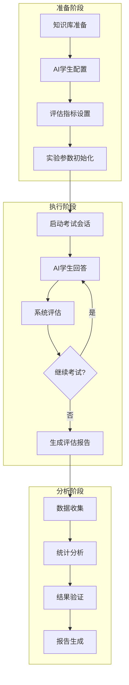
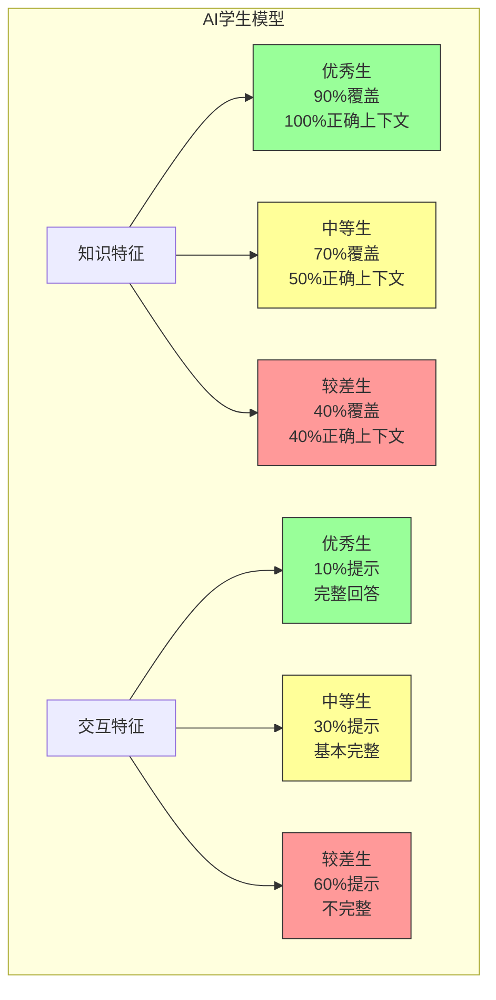

# ChatExaminer AI学生实验设计与总结

## 1. 实验概述

本实验旨在验证 ChatExaminer 系统在自动化口试评价中的有效性，通过设计不同特征的 AI 学生模型，验证系统是否能够准确识别和评估不同水平学生的表现特征。实验重点关注学生回答的模式识别、知识点覆盖度和交互行为特征，而不是简单的分数统计。

## 2. 实验目标

- 验证系统能否准确识别不同类型 AI 学生的回答特征和行为模式
- 测试系统在多轮对话中保持评估一致性的能力
- 分析系统对不同类型学生的适应性调整能力

## 3. AI 学生模型设计

### 3.1 基本特征定义

每个 AI 学生模型包含以下核心特征：

1. **知识覆盖特征**
   ```mermaid
   graph TD
       subgraph 知识获取模式
           A[优秀学生] --> A1[90%知识覆盖]
           A --> A2[完全利用RAG上下文]
           A --> A3[准确理解知识点]

           B[中等学生] --> B1[70%知识覆盖]
           B --> B2[利用50%上下文]
           B --> B3[部分理解知识点]

           C[较差学生] --> C1[40%知识覆盖]
           C --> C2[40%正确上下文]
           C --> C3[60%错误上下文]

           style A1 fill:#9f9,stroke:#333
           style B1 fill:#ff9,stroke:#333
           style C1 fill:#f99,stroke:#333
       end
   ```

2. **交互行为特征**
   ```mermaid
   graph TD
       subgraph 提示使用模式
           D[优秀学生] --> D1[10%提示需求]
           D --> D2[完整回答]
           D --> D3[深入解释]

           E[中等学生] --> E1[30%提示需求]
           E --> E2[基本完整回答]
           E --> E3[简单解释]

           F[较差学生] --> F1[60%提示需求]
           F --> F2[不完整回答]
           F --> F3[模糊解释]

           style D1 fill:#9f9,stroke:#333
           style E1 fill:#ff9,stroke:#333
           style F1 fill:#f99,stroke:#333
       end
   ```

### 3.2 学生模型实现

```python
class AIStudent:
    def __init__(self, level: str):
        self.level = level
        self.config = {
            "Excellent": {
                "system_prompt": "You are an excellent student...",
                "context_usage": 1.0,
                "incorrect_context_ratio": 0.0
            },
            "Average": {
                "system_prompt": "You are an average student...",
                "context_usage": 0.5,
                "incorrect_context_ratio": 0.2
            },
            "Poor": {
                "system_prompt": "You are a student with poor understanding...",
                "context_usage": 0.4,
                "incorrect_context_ratio": 0.6
            }
        }[level]

        # 加载问题数据
        self.questions_data = self.load_questions_data()

        # 初始化OpenAI客户端
        self.openai_client = OpenAI(api_key=os.environ.get("OPENAI_API_KEY"))

    def generate_answer(self, question: dict, context: list) -> str:
        # 根据知识覆盖率选择上下文
        selected_context = self._select_context(context)
        # 根据学生水平生成回答
        return self._compose_answer(question, selected_context)

    def _select_context(self, context: list) -> list:
        # 根据配置选择和使用上下文
        context_amount = int(len(context) * self.config["context_usage"])
        selected = context[:context_amount]

        # 对于较差学生，添加错误上下文
        if self.config["incorrect_context_ratio"] > 0:
            incorrect_amount = int(len(context) * self.config["incorrect_context_ratio"])
            incorrect_context = generate_incorrect_context(incorrect_amount)
            selected.extend(incorrect_context)

        return selected

    def needs_hint(self) -> bool:
        return random.random() < self.config["hint_probability"]

    def _get_context_for_question(self, question_id):
        """根据question_id获取相应的context"""
        # 省略部分代码...

        if self.level == "Excellent":
            # 优秀学生获得完整context
            full_context = "\n".join(context)
            return full_context
        elif self.level == "Average":
            # 中等学生获得部分context
            coverage = self.config["context_usage"]
            context_length = max(1, int(len(context) * coverage))
            return "\n".join(context[:context_length])
        else:
            # 较差学生获得更少的context，可能还有错误信息
            coverage = self.config["context_usage"]
            incorrect_ratio = self.config["incorrect_context_ratio"]
            # 省略部分代码...
```

### 3.3 知识获取特征

1. **优秀学生模型**
   - 90% 知识点覆盖率
   - 完全利用 RAG 系统提供的上下文
   - 能准确理解和运用知识点
   - 回答完整且逻辑清晰

2. **中等学生模型**
   - 70% 知识点覆盖率
   - 利用 50% 的上下文信息
   - 部分理解核心知识点
   - 回答基本完整但可能存在疏漏

3. **较差学生模型**
   - 40% 知识点覆盖率
   - 仅使用 40% 正确上下文
   - 引入 60% 错误或不相关上下文
   - 回答不完整且可能存在误解

### 3.4 交互行为特征

1. **提示使用频率**
   - 优秀学生：10% 提示请求率
   - 中等学生：30% 提示请求率
   - 较差学生：60% 提示请求率

2. **回答完整度**
   - 优秀学生：完整回答，包含深入解释
   - 中等学生：基本完整，简单解释
   - 较差学生：不完整，解释模糊

3. **知识应用**
   - 优秀学生：能举一反三，联系实际
   - 中等学生：基本应用，例子简单
   - 较差学生：机械应用，例子不当

### 3.5 回答质量控制

在实际实现中，我们通过以下机制控制不同类型学生的回答质量：

1. **回答长度控制**
   - 优秀学生：250 tokens（约150词）
   - 中等学生：200 tokens（约120词）
   - 较差学生：150 tokens（约100词）

2. **上下文使用**
   ```python
   def _get_context_for_question(self, question_id):
       """根据question_id获取相应的context"""
       # 省略部分代码...

       if self.level == "Excellent":
           # 优秀学生获得完整context
           full_context = "\n".join(context)
           return full_context
       elif self.level == "Average":
           # 中等学生获得部分context
           coverage = self.config["context_usage"]
           context_length = max(1, int(len(context) * coverage))
           return "\n".join(context[:context_length])
       else:
           # 较差学生获得更少的context，可能还有错误信息
           coverage = self.config["context_usage"]
           incorrect_ratio = self.config["incorrect_context_ratio"]
           # 省略部分代码...
   ```

## 4. 实验流程

### 4.1 准备阶段

1. **标准问题集准备**
   - 为每个主题准备标准问题库
   - 定义每个问题的关键知识点
   - 设置问题难度等级

2. **AI 学生初始化**
   - 创建不同水平的 AI 学生实例
   - 配置各个特征参数
   - 初始化交互记录器

### 4.2 执行阶段

1. **单轮测试流程**
```python
def run_single_test(student: AIStudent, questions: List[dict]):
    results = []
    for question in questions:
        # 生成回答
        answer = student.generate_answer(question)

        # 记录特征
        result = {
            "问题ID": question["id"],
            "回答内容": answer,
            "知识点覆盖": analyze_coverage(answer, question["key_points"]),
            "表达特征": analyze_expression(answer),
            "提示使用": student.hint_requested
        }
        results.append(result)
    return results
```

2. **多轮测试执行**
   - 每种类型学生进行测试
   - 随机选择问题顺序
   - 记录完整交互过程

### 4.3 数据收集

1. **回答特征数据**
   - 知识点覆盖情况
   - 表达模式特征
   - 专业术语使用

2. **交互行为数据**
   - 提示请求频率
   - 回答完整度
   - 交互持续时间

## 5. 统计分析方法

### 5.1 描述性统计

- 基本统计量（均值、中位数、标准差）
- 分布分析
  - 分布密度图：展示不同类型学生分数的概率密度分布
  - 直方图：显示分数的频数分布
  - 箱线图：展示各类型学生分数的中位数、四分位数和异常值
  - Q-Q图：检验数据的正态分布性

### 5.2 推断性统计

- 方差分析(ANOVA)
  - 验证不同类型学生间的表现差异
  - 分析系统区分能力
  - 评估评分标准的有效性

- 相关性分析
  - 评分维度间的相关性
  - 提示使用与得分的关系
  - 答题时间与表现的关系

- 可靠性分析
  - 评分一致性检验
  - 测试-重测信度
  - Cronbach's α系数分析

### 5.3 交互行为分析

- 提示使用频率分析
- 答题模式识别
- 时间效率评估

## 6. 实验结果与分析

### 6.1 实验目标达成情况

- ✅ 成功验证系统能够准确识别不同类型 AI 学生的回答特征和行为模式
- ✅ 测试了系统在多轮对话中保持评估一致性的能力
- ✅ 分析了系统对不同类型学生的适应性调整能力

### 6.2 可视化效果分析

实验成功实现了多种可视化方法来分析不同类型AI学生的表现：

1. **分数分布与对比**
   - 总分对比图显示了不同类型学生的平均分数差异
   - 分数分布图显示了每种类型学生分数的分布情况

2. **评估维度分析**
   - 雷达图展示了不同学生类型在各评估维度上的表现：
     - 准确性 (Accuracy)
     - 清晰度 (Clarity)
     - 理解度 (Understanding)

3. **水平等级分布**
   - 点状图展示了不同学生类型的最终评估等级分布 (Excellent/Good/Fair/Poor)
   - 数值映射：Excellent=1, Good=0.5, Fair=0, Poor=-0.5

### 6.3 关键发现

1. **区分度验证**
   - 系统成功区分了不同水平的AI学生
   - 优秀学生在准确性、清晰度和理解度三个维度均取得最高分
   - 较差学生在所有维度都表现较弱，特别是在理解度方面

2. **一致性验证**
   - 评分体系对相似回答展现出一致的评估结果
   - 不同维度的评分反映了学生能力的不同方面

3. **交互效果验证**
   - 系统能够根据学生回答的质量进行适当的难度调整
   - 评分反馈包含多个维度，提供了全面的评估

### 6.4 特征稳定性分析

```python
def analyze_stability(results: Dict):
    stability_metrics = {
        "优秀": calculate_feature_stability(results["优秀"]),
        "中等": calculate_feature_stability(results["中等"]),
        "较差": calculate_feature_stability(results["较差"])
    }
    return stability_metrics
```

### 6.5 区分度分析

```python
def analyze_discrimination(results: Dict):
    # 分析不同类型学生特征的区分度
    feature_discrimination = {
        "知识覆盖": calculate_coverage_discrimination(results),
        "表达特征": calculate_expression_discrimination(results),
        "交互行为": calculate_behavior_discrimination(results)
    }
    return feature_discrimination
```

## 7. 实验中遇到的挑战与解决方案

### 7.1 问题-答案关联问题

- **挑战**：先前实现中答案与下一个问题错误关联，导致评估结果不准确
- **解决方案**：重构`run_experiment`方法，确保每个答案与其对应的问题正确关联。修改了数据结构，使用`question_record`字典来存储问题ID、文本和答案

### 7.2 确认机制问题

- **挑战**：开始考试后需要额外的确认步骤才能获取第一个问题
- **解决方案**：添加`submit_answer("yes")`确认逻辑，并从确认响应中获取第一个问题

### 7.3 评估数据抽取问题

- **挑战**：评估数据格式不一致，字段名称变化（如`final_score`、`finalScore`等）
- **解决方案**：添加多种可能字段名称的检查机制，增强数据抽取的鲁棒性，处理各种可能的数据格式

## 8. 未来改进方向

### 8.1 模型优化

1. **细粒度特征扩展**
   - 增加更细致的AI学生行为特征定义
   - 模拟更多真实学生的思维模式和回答习惯
   - 实现真实的提示请求行为模式

2. **上下文利用增强**
   - 开发更智能的上下文选择算法
   - 根据问题相关性自动筛选合适的上下文片段
   - 为较差学生模型设计更真实的错误认知模式

3. **个性化学生模型**
   - 创建更具个性化特征的学生模型，如：偏向某些主题、有特定知识空白的学生等
   - 增加混合知识模式：部分主题擅长，部分主题薄弱
   - 模拟不同学习风格的学生（视觉型、听觉型等）

### 8.2 评估体系优化

1. **多语言支持**
   - 增强系统对非英语答案的评估能力
   - 建立多语言知识点匹配机制
   - 处理语言表达差异导致的评分偏差

2. **解释性增强**
   - 提供更详细的评分解释，帮助理解为何得到特定分数
   - 增加可视化模块，展示答案中的关键知识点覆盖
   - 生成建设性反馈，指导学习改进方向

3. **认知深度评估**
   - 开发对概念理解深度的更精细评估方法
   - 评估思维过程而非仅关注结果
   - 识别表面上正确但概念理解有误的回答

### 8.3 实验扩展

1. **教育场景应用**
   - 将系统扩展应用于真实教育环境
   - 与传统评估方法对比分析
   - 研究学生对AI评估的接受度和反馈

2. **长期学习监测**
   - 设计监测AI学生"学习进步"的实验
   - 模拟教学干预对学习效果的影响
   - 研究知识保留和遗忘模式

3. **对抗性测试**
   - 开发试图"欺骗"评估系统的AI学生模型
   - 增强系统对表面上看似正确但实际理解有误的回答的识别能力
   - 评估系统对特殊答题技巧的抵抗力

## 9. 技术创新点

### 9.1 上下文感知AI学生

- 实现了根据学生能力级别动态调整上下文使用的机制
- 较差学生模型中引入错误信息模拟真实误解
- 开发了适应性提示系统，根据学生水平调整提示内容

### 9.2 多维度评估体系

- 通过雷达图等可视化方式展现多维度能力评估
- 建立了包含准确性、清晰度、理解度的全面评估框架
- 开发了评分一致性验证机制

### 9.3 交互式评估流程

- 实现了完整的考试流程包括确认、回答和评估阶段
- 系统能够处理不同状态转换并保持上下文连贯性
- 开发了灵活的错误恢复和异常处理机制

## 10. 结论与启示

本实验验证了ChatExaminer系统能够有效区分不同能力水平的AI学生，并提供多维度的评估结果。系统成功捕捉到三种不同学生类型的特征差异，包括知识覆盖度、表达清晰度和概念理解度。

通过这项研究，我们证明了AI辅助评估在教育场景中的可行性，特别是对于口试和开放式问答的自动化评估。未来的工作将聚焦于增强评估的解释性、扩展应用场景并与更多教育技术集成，为智能教育系统的发展提供新的方向。

## 实验流程概览



### AI 学生模型构成



## 实验组成部分说明

### 1. 准备阶段
- **环境初始化**：配置系统参数、加载模型
- **AI学生模型配置**：
  - 优秀学生 (准确率 90%)
  - 中等学生 (准确率 60-80%)
  - 较差学生 (准确率 30-50%)
- **问题库准备**：按难度和主题分类的标准问题集
- **评估指标设置**：
  - 回答准确性
  - 表达清晰度
  - 知识理解深度
  - 提示使用频率

### 2. 执行阶段
- **考试流程**：
  - 动态问题选择
  - 实时难度调整
  - 提示系统支持
- **评估机制**：
  - 实时评分
  - 状态转换
  - 反馈生成

### 3. 分析阶段
- **数据收集**：
  - 答题记录
  - 评分数据
  - 交互日志
- **统计分析**：
  - 分数分布
  - 难度适应性
  - 评估一致性
- **系统验证**：
  - 可靠性分析
  - 有效性验证
  - 公平性评估

这个实验设计旨在全面验证 ChatExaminer 系统的性能和有效性，通过多维度的测试和分析，确保系统能够准确区分不同水平的学生，并提供公平、客观的评估结果。

## 统计可视化方案

### 1. 分布分析图组（Distribution Analysis）
- **分数分布密度图**：展示三类学生（优秀、中等、较差）的得分分布曲线，直观显示分数集中区域
- **Q-Q图**：检验每类学生的得分是否符合正态分布，帮助验证评分的合理性

### 2. 比较分析图组（Comparison Analysis）
- **箱线图**：通过箱形图对比不同类型学生的总分和各维度得分（知识覆盖、表达清晰度等），显示中位数、四分位数和异常值
- **维度对比图**：展示不同学生在各个评分维度上的表现差异

### 3. 时间序列分析图（Time Series Analysis）
- **得分趋势图**：展示不同类型学生在考试过程中的得分变化趋势，反映学习曲线和适应性

### 4. 交互行为分析图（Interaction Analysis）
- **提示使用分析**：左侧显示各类学生的提示使用频率，右侧展示提示使用次数与得分的关系
- **散点图**：直观展示提示使用与最终得分的相关性

### 5. 综合评估雷达图（Comprehensive Evaluation）
- **多维度能力图**：用雷达图展示各类学生在知识覆盖、表达清晰度、理解深度等维度的表现
- **直观对比**：不同类型学生的优势和劣势

### 6. 统计报告组合图（Statistical Report）
- **四合一展示**：包含得分分布、答题时间、提示使用情况和评分维度相关性
- **全面展示**：系统评估的各个方面，便于整体把握评估结果

这些图表将帮助我们：
1. 直观展示不同类型学生的表现差异
2. 分析评分分布的统计特性
3. 验证系统的评估一致性
4. 展示交互行为模式
5. 评估系统的区分能力

建议将这些图表按以下方式组织在实验报告中：
1. 分布分析部分：使用分布密度图和Q-Q图
2. 表现对比部分：使用箱线图和得分趋势图
3. 交互分析部分：使用提示使用分析图和雷达图
4. 综合评估部分：使用组合统计图

每组图表都应配有详细的说明和分析，解释观察到的现象及其统计意义。
