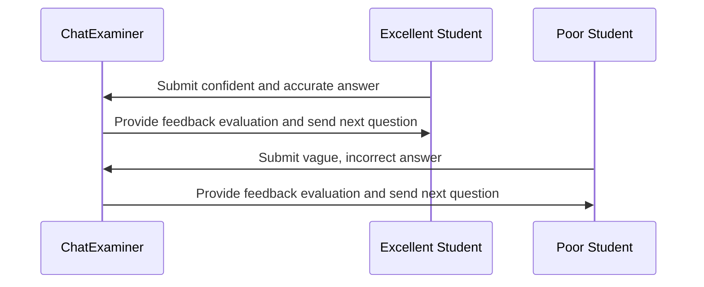

# ChatExaminer Experiment Design

## 1. Experiment Overview

This paper verifies the performance of the ChatExaminer system in automated oral examination evaluation through a series of experiments. The experiments mainly use two types of artificial students: one type is excellent students (confident performance, accurate and complete answers), and the other type is poor students (vague answers, lack of accuracy). The experiments will be conducted repeatedly to analyze the system's ability to differentiate between students of different performance levels in a statistical manner.

## 2. Experiment Objectives

- Verify that the system can dynamically generate subsequent questions based on student responses in real-time oral examination interaction.
- Measure the performance differences of the system's multi-dimensional scoring metrics (such as accuracy, clarity, and understanding) across different types of students.
- Verify the stability and consistency of the system in distinguishing students of different ability levels through repeated experiments.

## 3. Artificial Student Design

To simulate real examination scenarios, two types of artificial students were designed, with behavior patterns following the instructions in `server/test/studentPrompt.txt`:

- **Excellent Student**: Solid internal knowledge, confident and clear answers, able to accurately express core concepts.
- **Poor Student**: Incomplete knowledge mastery, hesitant, confused, and erroneous answers, showing low confidence.

The behavior of artificial students is controlled through preset prompts, which can be adjusted in style and detail to simulate different student performances.

## 4. System Interaction Process Design

The interaction process between ChatExaminer and artificial students is as follows:

1. The system starts an exam session and sends the first question.
2. The artificial student generates an answer based on their role and submits it to the system.
3. The system evaluates the answer in real-time, provides feedback, and generates the next question.
4. Repeat the above steps until the preset number of Q&A interactions is reached or the exam ends.

Below is a diagram of the system interaction process:



## 5. Experimental Data Collection and Analysis

During the experiment, the system will collect the following data:

- Scoring data for each question: scores calculated based on accuracy, clarity, and understanding.
- Response time and hint usage for answers.
- Overall performance of each artificial student in each exam: average score and variance.
- System-generated feedback and subsequent question records.

After multiple repetitions of the experiment, statistical analysis methods will be used to evaluate whether the system can stably distinguish students of different ability levels, as well as the effectiveness of each scoring metric.

## 6. Expected Results and Discussion

The system is expected to achieve the following goals:

- Dynamically generate subsequent questions that highly match the course content, ensuring interaction coherence.
- Clearly distinguish between the answer quality of excellent students and poor students through multi-dimensional scoring metrics.
- Show good stability and consistency in repeated experiments, making the performance differences between different student groups statistically significant.

The discussion section will analyze the advantages and limitations of the system (such as the challenge of potential similarities in artificial student answers) and phenomena observed in the experiments.

## 7. Future Work

Future research directions include:

- Introducing more diverse artificial student models to expand student behavior aspects and enhance experimental coverage.
- Optimizing the hint mechanism and conducting in-depth research on the specific impact of hints on scoring in multi-round interactions.
- Validating the system's application effect in actual teaching by combining with real student data.

## 8. Question Quality Assessment Based on Bloom's Taxonomy

To comprehensively evaluate the quality of questions generated by the ChatExaminer system, this research introduces Bloom's Revised Taxonomy as a theoretical foundation to construct a systematic question evaluation framework. Bloom's Taxonomy is a widely applied cognitive level classification system in education that can effectively distinguish the cognitive difficulty and type of questions.

### 8.1 Classification Framework Design

The evaluation framework is based on two dimensions of Bloom's Taxonomy:

#### 8.1.1 Cognitive Process Dimension
- **Remember**: Recall or recognize basic concepts, terms, or facts, such as "List three basic elements of reinforcement learning"
- **Understand**: Understand and explain concepts in one's own words, such as "Explain the meaning of the state value function"
- **Apply**: Apply learned knowledge to solve specific problems, such as "Use the Bellman equation to calculate the optimal policy for a given MDP"
- **Analyze**: Break down concepts, identify relationships between components, such as "Analyze the differences and applicable scenarios of Q-learning and SARSA algorithms"
- **Evaluate**: Make judgments based on criteria, such as "Evaluate the advantages of TD learning over MC methods in continuous state spaces"
- **Create**: Integrate elements to form a new whole or perspective, such as "Design a reinforcement learning algorithm to solve problems with partial observability"

#### 8.1.2 Knowledge Dimension
- **Factual Knowledge**: Basic elements, terms, and specific details
- **Conceptual Knowledge**: Classifications, principles, theories, and models
- **Procedural Knowledge**: Methods and techniques of how to do something
- **Metacognitive Knowledge**: Awareness and self-regulation of cognitive processes

### 8.2 Automated Classification Method Implementation

This research will use the following methods to automatically classify questions generated by the system:

#### 8.2.1 Large Language Model Classifier
Utilize the GPT-4 model to implement automatic question classification, with the following specific steps:

1. **Refined Prompt Engineering**: Design specialized prompt templates to guide the model in Bloom's classification
   ```python
   def classify_question(question_text, client):
       prompt = f"""
       请根据布卢姆修订版分类法，对以下问题进行分类：
       问题：{question_text}

       请从以下选项中选择最贴切的类别：
       1. 认知过程维度（必选一项）：记忆、理解、应用、分析、评价、创造
       2. 知识维度（必选一项）：事实性、概念性、程序性、元认知

       同时，提供简短理由说明为何选择这些类别。

       按以下JSON格式返回：
       {{
           "cognitive_process": "选择的认知过程类别",
           "knowledge_dimension": "选择的知识维度类别",
           "reasoning": "分类理由"
       }}
       """

       response = client.chat.completions.create(
           model="gpt-4o",
           messages=[
               {"role": "system", "content": "你是教育评估专家，精通布卢姆分类法。"},
               {"role": "user", "content": prompt}
           ],
           temperature=0.2
       )

       return json.loads(response.choices[0].message.content)
   ```

2. **Cross-Model Validation**: Use multiple different large language models to classify the same question and compare result consistency
3. **Expert Calibration**: Select some questions for manual classification by education experts as calibration benchmark

### 8.3 Distribution Balance Analysis

To ensure exam questions cover different cognitive levels, this research will conduct distribution balance analysis:

#### 8.3.1 Ideal Distribution Design
Design the following ideal distribution based on the teaching objectives of course 02465 (Introduction to Reinforcement Learning and Control Theory):

| Cognitive Process Dimension | Target Proportion | Description |
|------------|---------|------|
| 记忆 | 15% | 基础术语和定义 |
| 理解 | 25% | 核心概念理解 |
| 应用 | 25% | 算法应用和计算 |
| 分析 | 20% | 算法比较和问题分析 |
| 评价 | 10% | 方法评估和选择 |
| 创造 | 5% | 算法设计和问题解决 |

#### 8.3.2 High-Level vs. Low-Level Thinking Ratio
- **Low-Level Thinking (LOTS)**: Memory, Understand, Apply, Target Ratio 65%
- **High-Level Thinking (HOTS)**: Analyze, Evaluate, Create, Target Ratio 35%

#### 8.3.3 Distribution Analysis Method
```python
def analyze_distribution(questions_with_classifications):
    """Analyze question classification distribution and compare with target distribution"""
    # Count actual distribution
    cognitive_counts = Counter([q["classification"]["cognitive_process"]
                               for q in questions_with_classifications])

    # Calculate percentage for each category
    total = len(questions_with_classifications)
    percentages = {category: count/total*100 for category, count in cognitive_counts.items()}

    # Calculate HOTS and LOTS ratio
    lots = sum([percentages.get(cp, 0) for cp in ["记忆", "理解", "应用"]])
    hots = sum([percentages.get(cp, 0) for cp in ["分析", "评价", "创造"]])

    return {
        "category_percentages": percentages,
        "lots_percentage": lots,
        "hots_percentage": hots,
        "hots_lots_ratio": hots/lots if lots > 0 else float('inf')
    }
```

### 8.4 Quality Assessment Metrics

This research will use the following metrics to evaluate question quality:

#### 8.4.1 Category Diversity Score (CS)
- **Coverage Score**: Percentage of covered cognitive categories
  ```
  CS = (Number of covered cognitive categories / 6) × 100%
  ```
- **Shannon Diversity Index (SDI)**: Measure distribution balance
  ```
  SDI = -∑(pi × log(pi))，其中pi为第i类问题的比例
  ```

#### 8.4.2 Difficulty-Cognitive Match
- **Consistency Coefficient (CC)**: Problem difficulty level correlation with cognitive level
  ```
  CC = Pearson(difficulty level, cognitive level order)
  ```
  where cognitive level order: Memory=1, Understand=2, Apply=3, Analyze=4, Evaluate=5, Create=6

#### 8.4.3 Course Goal Alignment
- **Goal Coverage Rate (TCR)**: Problem category alignment with course teaching goals
  ```
  TCR = (Number of problems aligned with course goals / Total number of problems) × 100%
  ```
- **Weighted Goal Coverage Rate (WTCR)**: Weighted coverage rate considering teaching goal importance
  ```
  WTCR = ∑(Problem weighti × Goal weighti) / ∑Goal weighti
  ```

### 8.5 Experiment Design and Data Collection

#### 8.5.1 Experiment Process
1. Use ChatExaminer system to generate a large number of exam questions (Target: At least 100 questions)
2. Automatically classify all questions using Bloom's classification method
3. Calculate question distribution and quality assessment metrics
4. Optimize adjustments, feedback to question generation module
5. Repeat above steps until ideal distribution is reached

#### 8.5.2 Data Record Format
```json
{
  "question_id": "Q123",
  "question_text": "Explain the role of γ parameter in TD learning",
  "difficulty": 3,
  "classification": {
    "cognitive_process": "理解",
    "knowledge_dimension": "概念性",
    "reasoning": "该问题要求学生解释概念，体现对γ参数在TD学习中作用的理解"
  },
  "quality_metrics": {
    "difficulty_cognitive_match": 0.85,
    "course_alignment": 0.92
  }
}
```

### 8.6 Expected Results and Evaluation Criteria

#### 8.6.1 Ideal Results
- System generated question Bloom's classification distribution should approach preset target
- HOTS and LOTS question ratio should reach 35:65
- Category Diversity Score: CS≥90%, SDI≥1.5
- Difficulty-Cognitive Match: CC≥0.7
- Course Goal Alignment: TCR≥85%

#### 8.6.2 Analysis Method
Through statistical chart visualization of distribution, including:
- Cognitive Process Dimension Pie Chart
- Knowledge Dimension Bar Chart
- Difficulty and Cognitive Level Scatter Plot
- Quality Metrics Radar Chart

These analyses will help us evaluate the quality of system generated questions and provide basis for further optimization.
