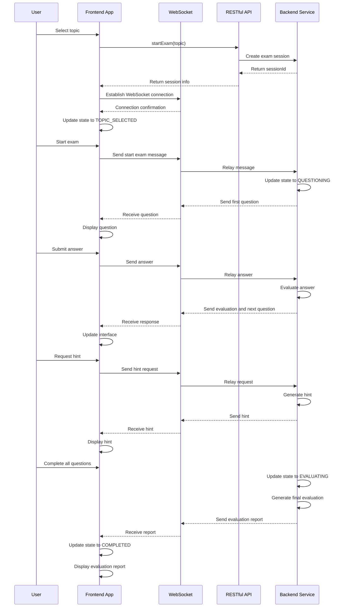
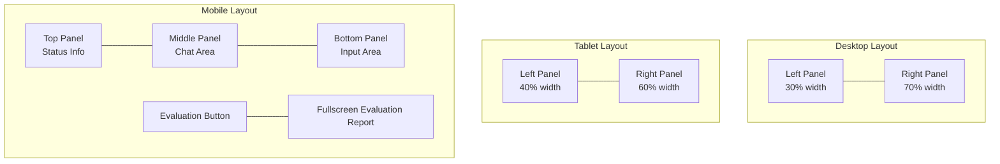
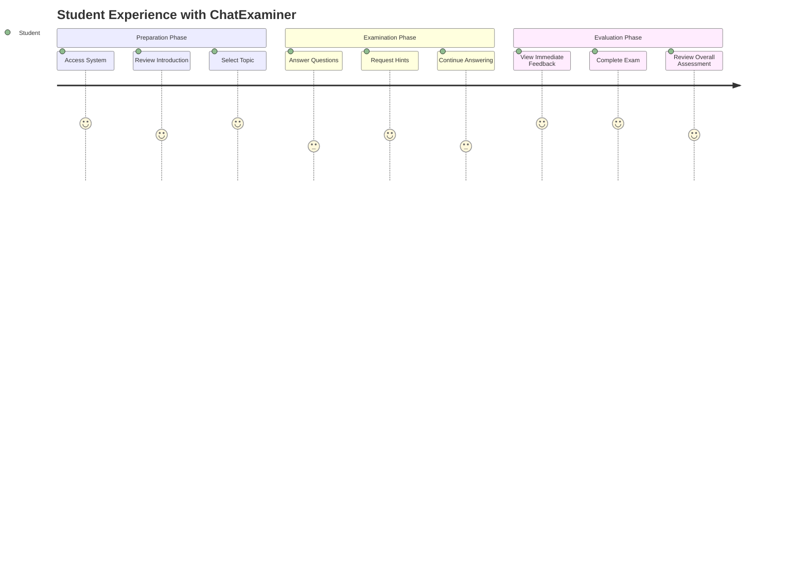
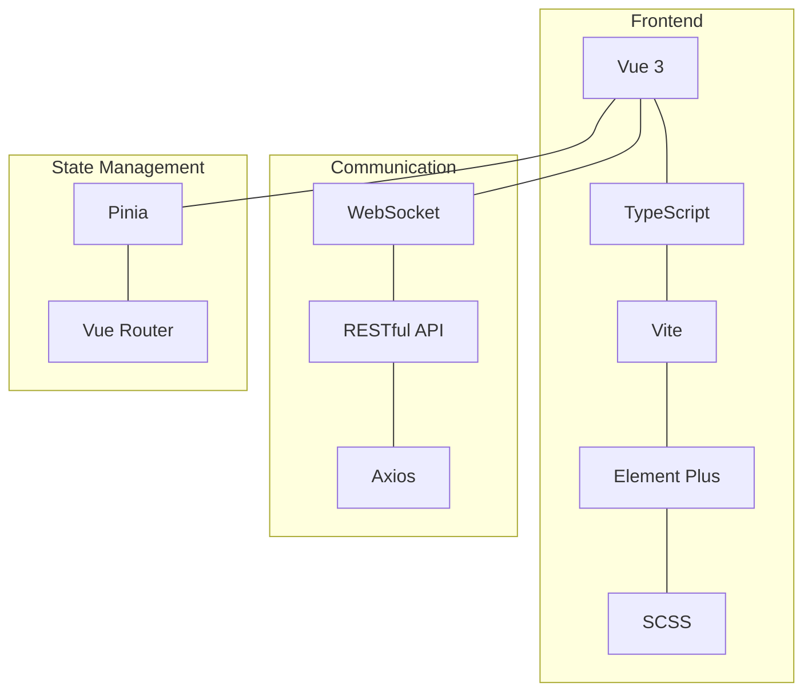
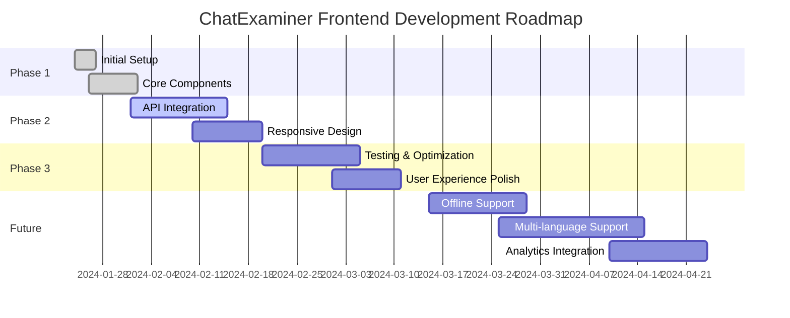

# ChatExaminer 前端开发文档

## 布局设计

### 整体布局
- 采用响应式设计，主要分为两种视图：
  1. 初始状态（选择主题）
  2. 考试进行状态（分栏布局）

### 组件结构
```
Exam.vue (主视图)
├── 初始状态
│   └── 主题选择表单
└── 考试状态
    ├── 左侧面板
    │   ├── StatePanel (状态面板)
    │   └── EvalReport (评估报告，仅完成状态显示)
    └── 右侧面板
        └── ExamChat (聊天界面)
```

### 组件详情

#### StatePanel（状态面板）
- 显示当前考试状态
- 显示已答题数量
- 显示使用提示次数
- 显示当前难度等级
- 使用 Element Plus 的 Card 和 Tag 组件

#### ExamChat（聊天界面）
- 消息列表显示
  - 支持系统消息、用户消息和助手消息
  - 不同角色消息使用不同样式
  - 显示发送时间
- 输入区域
  - 文本输入框
  - 发送按钮
  - 支持 Enter 发送
- 自动滚动到最新消息

#### EvalReport（评估报告）
- 总分显示
- 主题覆盖标签
- 优点列表
- 不足列表
- 建议列表

## 状态管理

### 考试状态
```typescript
type ExamState = 'INIT' | 'TOPIC_SELECTED' | 'QUESTIONING' | 'EXPLAINING' | 'EVALUATING' | 'COMPLETED' | 'CHAT'
```

### 数据流
1. 开始考试
   - 用户输入主题
   - 调用 API 创建会话
   - 建立 WebSocket 连接
   - 更新状态和显示初始消息

2. 考试过程
   - 用户发送消息
   - 通过 WebSocket 接收响应
   - 更新状态和消息列表
   - 动态更新统计数据

3. 完成评估
   - 获取评估报告
   - 显示详细评估信息

## API 服务

### ExamService 类
- 管理与后端的通信
- 维护考试会话状态
- 处理 WebSocket 连接
- 方法：
  - startExam
  - submitAnswer
  - getExamState
  - getEvaluation
  - connectWebSocket
  - clearSession

## 样式设计

### 主题变量
```scss
:root {
  --primary-color: #409eff;
  --background-color: #f5f7fa;
  --text-color: #303133;
  --spacing-md: 16px;
}
```

### 布局特点
- 使用 CSS Grid 实现分栏布局
- 固定侧边栏宽度（300px）
- 自适应主内容区域
- 统一的间距和圆角
- 阴影效果增强层次感

## 开发记录

### 2024-01-26
1. 初始化项目
   - 使用 Vue 3 + TypeScript + Vite
   - 配置 Element Plus UI 库
   - 设置路由和状态管理

2. 实现基础组件
   - 创建主视图 Exam.vue
   - 实现状态面板组件
   - 实现聊天界面组件
   - 实现评估报告组件

3. 配置 API 服务
   - 实现 ExamService 类
   - 配置 WebSocket 连接
   - 处理会话管理

4. 优化用户体验
   - 添加加载状态
   - 完善错误处理
   - 优化消息展示
   - 实现自动滚动

### 待办事项
- [ ] 添加消息重试机制
- [ ] 实现断线重连
- [ ] 优化移动端适配
- [ ] 添加主题切换功能
- [ ] 增加动画效果

## 数据流图



## 响应式布局示意图

展示前端在不同屏幕尺寸下的布局变化：



## 其他建议

1. **界面实际效果截图**：除了图表外，建议添加实际界面截图，展示不同状态下的UI

2. **交互原型链接**：可以添加Figma或其他原型工具的链接，供团队成员参考完整交互

3. **组件状态变化图**：展示主要组件在不同状态下的变化

```mermaid
stateDiagram-v2
    direction LR
    [*] --> Default
    Default --> Loading: Submit Answer
    Loading --> Success: Receive Response
    Loading --> Error: Network Error
    Success --> Default: After 3 seconds
    Error --> Retry: Click Retry
    Retry --> Loading: Resend
    Error --> Default: Cancel
```

4. **用户体验流程图**：展示完整用户旅程



## 实施建议

1. 将这些可视化图表添加到现有文档的相应部分，不要删除原有内容

2. 考虑使用实际前端界面的截图补充抽象图表

3. 为不同设备和状态添加界面预览

4. 添加开发路线图，展示前端未来迭代计划

这些可视化增强将使文档更加直观易懂，帮助新开发者更快理解系统结构和工作流程，同时也能更好地展示前端交互和设计思路。

## 技术栈图表



## 开发路线图



## 实施建议

1. 将这些英文图表整合到现有文档中，替换原有的中文图表

2. 考虑添加实际界面截图，配合每个图表展示实际效果

3. 为不同设备和状态添加界面预览图

4. 确保图表中的英文术语与代码库中使用的变量和函数名保持一致

这些可视化内容将大大提升文档的可读性和专业性，同时保持了文档的中文说明与英文技术表格的清晰对比。
