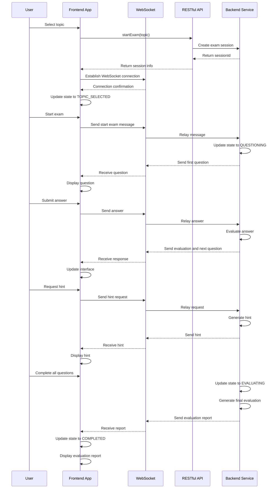
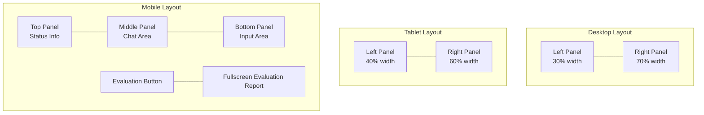
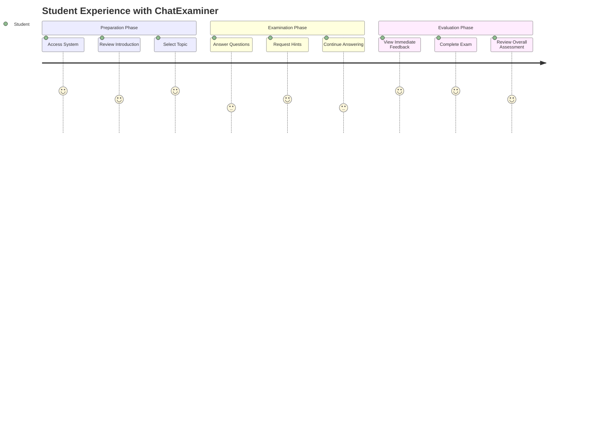
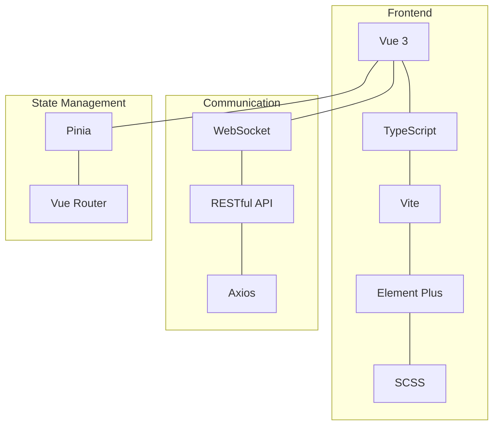
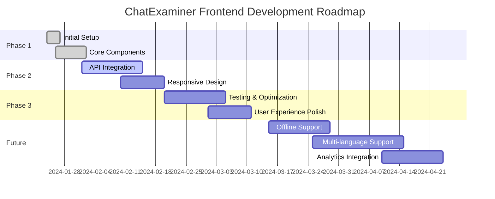

# ChatExaminer Frontend Development Documentation

## Layout Design

### Overall Layout
- Responsive design, mainly divided into two views:
  1. Initial state (topic selection)
  2. Exam in progress state (column layout)

### Component Structure
```
Exam.vue (Main View)
├── Initial State
│   └── Topic Selection Form
└── Exam State
    ├── Left Panel
    │   ├── StatePanel (Status Panel)
    │   └── EvalReport (Evaluation Report, only shown in completed state)
    └── Right Panel
        └── ExamChat (Chat Interface)
```

### Component Details

#### StatePanel (Status Panel)
- Display current exam state
- Display number of questions answered
- Display number of hints used
- Display current difficulty level
- Use Element Plus Card and Tag components

#### ExamChat (Chat Interface)
- Message list display
  - Support system messages, user messages and assistant messages
  - Different styles for different roles
  - Display sent time
- Input area
  - Text input box
  - Send button
  - Support Enter to send
- Auto-scroll to latest message

#### EvalReport (Evaluation Report)
- Total score display
- Topic coverage tags
- Strengths list
- Weaknesses list
- Suggestions list

## State Management

### Exam States
```typescript
type ExamState = 'INIT' | 'TOPIC_SELECTED' | 'QUESTIONING' | 'EXPLAINING' | 'EVALUATING' | 'COMPLETED' | 'CHAT'
```

### Data Flow
1. Start Exam
   - User inputs topic
   - Call API to create session
   - Establish WebSocket connection
   - Update state and display initial message

2. Exam Process
   - User sends message
   - Receive response via WebSocket
   - Update state and message list
   - Dynamically update statistics

3. Complete Evaluation
   - Get evaluation report
   - Display detailed evaluation information

## API Services

### ExamService Class
- Manage communication with backend
- Maintain exam session state
- Handle WebSocket connection
- Methods:
  - startExam
  - submitAnswer
  - getExamState
  - getEvaluation
  - connectWebSocket
  - clearSession

## Style Design

### Theme Variables
```scss
:root {
  --primary-color: #409eff;
  --background-color: #f5f7fa;
  --text-color: #303133;
  --spacing-md: 16px;
}
```

### Layout Features
- Use CSS Grid for column layout
- Fixed sidebar width (300px)
- Adaptive main content area
- Uniform spacing and rounded corners
- Shadow effects to enhance layering

## Development Records

### 2024-01-26
1. Initialize Project
   - Use Vue 3 + TypeScript + Vite
   - Configure Element Plus UI library
   - Set up routing and state management

2. Implement Basic Components
   - Create main view Exam.vue
   - Implement status panel component
   - Implement chat interface component
   - Implement evaluation report component

3. Configure API Services
   - Implement ExamService class
   - Configure WebSocket connection
   - Handle session management

4. Optimize User Experience
   - Add loading states
   - Improve error handling
   - Optimize message display
   - Implement auto-scrolling

### To-Do Items
- [ ] Add message retry mechanism
- [ ] Implement reconnection
- [ ] Optimize mobile adaptation
- [ ] Add theme switching functionality
- [ ] Add animation effects

## Data Flow Diagram



## Responsive Layout Diagram

Showing frontend layout changes across different screen sizes:



## Other Suggestions

1. **Interface Screenshots**: In addition to diagrams, it's recommended to add actual interface screenshots to show UI in different states

2. **Interactive Prototype Link**: A Figma or other prototype tool link can be added for team members to reference complete interactions

3. **Component State Change Diagram**: Show how main components change in different states

```mermaid
stateDiagram-v2
    direction LR
    [*] --> Default
    Default --> Loading: Submit Answer
    Loading --> Success: Receive Response
    Loading --> Error: Network Error
    Success --> Default: After 3 seconds
    Error --> Retry: Click Retry
    Retry --> Loading: Resend
    Error --> Default: Cancel
```

4. **User Experience Flow Chart**: Show complete user journey



## Implementation Suggestions

1. Add these visual charts to the corresponding sections of the existing document, do not delete the original content

2. Consider using actual interface screenshots to supplement abstract charts

3. Add interface previews for different devices and states

4. Add development roadmap, showing frontend future iteration plan

These visual enhancements will make the document more intuitive and easier to understand for new developers, while also better showing frontend interaction and design ideas.

## Technology Stack Diagram



## Development Roadmap



## Implementation Suggestions

1. Integrate these English charts into the existing document, replacing the original Chinese charts

2. Consider adding actual interface screenshots, and show actual effects with each chart

3. Add interface preview for different devices and states

4. Ensure that the English terms in the charts are consistent with the variable and function names used in the code library

These visual contents will greatly improve the readability and professionalism of the document, while maintaining the clear contrast between Chinese descriptions and English technical tables.
