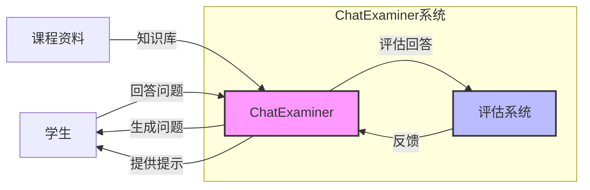

# Master Thesis Plan: ChatExaminer

## 前置部分
- Abstract (1-2页)
  - 清晰阐述研究目标和贡献
  - 强调系统创新性
- Acknowledgements
- Table of Contents
- List of Figures/Tables

## 1. 引言 (8-10页)

### 1.1 研究背景与动机

随着人工智能技术的快速发展，传统的口试和课堂评估方法正面临着智能化转型的挑战[1]。近年来，大语言模型在自动文本生成和对话系统方面取得了显著进展。特别是自 OpenAI 发布 GPT-3 及其后续版本[2]以来，这类模型展现出前所未有的潜力，为教育领域开创了新的可能性。

在传统教学中，教师通过持续评估来反馈学生的表现，这种方法虽然依赖于教师的专业经验，能够提供实时反馈和评估以促进学生进步，但极其耗时。近期研究[3]在使用 AI 技术生成考试题目方面取得了部分成功，展示了自动化出题的高效性。在求职面试领域，利用多模态数据进行综合分析来评估候选人为动态对话管理提供了有益的见解[4,5]，但该领域的研究重点与教育中匹配课程知识的要求有显著差异。

然而，现有的自动评估系统主要局限于静态题目的设计和评分[3]，而实际的口试评估过程不仅需要生成高质量的问题，还需要与学生进行实时互动、动态调整提问策略，并对学生回答的质量进行多维度评估[1]。总的来说，尽管现有系统在问题生成、对话连贯性和多模态数据处理方面取得了一定成果[6,7]，但在教育领域的口试评估中仍面临诸多挑战：

1. 如何基于课程和教学要求，自动生成与学科知识高度匹配的考试问题
2. 如何在实时口试中动态调整提问策略，从多个角度评估学生回答的准确性、表达清晰度和知识理解深度
3. 如何确保生成的问题既满足严格的教学标准，又能有效区分不同水平的学生
4. 如何合理引入并量化提示机制对评分的影响，同时确保系统评估的公平性和规范性

### 1.2 项目概述

基于上述挑战，本项目开发了一个基于 AI 的口试评价系统——ChatExaminer。该系统基于 DTU 课程 02465（强化学习与控制理论导论）[8]的教学大纲，利用课程提供的知识库、教学大纲和口试程序[9]，通过实时交互和动态评估，为学生提供接近真实口试体验的自动化考试环境。

系统的主要创新点包括：
1. 动态问题生成：根据学生回答实时调整后续问题，确保问题与课程要求高度匹配
2. 多维度评估：不仅关注答案准确性，还包括表达清晰度和理解深度
3. 智能提示机制：根据学生表现提供个性化的引导，并将提示使用情况纳入评估体系

### 1.3 系统架构概览



上图展示了 ChatExaminer 系统的核心交互流程。系统通过分析学生的回答，动态生成后续问题，并提供实时评估和必要的提示，形成一个完整的考试闭环。系统的设计不仅有助于开发自动化、标准化和高效的口试评估系统，还为智能教育评估系统的进一步发展提供了理论基础和实践参考。

### 1.4 研究问题

基于上述背景，本研究提出以下核心问题：

1. **如何设计一个基于大语言模型的口试系统，使其能在实时交互中根据学生回答动态生成与课程要求高度匹配的后续问题？**
   - 问题生成策略的设计
   - 课程知识的对齐机制
   - 交互流程的自然性
   - 动态调整的准确性

2. **如何通过合理的实验设计，验证系统定义的评分指标和反馈机制能否准确反映学生的真实水平，并确保与教师设定的评估标准（如课程大纲）保持一致？**
   - 评估指标的设计和验证
   - 不同类型学生的表现区分
   - 系统评估的一致性
   - 与教师标准的对齐

### 1.5 论文结构与阅读指南

本文的组织结构旨在系统地回答上述研究问题，各章节之间紧密关联，逐步展开论证：

- **第二章 系统设计与实现**：为回答研究问题奠定理论基础并详细介绍系统
  - 分析现有 AI 教育评估系统的优势与局限，为研究问题 1 提供设计依据
  - 探讨口试评估理论和标准，支持研究问题 2 中的评估指标设计
  - 回顾大语言模型在教育中的应用，特别是提示机制的研究现状，为研究问题 3 提供参考
  - 详细介绍系统架构和技术实现，包括：
    ```mermaid
    graph TD
        A[State machine] --> B[Question generation module]
        B --> C[Evaluation framework]
        C --> D[Prompt system]

        subgraph Core functionalities
        B
        C
        D
        end
    ```
  - 阐述如何实现问题生成与课程内容的对齐
  - 说明状态机如何管理考试流程
  - 描述提示系统的设计原理

- **第三章 实验设计与结果分析**：主要针对研究问题 2 和 3
  - 通过多维度实验验证系统的评估能力：
    - 问题生成质量评估（RQ1）
    - 评分指标有效性验证（RQ2）
    - 提示机制影响分析（RQ3）
  - 采用不同类型的人工学生进行重复批量实验：
    - 优秀学生模型（90%准确率）
    - 中等学生模型（60-80%准确率）
    - 较差学生模型（30-50%准确率）
  - 通过统计方法验证系统的区分能力和评估一致性

- **第四章 系统评价与改进**：综合分析实验结果
  - 系统对每个研究问题的解答程度
  - 与现有系统的对比分析
  - 技术和应用层面的局限性
  - 潜在的改进方向

- **第五章 结论**：总结研究成果
  - 回顾研究问题的解答情况
  - 总结系统的创新点和局限性
  - 展望未来研究方向

通过这种结构安排，读者可以清晰地了解：
1. 每个研究问题是如何被逐步解答的
2. 系统设计与实验验证之间的逻辑关系
3. 研究成果的理论价值和实践意义

本论文的主要贡献在于：
- 提出了一个创新的口试评估框架
- 实现了基于大语言模型的动态问题生成
- 设计了可量化的评估指标体系
- 提供了提示机制对评估影响的实证研究

## 2. 系统设计与实现 (20-25页)
### 2.1 研究框架与方法设计
- 研究问题与目标界定
- 研究框架构建
- 方法选择与合理性论证
- 研究进度与里程碑规划

### 2.2 软件工程方法论
- 需求分析与系统建模
  - 考试流程建模方法
  - 状态转换设计原则
  - 用户需求分析框架
- 架构设计与实现方法
  - 模块化设计原则
  - 状态机实现方法
  - API设计标准
- 测试与验证策略
  - 单元测试设计
  - 集成测试方法
  - 性能测试指标
  - 用户体验验证

### 2.3 系统整体架构
- 分层架构设计
  - 前端用户界面
  - 后端服务层
  - RAG增强模块
  - 向量数据库
- 模块交互机制
  - API设计与实现
  - WebSocket实时通信
  - 数据流转与状态同步
- 知识库构建与整合
  - 课程资料预处理
  - 向量化与索引建立
  - 检索策略优化
- 系统部署与扩展性

### 2.4 考官状态机设计
- 状态体系定义
  - 基础状态集（INIT、TOPIC_SELECTED、QUESTIONING等）
  - 状态属性与元数据
  - 状态内上下文管理
- 状态转换机制
  - 转换条件定义
  - 转换函数实现
  - 异常状态处理
- 数据驱动的状态更新
  - 结构化意图提取
  - 基于OpenAI的状态推断
  - 动态调整策略
- 会话历史与上下文管理

### 2.5 评估框架实现
- 多维度评分指标体系
  - 准确性指标（知识点覆盖）
  - 清晰度指标（表达质量）
  - 理解深度指标（概念掌握）
- 动态评分机制
  - 难度加权算法（难度系数0.7-1.5）
  - 提示惩罚策略（每次提示-5%）
  - 一致性校准方法
- 反馈生成系统
  - 实时反馈设计
  - 综合评估报告生成
  - 个性化建议算法
- 评估数据收集与分析
  - 评分数据标准化
  - 历史数据对比
  - 评估指标优化

### 2.6 人工学生模型
- 模型类型设计
  - 优秀学生模型（知识覆盖率90%）
  - 中等学生模型（知识覆盖率70%）
  - 较差学生模型（知识覆盖率40%）
- 行为参数化实现
  - 知识覆盖参数
  - 上下文利用参数
  - 提示请求概率
  - 误导信息比例
- 随机性与多样性
  - 随机因子引入
  - 行为波动模拟
  - 情绪状态表达
- 实验验证应用
  - 模型训练与调优
  - 行为一致性验证
  - 真实性评估

## 3. 实验设计与结果分析 (15-18页)
### 3.1 实验方法论
#### 3.1.1 实验对象与变量控制
- 人工学生模型设计原理
- 特征参数控制方法
- 行为模式与交互特征量化

#### 3.1.2 实验场景设计
- 口试问题库设计标准
- 知识点覆盖度规划
- 难度梯度设置方法

#### 3.1.3 数据收集流程
- 答题行为数据采集机制
- 互动过程日志记录
- 评估结果存储与组织

### 3.2 分析方法论
#### 3.2.1 定量分析方法
- 评分分布分析
- 方差分析(ANOVA)设计
- 效应量计算方法
- 相关性分析指标

#### 3.2.2 定性分析方法
- 交互行为模式分析
- 答题特征提取
- 文本反馈质量评估

#### 3.2.3 统计验证方法
- 假设检验设计
- 显著性水平选择
- 可靠性与一致性验证
- 数据可视化策略

### 3.3 实验设计与实施
- 实验目标与假设
  - 系统评估能力假设
  - 学生表现差异假设
  - 提示使用影响假设
- 实验参数设置
  - 测试问题设计
  - 人工学生配置
  - 评估指标权重
- 数据收集方法
  - 评分数据收集
  - 交互过程记录
  - 时间效率测量
- 实验执行流程
  - 批量测试设计
  - 控制变量策略
  - 数据清洗与预处理

### 3.4 定量分析结果
- 评分分布分析
  - 不同学生类型得分分布
  - 方差分析结果
  - 统计显著性验证
- 效率与一致性分析
  - 评估时间效率
  - 跨会话一致性
  - 评分稳定性分析
- 提示使用影响
  - 提示使用频率与模式
  - 提示对得分的影响量化
  - 提示效果回归分析
- 难度适应性分析
  - 不同难度题目区分度
  - 难度梯度效应
  - 动态调整有效性

### 3.5 定性分析结果
- 交互质量评估
  - 对话流畅度分析
  - 问题生成质量
  - 状态转换合理性
- 反馈有效性分析
  - 反馈相关性评估
  - 反馈详细度分析
  - 反馈可操作性
- 用户体验研究
  - 模拟学生满意度
  - 交互直观性评估
  - 系统响应性分析

### 3.6 结果讨论与解释
- 主要发现解读
  - 系统区分能力验证
  - 评分一致性解释
  - 行为模式识别效果
- 假设验证结果
  - 支持的假设
  - 未支持的假设
  - 意外发现分析
- 与相关研究比较
  - 性能优势分析
  - 局限性讨论
  - 创新点强调

## 4. 系统评价与改进 (7-8页)
### 4.1 系统评价
- 功能完整性评估
  - 核心功能覆盖度
  - 性能指标达成度
  - 用户需求满足度
- 技术创新点
  - 状态机设计创新
  - 评估框架创新
  - 人工学生模型创新
- 应用价值分析
  - 教育场景适用性
  - 实际部署可行性
  - 规模化应用潜力

### 4.2 局限性分析
- 技术局限
  - 大语言模型固有限制
  - 知识库覆盖局限
  - 计算资源需求
- 评估局限
  - 评分主观性问题
  - 人工学生与真实学生差异
  - 特定领域适应性
- 应用挑战
  - 部署与维护成本
  - 用户接受度问题
  - 伦理与隐私考量

### 4.3 改进方向与未来展望
- 短期改进计划
  - 模型优化策略
  - 界面交互优化
  - 评估指标细化
- 中长期研究方向
  - 多模态评估整合
  - 跨学科应用扩展
  - 自适应学习支持
- 教育技术展望
  - AI考官发展趋势
  - 个性化学习评估前景
  - 人机协作教育模式

## 5. 结论 (3-4页)
- 研究总结
- 主要贡献
- 实践意义

## 参考文献

## 附录
- 系统API文档
- 实验数据
- 代码示例
- 评估标准详细说明
- 人工学生行为模式定义
