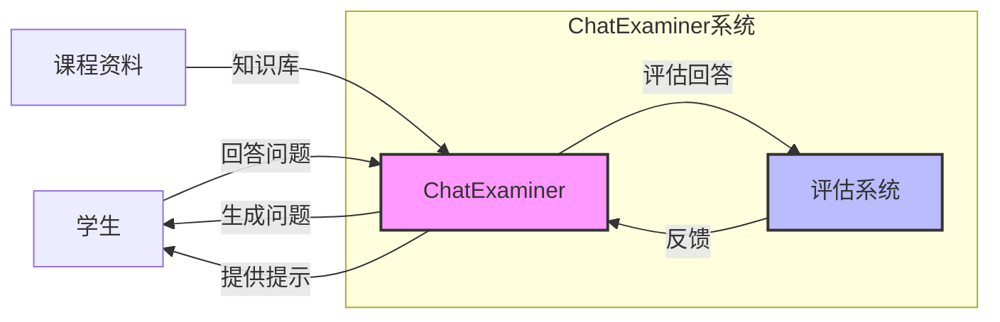

# Master Thesis Plan: ChatExaminer

## 前置部分
- Abstract (1-2页)
  - 清晰阐述研究目标和贡献
  - 强调系统创新性
- Acknowledgements
- Table of Contents
- List of Figures/Tables

## 1. 引言 (8-10页)

### 1.1 研究背景与动机

随着人工智能技术的快速发展，传统的口试和课堂评估方法正面临着智能化转型的挑战[1]。近年来，大语言模型在自动文本生成和对话系统方面取得了显著进展。特别是自 OpenAI 发布 GPT-3 及其后续版本[2]以来，这类模型展现出前所未有的潜力，为教育领域开创了新的可能性。

在传统教学中，教师通过持续评估来反馈学生的表现，这种方法虽然依赖于教师的专业经验，能够提供实时反馈和评估以促进学生进步，但极其耗时。近期研究[3]在使用 AI 技术生成考试题目方面取得了部分成功，展示了自动化出题的高效性。在求职面试领域，利用多模态数据进行综合分析来评估候选人为动态对话管理提供了有益的见解[4,5]，但该领域的研究重点与教育中匹配课程知识的要求有显著差异。

然而，现有的自动评估系统主要局限于静态题目的设计和评分[3]，而实际的口试评估过程不仅需要生成高质量的问题，还需要与学生进行实时互动、动态调整提问策略，并对学生回答的质量进行多维度评估[1]。总的来说，尽管现有系统在问题生成、对话连贯性和多模态数据处理方面取得了一定成果[6,7]，但在教育领域的口试评估中仍面临诸多挑战：

1. 如何基于课程和教学要求，自动生成与学科知识高度匹配的考试问题
2. 如何在实时口试中动态调整提问策略，从多个角度评估学生回答的准确性、表达清晰度和知识理解深度
3. 如何确保生成的问题既满足严格的教学标准，又能有效区分不同水平的学生
4. 如何合理引入并量化提示机制对评分的影响，同时确保系统评估的公平性和规范性

### 1.2 项目概述

基于上述挑战，本项目开发了一个基于 AI 的口试评价系统——ChatExaminer。该系统基于 DTU 课程 02465（强化学习与控制理论导论）[8]的教学大纲，利用课程提供的知识库、教学大纲和口试程序[9]，通过实时交互和动态评估，为学生提供接近真实口试体验的自动化考试环境。

系统的主要创新点包括：
1. 动态问题生成：根据学生回答实时调整后续问题，确保问题与课程要求高度匹配
2. 多维度评估：不仅关注答案准确性，还包括表达清晰度和理解深度
3. 智能提示机制：根据学生表现提供个性化的引导，并将提示使用情况纳入评估体系

### 1.3 系统架构概览



上图展示了 ChatExaminer 系统的核心交互流程。系统通过分析学生的回答，动态生成后续问题，并提供实时评估和必要的提示，形成一个完整的考试闭环。系统的设计不仅有助于开发自动化、标准化和高效的口试评估系统，还为智能教育评估系统的进一步发展提供了理论基础和实践参考。

### 1.4 研究问题

基于上述背景，本研究提出以下核心问题：

1. **如何设计一个基于大语言模型的口试系统，使其能在实时交互中根据学生回答动态生成与课程要求高度匹配的后续问题？**
   - 问题生成策略的设计
   - 课程知识的对齐机制
   - 交互流程的自然性
   - 动态调整的准确性

2. **如何通过合理的实验设计，验证系统定义的评分指标和反馈机制能否准确反映学生的真实水平，并确保与教师设定的评估标准（如课程大纲）保持一致？**
   - 评估指标的设计和验证
   - 不同类型学生的表现区分
   - 系统评估的一致性
   - 与教师标准的对齐

3. **提示机制如何影响学生表现和系统评估？**
   - 提示策略的设计
   - 提示使用对评分的影响
   - 提示效果的量化分析
   - 评估公平性的保证

### 1.5 论文结构与阅读指南

本文的组织结构旨在系统地回答上述研究问题，各章节之间紧密关联，逐步展开论证：

- **第二章 文献综述**：为回答研究问题奠定理论基础
  - 分析现有 AI 教育评估系统的优势与局限，为研究问题 1 提供设计依据
  - 探讨口试评估理论和标准，支持研究问题 2 中的评估指标设计
  - 回顾大语言模型在教育中的应用，特别是提示机制的研究现状，为研究问题 3 提供参考

- **第三章 系统设计与实现**：重点回答研究问题 1
  - 详细介绍系统架构和技术实现，包括：
    ```mermaid
    graph TD
        A[State machine] --> B[Question generation module]
        B --> C[Evaluation framework]
        C --> D[Prompt system]

        subgraph Core functionalities
        B
        C
        D
        end
    ```
  - 阐述如何实现问题生成与课程内容的对齐
  - 说明状态机如何管理考试流程
  - 描述提示系统的设计原理

- **第四章 实验与评估**：主要针对研究问题 2 和 3
  - 通过多维度实验验证系统的评估能力：
    - 问题生成质量评估（RQ1）
    - 评分指标有效性验证（RQ2）
    - 提示机制影响分析（RQ3）
  - 采用不同类型的人工学生进行重复批量实验：
    - 优秀学生模型（90%准确率）
    - 中等学生模型（60-80%准确率）
    - 较差学生模型（30-50%准确率）
  - 通过统计方法验证系统的区分能力和评估一致性

- **第五章 讨论**：综合分析实验结果
  - 系统对每个研究问题的解答程度
  - 与现有系统的对比分析
  - 技术和应用层面的局限性
  - 潜在的改进方向

- **第六章 结论**：总结研究成果
  - 回顾研究问题的解答情况
  - 总结系统的创新点和局限性
  - 展望未来研究方向

通过这种结构安排，读者可以清晰地了解：
1. 每个研究问题是如何被逐步解答的
2. 系统设计与实验验证之间的逻辑关系
3. 研究成果的理论价值和实践意义

本论文的主要贡献在于：
- 提出了一个创新的口试评估框架
- 实现了基于大语言模型的动态问题生成
- 设计了可量化的评估指标体系
- 提供了提示机制对评估影响的实证研究

## 2. 文献综述 (12-15页)
### 2.1 AI教育评估系统
- 现有AI考官系统分析
- 技术方法对比
- 系统局限性分析
- 研究空白识别

### 2.2 口试评估理论
- 评估标准与方法
- Bloom分类法应用
- 动态评估机制
- 教育心理学理论支持

### 2.3 大语言模型在教育中的应用
- 现有应用案例
- 技术优势与局限性
- RAG技术在教育领域的应用

## 3. 系统设计与实现 (15-18页)
### 3.1 系统架构
- 整体框架设计
- 核心模块说明
- 技术选型依据
- 系统交互流程

### 3.2 考官状态机设计
- 状态定义与转换
- 上下文管理
- 问题生成与选择
- 提示系统设计

### 3.3 评估框架实现
- 评估指标设计
- 动态评分机制
- 反馈生成系统
- 评估数据管理

### 3.4 人工学生模型
- 学生行为模式设计
- 状态机实现
- 不同类型学生特征
- 交互模式设计

## 4. 实验与评估 (12-15页)
### 4.1 实验设计
- 评估指标定义
- 测试场景设计
- 人工学生测试框架
- 数据收集方法

### 4.2 系统验证实验
- 考官-学生交互测试
- 不同类型学生表现分析
- 系统稳定性测试
- 评估一致性验证

### 4.3 结果分析
- 定量分析
  - 评分一致性
  - 时间效率
  - 提示使用情况
- 定性分析
  - 交互质量
  - 反馈有效性
  - 系统适应性

## 5. 讨论 (7-8页)
### 5.1 主要发现
- 系统性能评估
- 评估框架有效性
- 人工学生测试结果

### 5.2 系统特点
- 创新点分析
- 与现有系统比较
- 应用价值

### 5.3 局限性
- 技术局限
- 评估局限
- 应用局限

### 5.4 未来工作
- 改进方向
- 扩展可能

## 6. 结论 (3-4页)
- 研究总结
- 主要贡献
- 实践意义

## 参考文献

## 附录
- 系统API文档
- 实验数据
- 代码示例
- 评估标准详细说明
- 人工学生行为模式定义
