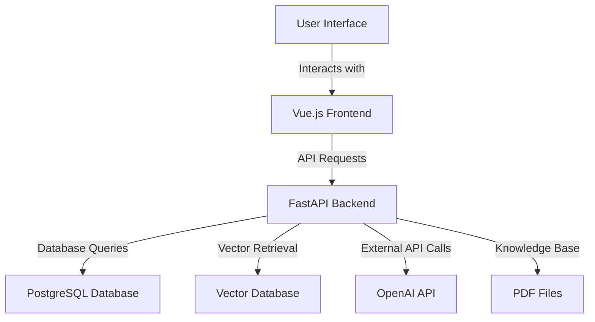

# ChatExaminer

An intelligent examination system based on RAG (Retrieval-Augmented Generation) architecture that simulates interactive oral examinations through dynamic question generation and real-time evaluation.

## Project Overview

ChatExaminer is a proof-of-concept AI-powered oral examination system that aims to:
- Generate dynamic questions based on course materials
- Conduct interactive examinations similar to live oral exams
- Provide real-time evaluation of student responses
- Adapt questioning based on student performance
- Assist human examiners with performance assessment

## Key Features

- 🎯 Dynamic Question Generation
  - Generates questions from course materials
  - Creates adaptive dialogue trees
  - Aligns with syllabus and learning objectives

- 🤖 Interactive Examination
  - Simulates real oral exam scenarios
  - Provides follow-up questions based on responses
  - Maintains conversation context

- 📊 Automated Evaluation
  - Assesses student responses in real-time
  - Provides detailed performance metrics
  - Generates feedback for human examiners

## User Stories

1. **As a student, I want to input short answers using the keyboard so that I can respond quickly during the exam.**
   - The system should accept text input from the student and submit it within a specified time limit.

2. **As a student, I want to view the context of the questions during the exam so that I can better understand them.**
   - The system should display relevant context information next to the questions.

3. **As an examiner, I want to view student responses in real-time so that I can evaluate them immediately.**
   - The system should update the examiner's interface with the student's responses in real-time.

4. **As a student, I want to receive immediate feedback after submitting my answers so that I can understand my performance.**
   - The system should provide instant feedback and scoring after the student submits their answer.

5. **As a teacher, I want to set time limits for the exam to control the pace of the examination.**
   - The system should display a countdown timer when the exam starts.

6. **As a student, I want to view my grades and feedback after the exam so that I can reflect on my performance.**
   - The system should provide a detailed report of grades and feedback after the exam concludes.

7. **As a system administrator, I want to monitor the health status of the system to ensure service availability.**
   - The administrator should be able to access the system's health check interface.

8. **As a student, I want to use a hint function during the exam to receive help when needed.**
   - The system should provide a hint button that students can click when they require assistance.

## Technical Architecture

### System Architecture

The architecture of ChatExaminer consists of the following core components:

The architecture of ChatExaminer consists of the following core components:


### Core Components

- **RAG Engine**
  - Knowledge base integration
  - Context-aware retrieval
  - Question generation

- **Dialogue Manager**
  - Conversation flow control
  - Response analysis
  - Dynamic question selection

- **Evaluation System**
  - Performance assessment
  - Feedback generation
  - Alignment verification

### Data Processing

- PDF parsing and structuring
- LaTeX representation handling
- Course material organization

## Research Focus

This project addresses the following research questions:

1. How can AI systems effectively simulate interactive oral examination dynamics?
2. How can we ensure AI-generated questions align with teacher-defined criteria?
3. What methods can effectively evaluate AI-student interactions in educational contexts?

## Development Status

Current development focuses on:
- [ ] Knowledge base integration
- [ ] Question generation algorithms
- [ ] Interactive dialogue management
- [ ] Evaluation metrics implementation
- [ ] Teacher control interface

## Getting Started

[Development setup instructions will be added as the project progresses]

### Configuration

1. Create a `.env` file and set the following environment variables:

```
OPENAI_API_KEY=<your-openai-api-key>
```

## Code Architecture

### Directory Structure
```
project_root/
├── knowledge/
│   └── pdf/            # PDF knowledge base files
├── data/               # Generated data storage
│   └── exam_questions.json  # Generated exam questions
├── script/            # Proof of Concept Implementation
│   ├── pdf_load.py     # Basic PDF processing (PoC)
│   ├── rag_pipeline_script.py  # Simple RAG pipeline (PoC)
│   └── rag/
│       └── core.py     # Core concepts demonstration (PoC)
└── .env                # Environment configuration
```

### Proof of Concept Implementation

The current implementation in the `script/` directory serves as a proof of concept to demonstrate core functionalities:

#### 1. PDF Processing (`pdf_load.py`)
- **Purpose**: Handles PDF document processing and vectorization
- **Key Classes**:
  - `DocumentMetadata`: Stores document chunk metadata (filename, page number, chunk index)
  - `KnowledgeDoc`: Document schema with metadata and embeddings
- **Key Functions**:
  - `extract_and_chunk_pdfs()`: Intelligent text extraction and chunking
  - `vectorize_documents()`: Generates embeddings using SentenceTransformer
  - `clean_text()`: Text preprocessing and stopwords removal
- **Features**:
  - Intelligent chunking with RecursiveCharacterTextSplitter
  - Quality control for text chunks
  - Error handling for PDF processing
  - Metadata preservation

#### 2. RAG Pipeline (`rag_pipeline_script.py`)
- **Purpose**: Implements the main RAG pipeline for question generation and evaluation.
- **Key Classes**:
  - `ExamQuestion`: Structure for storing exam questions.
  - `RAGPipeline`: Main pipeline controller.
- **Key Features**:
  - JSON-based question storage and retrieval.
  - Enhanced context relevance scoring.
  - **Two-Round Semantic Search**:
    - **First Round**: Retrieves a broad set of knowledge content related to the topic to ensure a wide context for question generation.
    - **Second Round**: Refines the search results by selecting one context and performing a focused search to generate a specific question based on that content.
  - Question generation with GPT-4, ensuring questions are concise and directly answerable from the provided context.
  - Answer evaluation with detailed feedback, focusing on clarity and relevance.
- **Integration**: Connects PDF processing with the examination system, allowing for dynamic question generation based on course materials.

#### 3. Examination System (`rag/core.py`)
- **Status**: Conceptual framework demonstration
- **Current Scope**:
  - Basic exam context management
  - Simple question-answer flow
  - Preliminary feedback generation
- **Limitations**:
  - Limited dialogue management
  - Basic context awareness
  - Simple evaluation criteria

### Future Development Plans

The current proof of concept implementation will evolve into:

1. **Enhanced Processing**
   - Advanced PDF parsing with structure preservation
   - Sophisticated chunking strategies
   - Improved metadata extraction

2. **Robust Pipeline**
   - Advanced context retrieval algorithms
   - Dynamic question adaptation
   - Comprehensive evaluation system

3. **Interactive System**
   - Real-time dialogue management
   - Adaptive questioning strategies
   - Detailed performance analytics

4. **Question Tree Implementation**
   - **Overview**: Implement a pre-generated question tree structure that allows for dynamic question selection based on student responses during the examination.
   - **Design**:
     - **QuestionNode Class**: Create a class to represent each question and its potential follow-up questions.
     - **Tree Structure**: Each question can have multiple child questions, forming a hierarchical structure that allows for depth in questioning.
     - **Dynamic Selection**: Based on the student's answer, the system will select the next question from the tree, ensuring a tailored examination experience.
   - **Implementation Steps**:
     1. **Generate Question Tree**:
        - Create a method to generate a question tree for a given topic and difficulty level.
        - Each node in the tree will represent a question, with child nodes representing follow-up questions.
     2. **Select Next Question**:
        - Implement logic to evaluate the student's answer and select the appropriate next question from the tree.
        - Use keywords or response analysis to determine the direction of questioning.
     3. **Integrate with Existing System**:
        - Ensure the question tree integrates seamlessly with the existing RAG pipeline and evaluation system.
        - Maintain context and flow of the examination while allowing for dynamic adjustments based on student performance.

### Example Question Tree Structure

```python
class QuestionNode:
    def __init__(self, question: str, context: List[str], difficulty: int, topic: str):
        self.question = question
        self.context = context
        self.difficulty = difficulty
        self.topic = topic
        self.children = []  # Store follow-up questions

    def add_child(self, child_node: 'QuestionNode'):
        self.children.append(child_node)

def generate_question_tree(topic: str, difficulty: int, depth: int) -> QuestionNode:
    root_question = rag.generate_question(topic, difficulty)
    root_node = QuestionNode(root_question.question, root_question.context, difficulty, topic)

    if depth > 0:
        for _ in range(3):  # Assume each question has 3 follow-up questions
            child_question = rag.generate_question(topic, difficulty + 1)  # Gradually increasing difficulty
            child_node = QuestionNode(child_question.question, child_question.context, difficulty + 1, topic)
            root_node.add_child(child_node)
            # Recursively generate sub-questions
            child_node.children.extend(generate_question_tree(topic, difficulty + 1, depth - 1).children)

    return root_node
```

### Component Interactions

1. **Knowledge Base Creation**
   ```mermaid
   graph LR
   A[PDF Files] --> B[pdf_load.py]
   B --> C[Vector Database]
   ```

2. **Question Generation Flow**
   ```mermaid
   graph LR
   A[ExamContext] --> B[RAGPipeline]
   B --> C[Context Retrieval]
   C --> D[GPT-4 Generation]
   D --> E[JSON Storage]
   ```

3. **Answer Evaluation Flow**
   ```mermaid
   graph LR
   A[Student Answer] --> B[RAGPipeline]
   B --> C[Context Retrieval]
   C --> D[GPT-4 Evaluation]
   D --> E[Feedback Generation]
   ```

### Key Dependencies
- OpenAI API: For GPT-4o-mini based generation and evaluation
- SentenceTransformer: For text embedding
- Vector Database: For efficient knowledge retrieval
- PyMuPDF: For PDF processing

### Configuration
The system requires proper configuration of:
- OpenAI API key in `.env`
- Knowledge base PDFs in `knowledge/pdf/`
- Vector database workspace settings
- Data storage directory for generated questions
